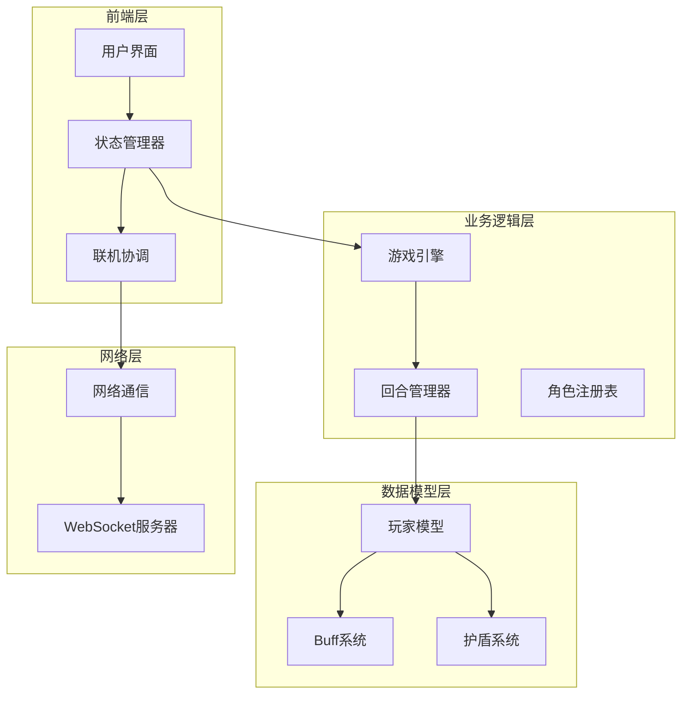
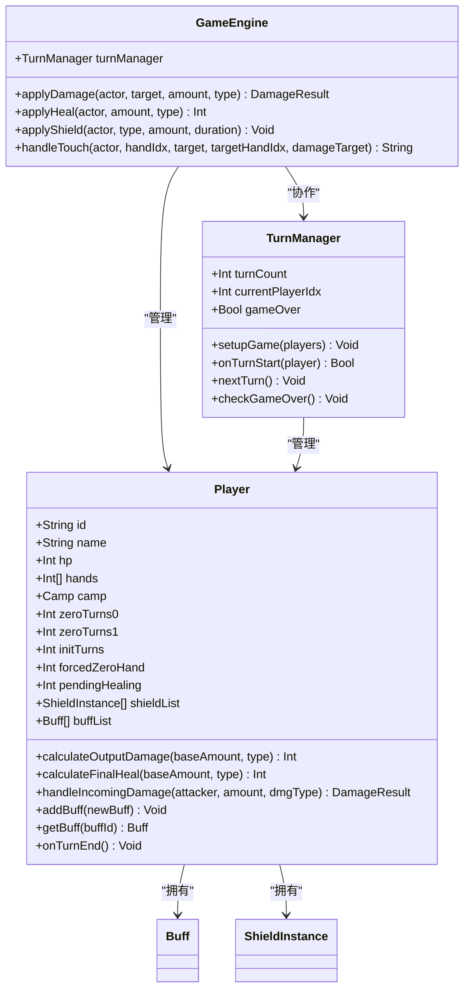
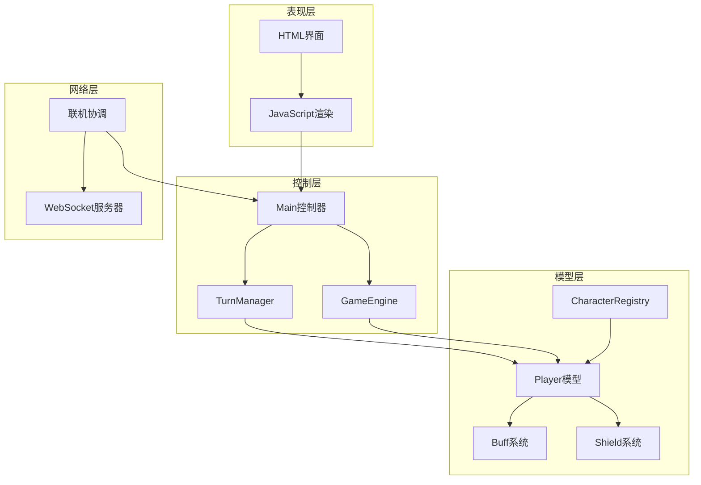
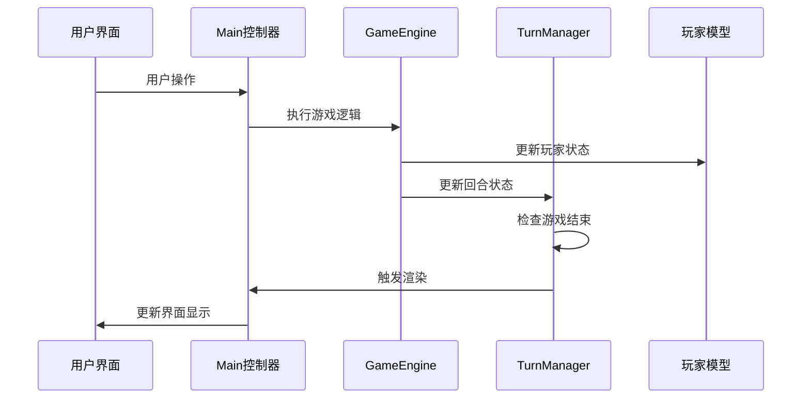
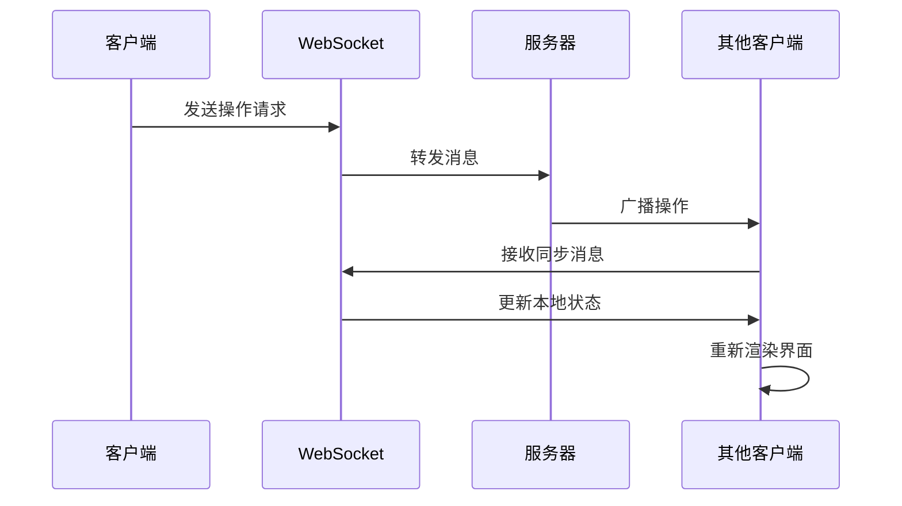
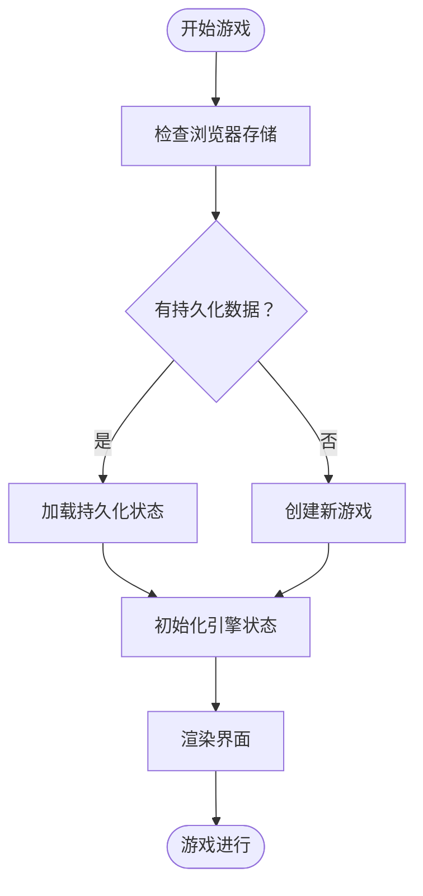
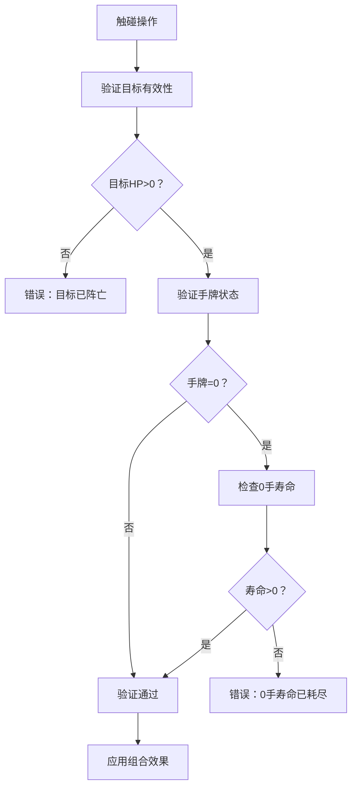
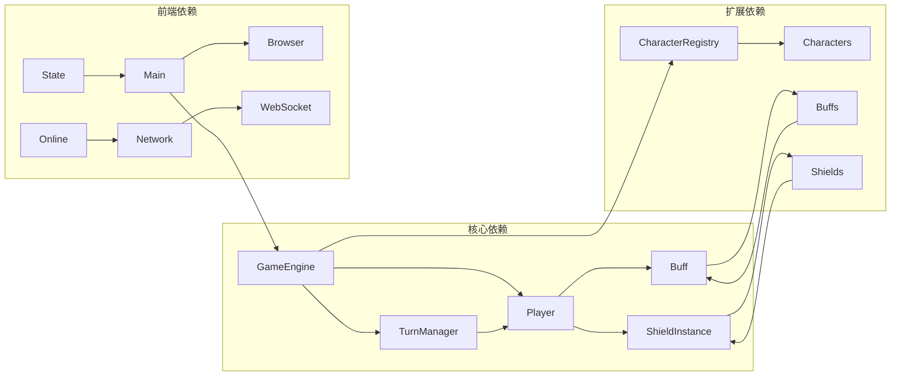

# 状态管理系统

<cite>
**本文档引用的文件**
- [GameEngine.hx](file://GameEngine.hx)
- [TurnManager.hx](file://TurnManager.hx)
- [Main.hx](file://Main.hx)
- [js/game2-state.js](file://js/game2-state.js)
- [character/Player.hx](file://character/Player.hx)
- [model/Player.hx](file://model/Player.hx)
- [model/Buff.hx](file://model/Buff.hx)
- [character/DaQiao.hx](file://character/DaQiao.hx)
- [character/XiaoQiao.hx](file://character/XiaoQiao.hx)
- [buffs/DamageBoostBuff.hx](file://buffs/DamageBoostBuff.hx)
- [buffs/PoisonBuff.hx](file://buffs/PoisonBuff.hx)
- [character/CharacterRegistry.hx](file://character/CharacterRegistry.hx)
- [js/server.js](file://js/server.js)
- [network.js](file://network.js)
- [js/game2-online.js](file://js/game2-online.js)
</cite>

## 目录
1. [简介](#简介)
2. [项目结构](#项目结构)
3. [核心组件](#核心组件)
4. [架构概览](#架构概览)
5. [详细组件分析](#详细组件分析)
6. [依赖关系分析](#依赖关系分析)
7. [性能考虑](#性能考虑)
8. [故障排除指南](#故障排除指南)
9. [结论](#结论)
10. [附录](#附录)

## 简介

这是一个基于Haxe开发的指尖博弈游戏的状态管理系统。系统实现了完整的回合制战斗机制，包括玩家状态管理、手牌状态、Buff状态、回合状态的存储和管理。系统支持单人对战和多人联机模式，具备状态同步、持久化、验证约束和扩展机制。

## 项目结构

系统采用模块化架构，主要分为以下几个层次：

**图表来源**
- [Main.hx:1-411](file://Main.hx#L1-L411)
- [GameEngine.hx:1-725](file://GameEngine.hx#L1-L725)
- [TurnManager.hx:1-232](file://TurnManager.hx#L1-L232)

**章节来源**
- [Main.hx:1-411](file://Main.hx#L1-L411)
- [GameEngine.hx:1-725](file://GameEngine.hx#L1-L725)
- [TurnManager.hx:1-232](file://TurnManager.hx#L1-L232)

## 核心组件

### 玩家状态模型

玩家状态是系统的核心数据结构，包含以下关键字段：

**图表来源**
- [model/Player.hx:1-398](file://model/Player.hx#L1-L398)
- [GameEngine.hx:16-43](file://GameEngine.hx#L16-L43)
- [TurnManager.hx:6-13](file://TurnManager.hx#L6-L13)

### 状态数据结构

系统采用以下核心数据结构来管理游戏状态：

| 数据结构 | 字段 | 类型 | 描述 |
|---------|------|------|------|
| Player | id, name, hp, hands, camp | 基本属性 | 玩家实体状态 |
| Player | zeroTurns0, zeroTurns1, initTurns | 手牌状态 | 0手寿命管理 |
| Player | pendingHealing | 回血状态 | 解毒溢出累计 |
| Player | shieldList, buffList | 效果状态 | 护盾和Buff列表 |
| TurnManager | turnCount, currentPlayerIdx, gameOver | 回合状态 | 游戏进程控制 |
| GameEngine | lastTouchDamageLog, currentComboMultiplier | 事件状态 | 战斗过程记录 |

**章节来源**
- [model/Player.hx:3-26](file://model/Player.hx#L3-L26)
- [TurnManager.hx:7-11](file://TurnManager.hx#L7-L11)
- [GameEngine.hx:18-35](file://GameEngine.hx#L18-L35)

## 架构概览

系统采用分层架构，实现了清晰的关注点分离：

**图表来源**
- [Main.hx:9-12](file://Main.hx#L9-L12)
- [TurnManager.hx:15-25](file://TurnManager.hx#L15-L25)
- [GameEngine.hx:37-43](file://GameEngine.hx#L37-L43)

## 详细组件分析

### 状态同步机制

系统实现了多层次的状态同步机制：

#### 本地状态更新流程

**图表来源**
- [Main.hx:274-293](file://Main.hx#L274-L293)
- [GameEngine.hx:418-468](file://GameEngine.hx#L418-L468)
- [TurnManager.hx:110-190](file://TurnManager.hx#L110-L190)

#### 远程状态同步

系统通过WebSocket实现实时状态同步：

**图表来源**
- [js/server.js:220-342](file://js/server.js#L220-L342)
- [network.js:56-100](file://network.js#L56-L100)
- [js/game2-online.js:63-121](file://js/game2-online.js#L63-L121)

#### 冲突解决策略

系统采用以下冲突解决策略：

1. **时序一致性**：通过WebSocket保证消息顺序
2. **状态快照**：前端实现状态快照和回滚机制
3. **操作幂等**：设计操作的幂等性避免重复执行
4. **本地验证**：客户端先本地验证再发送网络请求

**章节来源**
- [js/game2-state.js:179-220](file://js/game2-state.js#L179-L220)
- [js/game2-online.js:82-121](file://js/game2-online.js#L82-L121)

### 状态持久化方案

系统提供了多种状态持久化机制：

#### 浏览器存储

**图表来源**
- [js/game2-state.js:179-220](file://js/game2-state.js#L179-L220)
- [Main.hx:81-119](file://Main.hx#L81-L119)

#### 状态快照

系统实现了完整的状态快照功能：

| 快照类型 | 作用 | 数据内容 |
|---------|------|----------|
| 回合快照 | 大回合结束记录 | 全场玩家状态 |
| 操作快照 | 帮抗过程记录 | 伤害快照 |
| 状态快照 | 联机同步 | 完整游戏状态 |

**章节来源**
- [Main.hx:81-119](file://Main.hx#L81-L119)
- [js/game2-state.js:179-220](file://js/game2-state.js#L179-L220)

### 状态验证和约束检查

系统实现了多层次的状态验证机制：

#### 合法性验证

**图表来源**
- [GameEngine.hx:418-427](file://GameEngine.hx#L418-L427)
- [character/Player.hx:317-327](file://character/Player.hx#L317-L327)

#### 边界条件处理

系统处理以下边界条件：

1. **手牌边界**：0手寿命限制、手牌取模运算
2. **HP边界**：HP最小值为0、负值处理
3. **Buff边界**：层数为0时自动移除
4. **护盾边界**：护盾厚度为0时自动移除

**章节来源**
- [GameEngine.hx:439-456](file://GameEngine.hx#L439-L456)
- [character/Player.hx:329-354](file://character/Player.hx#L329-L354)

### 状态扩展指南

#### 添加新的状态字段

要添加新的状态字段，需要：

1. **模型层扩展**：在Player类中添加新字段
2. **序列化支持**：在快照函数中包含新字段
3. **渲染支持**：在渲染函数中显示新状态
4. **验证逻辑**：添加相应的验证规则

#### 修改状态转换规则

修改状态转换规则的步骤：

1. **定位转换逻辑**：在GameEngine或Player类中找到相关方法
2. **修改算法**：更新状态转换逻辑
3. **测试验证**：编写单元测试验证新逻辑
4. **兼容性检查**：确保不影响现有功能

#### 优化状态查询性能

性能优化建议：

1. **索引优化**：为常用查询字段建立索引
2. **缓存策略**：缓存频繁访问的状态
3. **批量操作**：合并多个状态更新操作
4. **延迟计算**：推迟不必要的计算

**章节来源**
- [character/CharacterRegistry.hx:66-81](file://character/CharacterRegistry.hx#L66-L81)
- [model/Player.hx:212-235](file://model/Player.hx#L212-L235)

## 依赖关系分析

系统采用松耦合的设计，主要依赖关系如下：

**图表来源**
- [GameEngine.hx:3-15](file://GameEngine.hx#L3-L15)
- [TurnManager.hx:3-5](file://TurnManager.hx#L3-L5)
- [character/CharacterRegistry.hx:3-5](file://character/CharacterRegistry.hx#L3-L5)

**章节来源**
- [GameEngine.hx:3-15](file://GameEngine.hx#L3-L15)
- [TurnManager.hx:3-5](file://TurnManager.hx#L3-L5)
- [character/CharacterRegistry.hx:17-64](file://character/CharacterRegistry.hx#L17-L64)

## 性能考虑

系统在设计时考虑了以下性能因素：

### 时间复杂度优化

1. **状态查找**：使用数组索引而非遍历查找
2. **Buff处理**：按类型分类处理提高效率
3. **渲染优化**：批量更新DOM减少重绘

### 空间复杂度优化

1. **状态压缩**：合并相似状态字段
2. **内存回收**：及时清理无效状态
3. **缓存管理**：合理控制缓存大小

### 并发处理

1. **异步操作**：网络请求采用异步处理
2. **状态锁**：关键状态操作使用锁机制
3. **回滚机制**：支持状态回滚避免数据不一致

## 故障排除指南

### 常见问题及解决方案

#### 状态不同步问题

**症状**：客户端显示状态与服务器不一致

**解决方案**：
1. 检查WebSocket连接状态
2. 验证消息序列化/反序列化
3. 实现状态快照和回滚机制

#### 性能问题

**症状**：游戏运行缓慢或卡顿

**解决方案**：
1. 分析性能瓶颈定位
2. 实施缓存策略
3. 优化渲染逻辑

#### 冲突处理问题

**症状**：多人游戏中出现状态冲突

**解决方案**：
1. 实现操作去重机制
2. 添加冲突检测逻辑
3. 设计优雅降级策略

**章节来源**
- [js/server.js:220-342](file://js/server.js#L220-L342)
- [network.js:13-36](file://network.js#L13-L36)

## 结论

这个状态管理系统展现了良好的架构设计和实现质量。系统通过清晰的分层架构、完善的验证机制、灵活的扩展能力，为指尖博弈游戏提供了稳定可靠的状态管理基础。

系统的主要优势包括：

1. **模块化设计**：各组件职责明确，便于维护和扩展
2. **状态完整性**：全面覆盖游戏状态的各个方面
3. **并发安全**：通过多种机制保证状态一致性
4. **性能优化**：采用多种技术手段提升运行效率
5. **扩展友好**：提供清晰的扩展接口和指导

未来可以考虑的改进方向：
- 增强状态压缩算法
- 优化网络同步协议
- 添加更多调试工具
- 实现更精细的权限控制

## 附录

### API参考

#### 核心API

| 方法 | 参数 | 返回值 | 描述 |
|------|------|--------|------|
| GameEngine.applyDamage | actor, target, amount, type | DamageResult | 造成伤害 |
| GameEngine.applyHeal | actor, amount, type | Int | 恢复生命值 |
| GameEngine.applyShield | actor, type, amount, duration | Void | 添加护盾 |
| TurnManager.nextTurn |  | Void | 进入下一回合 |
| Player.handleIncomingDamage | attacker, amount, dmgType | DamageResult | 受到伤害 |

#### 状态查询API

| 方法 | 参数 | 返回值 | 描述 |
|------|------|--------|------|
| Player.getBuff | buffId | Buff | 获取特定Buff |
| Player.isValidTouch | handIdx, target, targetHandIdx | Bool | 验证触碰合法性 |
| TurnManager.checkGameOver |  | Void | 检查游戏结束 |

### 配置选项

系统支持以下配置选项：

| 选项 | 类型 | 默认值 | 描述 |
|------|------|--------|------|
| enableLogging | Bool | true | 启用日志记录 |
| autoSave | Bool | true | 自动保存游戏进度 |
| syncInterval | Int | 1000 | 网络同步间隔(ms) |
| maxUndoSteps | Int | 10 | 最大撤销步数 |