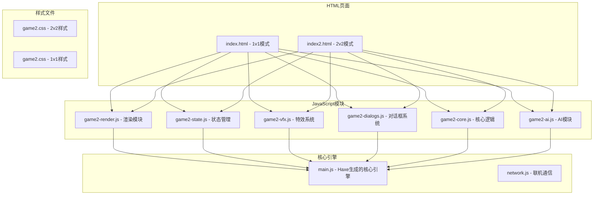
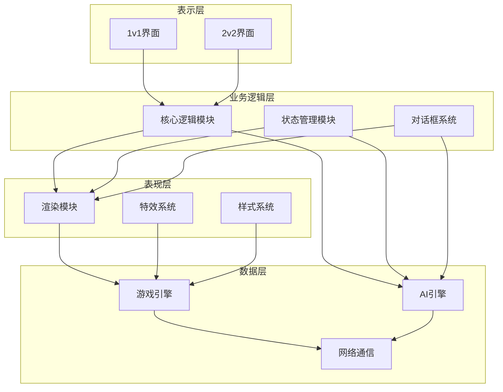
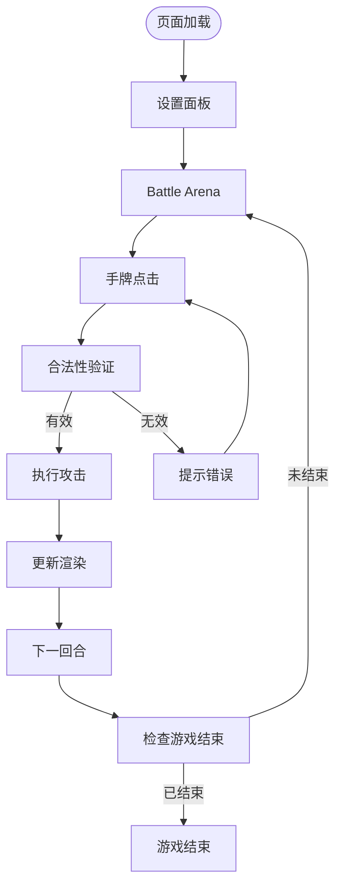
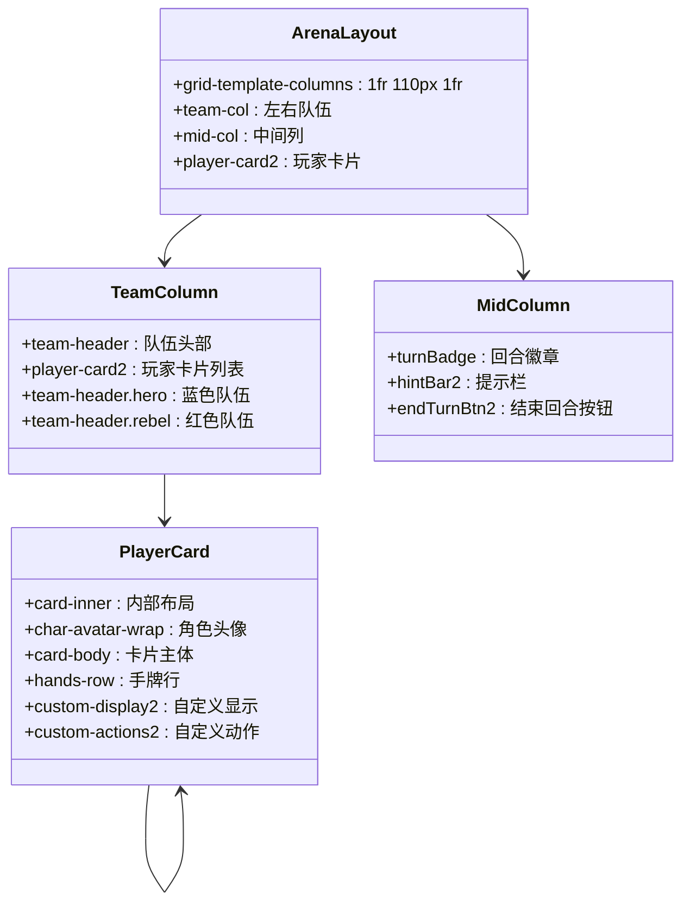
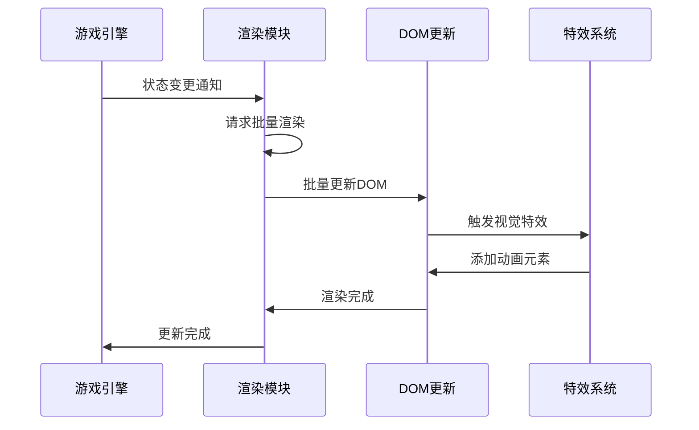
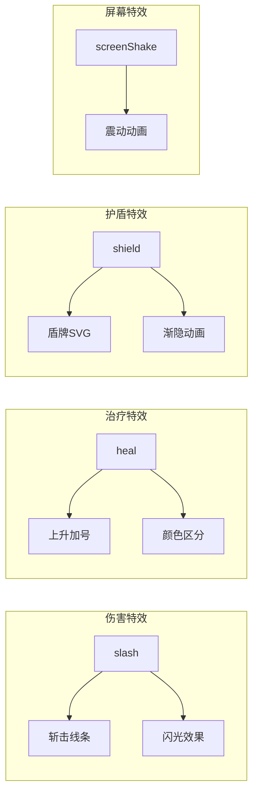
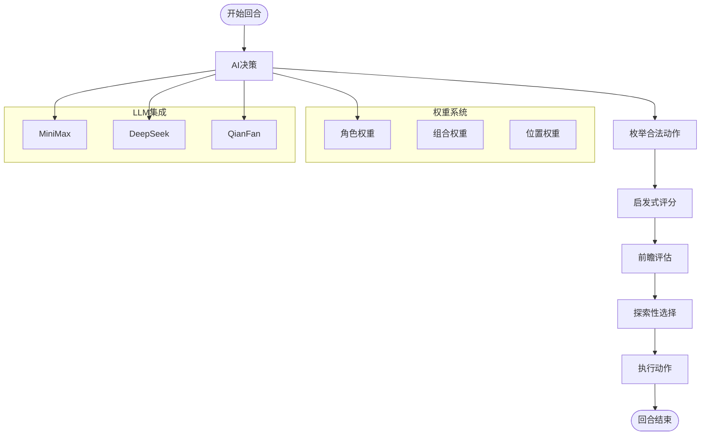
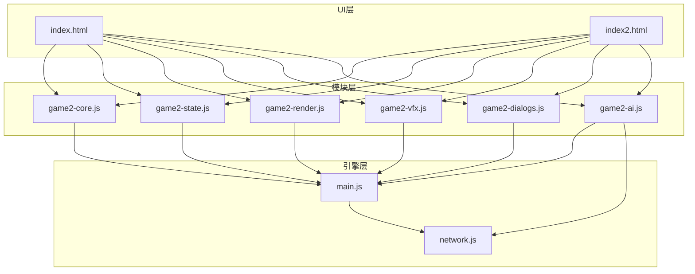

# 用户界面系统

<cite>
**本文档引用的文件**
- [index.html](file://index.html)
- [index2.html](file://index2.html)
- [game2.css](file://css/game2.css)
- [game2-render.js](file://js/game2-render.js)
- [game2-state.js](file://js/game2-state.js)
- [game2-vfx.js](file://js/game2-vfx.js)
- [game2-dialogs.js](file://js/game2-dialogs.js)
- [game2-core.js](file://js/game2-core.js)
- [game2-ai.js](file://js/game2-ai.js)
- [main.js](file://main.js)
- [network.js](file://network.js)
</cite>

## 目录
1. [简介](#简介)
2. [项目结构](#项目结构)
3. [核心组件](#核心组件)
4. [架构概览](#架构概览)
5. [详细组件分析](#详细组件分析)
6. [依赖关系分析](#依赖关系分析)
7. [性能考量](#性能考量)
8. [故障排除指南](#故障排除指南)
9. [结论](#结论)
10. [附录](#附录)

## 简介

用户界面系统是一个基于Web技术构建的多英雄对战游戏前端框架，支持1v1和2v2两种游戏模式。该系统采用模块化架构设计，包含完整的渲染系统、特效系统、状态管理系统、对话框系统和AI模块。

系统的核心特点包括：
- **双模式支持**：同时支持1v1和2v2游戏模式
- **模块化架构**：JavaScript模块清晰分离职责
- **实时特效**：丰富的视觉反馈和动画效果
- **AI集成**：内置智能决策系统
- **响应式设计**：适配不同屏幕尺寸
- **联机支持**：WebSocket实现实时多人对战

## 项目结构

项目采用清晰的文件组织结构，主要分为以下几个部分：

**图表来源**
- [index.html:1-482](file://index.html#L1-L482)
- [index2.html:1-988](file://index2.html#L1-L988)
- [game2.css:1-439](file://css/game2.css#L1-L439)

**章节来源**
- [index.html:1-482](file://index.html#L1-L482)
- [index2.html:1-988](file://index2.html#L1-L988)
- [css/game2.css:1-439](file://css/game2.css#L1-L439)

## 核心组件

### 渲染模块 (game2-render.js)

渲染模块负责将游戏状态转换为可视化的用户界面。其核心功能包括：

- **批量渲染优化**：使用requestAnimationFrame避免重复DOM操作
- **状态映射**：将游戏数据映射到UI元素
- **特效触发**：基于状态变化触发相应的视觉特效
- **样式管理**：动态更新手牌样式和状态指示器

### 状态管理模块 (game2-state.js)

状态管理模块维护游戏的全局状态，包括：
- **阵营配置**：英雄队和反抗军队的配置
- **阵容管理**：双半肉和坦脆流阵容切换
- **抗伤位管理**：坦克位置和目标选择
- **快照机制**：支持状态回滚和恢复

### 特效系统 (game2-vfx.js)

特效系统提供丰富的视觉反馈：
- **伤害特效**：斩击动画和屏幕震动
- **治疗特效**：上升的加号动画
- **护盾特效**：盾牌出现动画
- **伤害类型区分**：物理、法术、真实伤害的不同表现

### 对话框系统 (game2-dialogs.js)

对话框系统处理各种交互弹窗：
- **帮抗弹窗**：濒死时的救援选择
- **目标选择**：特殊技能的目标选择
- **抢夺确认**：大乔的抢血确认
- **蛋糕使用**：藏师的蛋糕释放

### 核心逻辑 (game2-core.js)

核心逻辑模块处理游戏的主要交互：
- **两步点击状态机**：确保合法的游戏操作
- **攻击判定**：验证攻击的有效性
- **回合管理**：推进游戏进程
- **濒死检测**：处理角色死亡和救援

### AI模块 (game2-ai.js)

AI模块提供智能决策能力：
- **启发式评分**：基于权重的决策算法
- **LLM集成**：支持多种AI提供商
- **自战训练**：持续改进AI策略
- **权重系统**：角色特定的策略权重

**章节来源**
- [game2-render.js:1-304](file://js/game2-render.js#L1-L304)
- [game2-state.js:1-242](file://js/game2-state.js#L1-L242)
- [game2-vfx.js:1-305](file://js/game2-vfx.js#L1-L305)
- [game2-dialogs.js:1-372](file://js/game2-dialogs.js#L1-L372)
- [game2-core.js:1-223](file://js/game2-core.js#L1-L223)
- [game2-ai.js:1-1057](file://js/game2-ai.js#L1-L1057)

## 架构概览

系统采用分层架构设计，各层之间职责明确，耦合度低：

**图表来源**
- [game2-render.js:35-42](file://js/game2-render.js#L35-L42)
- [game2-state.js:5-21](file://js/game2-state.js#L5-L21)
- [game2-vfx.js:11-305](file://js/game2-vfx.js#L11-L305)
- [main.js:10-702](file://main.js#L10-L702)

**章节来源**
- [main.js:10-702](file://main.js#L10-L702)

## 详细组件分析

### 1v1界面实现

1v1界面采用简洁的设计风格，重点关注核心游戏体验：

**图表来源**
- [index.html:175-233](file://index.html#L175-L233)
- [game2-core.js:5-66](file://js/game2-core.js#L5-L66)

1v1界面的关键特性：
- **简化布局**：只显示两个玩家的卡片
- **直接交互**：手牌点击直接触发攻击
- **即时反馈**：操作后立即更新界面状态
- **紧凑设计**：充分利用屏幕空间

### 2v2界面实现

2v2界面采用复杂的网格布局，支持四人对战：

**图表来源**
- [index2.html:170-318](file://index2.html#L170-L318)
- [css/game2.css:34-95](file://css/game2.css#L34-L95)

2v2界面的复杂特性：
- **网格布局**：使用CSS Grid实现复杂的页面布局
- **多玩家支持**：支持四个玩家的并行操作
- **抗伤位系统**：独特的坦克位置管理
- **阵容切换**：双半肉和坦脆流的动态切换

### 渲染系统架构

渲染系统采用批处理优化，避免频繁的DOM操作：

**图表来源**
- [game2-render.js:35-42](file://js/game2-render.js#L35-L42)
- [game2-render.js:67-210](file://js/game2-render.js#L67-L210)

渲染系统的优化策略：
- **rAF批处理**：使用requestAnimationFrame合并多次更新
- **状态快照**：比较前后状态差异，只更新变化的部分
- **样式缓存**：避免重复的样式查询
- **条件渲染**：只渲染必要的UI元素

### 特效系统实现

特效系统提供丰富的视觉反馈，增强游戏体验：

**图表来源**
- [game2-vfx.js:54-119](file://js/game2-vfx.js#L54-L119)
- [game2-vfx.js:124-159](file://js/game2-vfx.js#L124-L159)
- [game2-vfx.js:164-224](file://js/game2-vfx.js#L164-L224)
- [game2-vfx.js:229-236](file://js/game2-vfx.js#L229-L236)

特效系统的实现细节：
- **SVG动画**：使用SVG实现高质量的矢量动画
- **CSS关键帧**：定义流畅的动画效果
- **类型区分**：不同伤害类型的视觉区分
- **性能优化**：动画完成后自动清理DOM节点

### AI决策系统

AI系统采用混合决策算法，结合启发式搜索和机器学习：

**图表来源**
- [game2-ai.js:199-250](file://js/game2-ai.js#L199-L250)
- [game2-ai.js:279-370](file://js/game2-ai.js#L279-L370)
- [game2-ai.js:642-690](file://js/game2-ai.js#L642-L690)

AI系统的特色功能：
- **多模型支持**：支持三种不同的AI提供商
- **权重驱动**：基于角色特定权重的决策
- **探索机制**：15%概率的随机探索
- **自战训练**：持续改进AI策略的能力

**章节来源**
- [index.html:175-233](file://index.html#L175-L233)
- [index2.html:497-520](file://index2.html#L497-L520)
- [game2-render.js:35-210](file://js/game2-render.js#L35-L210)
- [game2-vfx.js:11-305](file://js/game2-vfx.js#L11-L305)
- [game2-ai.js:75-125](file://js/game2-ai.js#L75-L125)

## 依赖关系分析

系统采用模块化设计，各模块之间的依赖关系清晰：

**图表来源**
- [index.html:170-171](file://index.html#L170-L171)
- [index2.html:429-434](file://index2.html#L429-L434)
- [main.js:1-10](file://main.js#L1-L10)

模块间的耦合度分析：
- **低耦合**：各模块职责单一，相互依赖度低
- **向上依赖**：UI层依赖业务逻辑层
- **向下依赖**：业务逻辑层依赖核心引擎
- **横向通信**：通过事件和回调进行通信

**章节来源**
- [index.html:170-171](file://index.html#L170-L171)
- [index2.html:429-434](file://index2.html#L429-L434)
- [main.js:1-10](file://main.js#L1-L10)

## 性能考量

系统在多个层面进行了性能优化：

### 渲染性能优化

1. **批量更新**：使用requestAnimationFrame合并DOM更新
2. **状态快照**：只更新发生变化的元素
3. **样式缓存**：避免重复的样式查询
4. **虚拟DOM**：减少直接DOM操作

### 内存管理

1. **自动清理**：动画完成后自动移除DOM节点
2. **定时器管理**：及时清理计时器和事件监听器
3. **循环引用**：避免模块间的循环引用
4. **垃圾回收**：及时释放不再使用的对象

### 网络性能

1. **WebSocket连接池**：复用WebSocket连接
2. **消息压缩**：传输时压缩消息内容
3. **断线重连**：自动处理网络中断
4. **状态同步**：只同步必要的游戏状态

## 故障排除指南

### 常见问题及解决方案

#### 渲染问题
- **症状**：界面不更新或更新延迟
- **原因**：批量渲染机制未正确触发
- **解决**：检查render2()函数的调用链

#### 特效问题
- **症状**：动画不显示或显示异常
- **原因**：CSS样式冲突或JavaScript错误
- **解决**：检查VFX模块的样式注入

#### AI问题
- **症状**：AI不响应或决策异常
- **原因**：权重配置错误或模型加载失败
- **解决**：检查AI模块的初始化过程

#### 联机问题
- **症状**：无法连接或消息不同步
- **原因**：WebSocket连接问题
- **解决**：检查network.js的连接状态

**章节来源**
- [game2-render.js:35-51](file://js/game2-render.js#L35-L51)
- [game2-vfx.js:260-300](file://js/game2-vfx.js#L260-L300)
- [game2-ai.js:184-194](file://js/game2-ai.js#L184-L194)
- [network.js:13-36](file://network.js#L13-L36)

## 结论

用户界面系统是一个设计精良的模块化Web应用，具有以下优势：

1. **架构清晰**：模块职责明确，耦合度低
2. **性能优秀**：多层优化确保流畅的用户体验
3. **扩展性强**：易于添加新功能和新角色
4. **维护友好**：代码结构清晰，便于维护和调试

系统的不足之处：
- **浏览器兼容性**：某些现代API在旧版本浏览器中可能不支持
- **移动端优化**：需要进一步优化触摸交互体验
- **国际化支持**：目前仅支持中文界面

## 附录

### UI定制指南

#### 样式修改
1. **主题定制**：通过修改CSS变量实现主题切换
2. **响应式设计**：使用媒体查询适配不同屏幕尺寸
3. **动画调整**：修改CSS关键帧定义调整动画效果

#### 新功能集成
1. **模块开发**：遵循现有模块模式开发新功能
2. **事件系统**：使用现有的事件机制进行模块间通信
3. **测试验证**：确保新功能与现有系统兼容

#### 性能优化建议
1. **懒加载**：对大型资源使用懒加载策略
2. **缓存策略**：合理使用浏览器缓存
3. **代码分割**：按需加载JavaScript模块