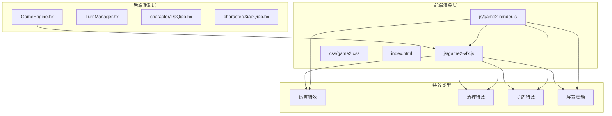
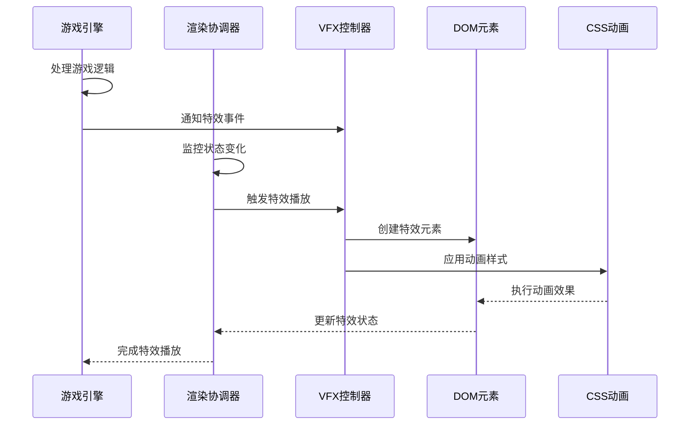
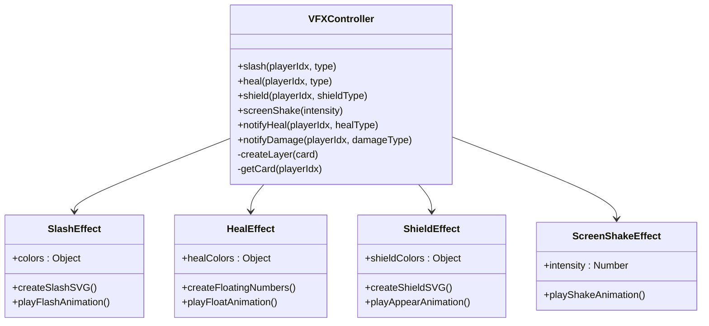
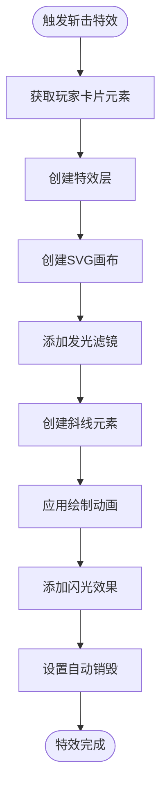
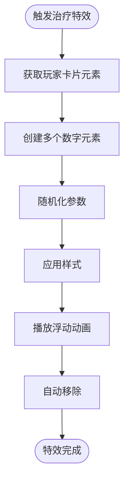
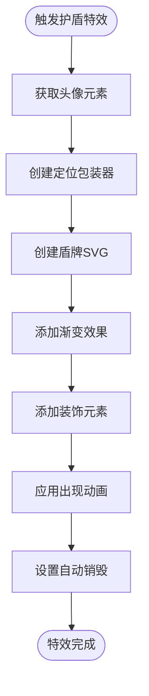
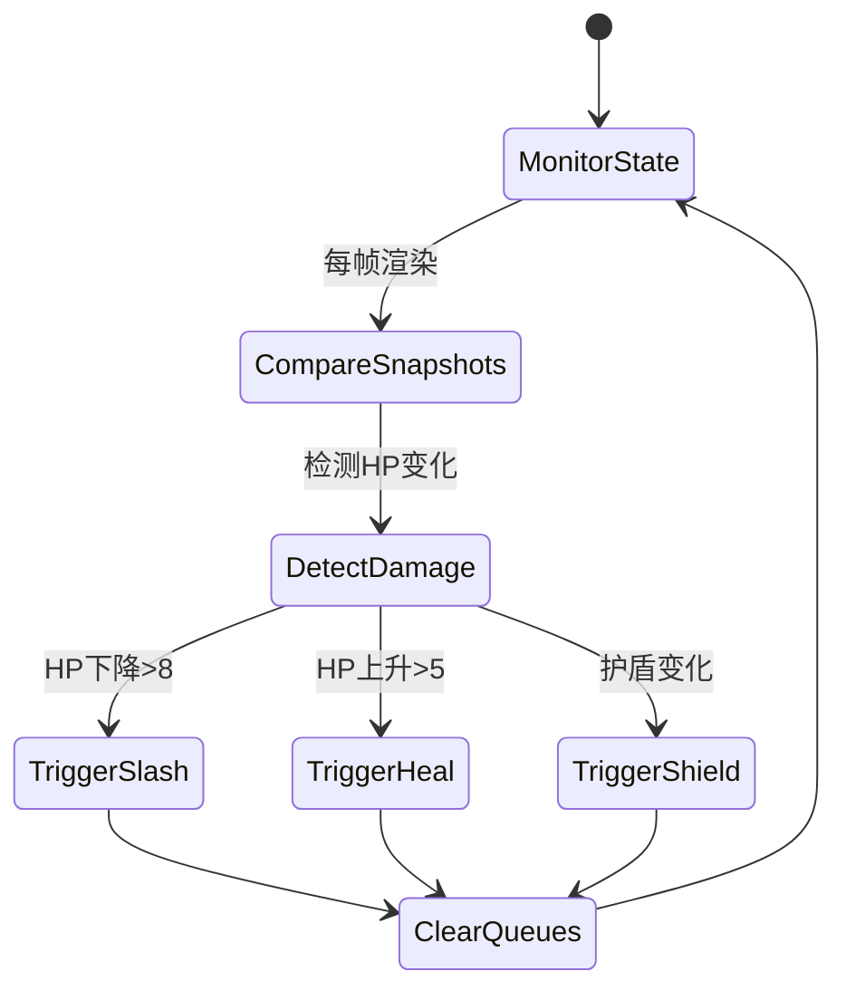
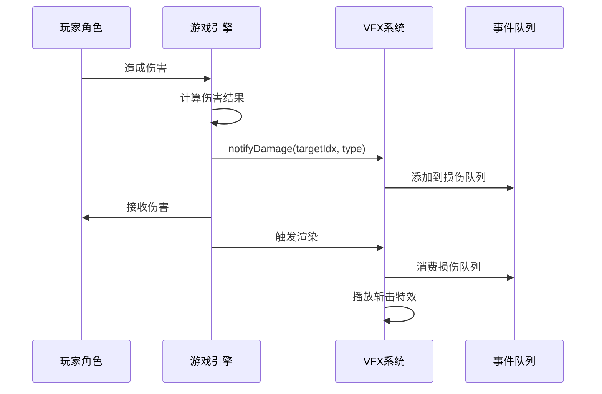
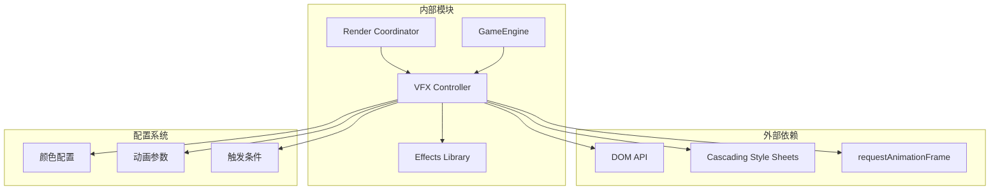
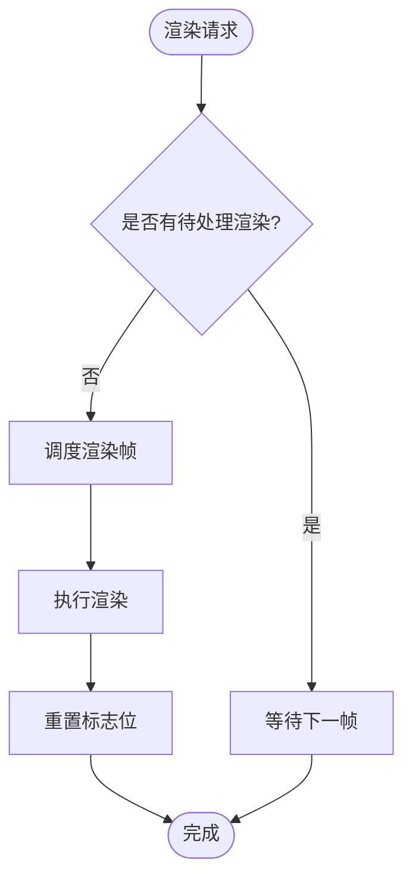

# 视觉特效系统

<cite>
**本文档引用的文件**
- [js/game2-vfx.js](file://js/game2-vfx.js)
- [js/game2-render.js](file://js/game2-render.js)
- [GameEngine.hx](file://GameEngine.hx)
- [TurnManager.hx](file://TurnManager.hx)
- [css/game2.css](file://css/game2.css)
- [character/DaQiao.hx](file://character/DaQiao.hx)
- [character/XiaoQiao.hx](file://character/XiaoQiao.hx)
- [index.html](file://index.html)
</cite>

## 目录
1. [简介](#简介)
2. [项目结构](#项目结构)
3. [核心组件](#核心组件)
4. [架构概览](#架构概览)
5. [详细组件分析](#详细组件分析)
6. [依赖关系分析](#依赖关系分析)
7. [性能考虑](#性能考虑)
8. [故障排除指南](#故障排除指南)
9. [结论](#结论)
10. [附录](#附录)

## 简介

视觉特效系统是本项目的核心组成部分，负责在战斗过程中提供丰富的视觉反馈和动画效果。该系统实现了完整的战斗动画链路，包括伤害数字显示、角色动作序列、环境特效制作等。系统采用Haxe后端逻辑与JavaScript前端渲染相结合的设计模式，通过事件驱动的方式实现特效触发机制。

系统的主要特性包括：
- 基于伤害类型的差异化特效展示
- 自动化的特效触发与手动控制相结合
- 高效的渲染优化策略
- 可配置的特效参数系统
- 完善的性能监控与调试功能

## 项目结构

视觉特效系统主要分布在以下几个关键文件中：

**图表来源**
- [js/game2-vfx.js:1-305](file://js/game2-vfx.js#L1-L305)
- [js/game2-render.js:1-304](file://js/game2-render.js#L1-L304)
- [GameEngine.hx:1-725](file://GameEngine.hx#L1-L725)

**章节来源**
- [js/game2-vfx.js:1-305](file://js/game2-vfx.js#L1-L305)
- [js/game2-render.js:1-304](file://js/game2-render.js#L1-L304)
- [GameEngine.hx:1-725](file://GameEngine.hx#L1-L725)

## 核心组件

视觉特效系统由四个核心组件构成，每个组件都有明确的职责分工：

### VFX特效控制器
VFX模块是特效系统的核心控制器，负责管理所有视觉特效的创建、播放和销毁。该模块提供了四种主要的特效类型：
- 斩击特效：用于展示物理伤害
- 治疗特效：用于展示回血效果  
- 护盾特效：用于展示护盾生成
- 屏幕震动：用于展示大伤害效果

### 渲染协调器
渲染协调器负责监控游戏状态变化，并在适当的时机触发相应的特效。它通过比较前后状态来检测伤害、治疗和护盾的变化，然后调用VFX模块播放对应的特效。

### 游戏引擎集成
游戏引擎通过事件通知机制向VFX系统传递特效触发信号。当发生伤害、治疗或护盾事件时，引擎会调用VFX的相应通知方法。

### 特效配置系统
系统内置了完整的特效配置系统，包括颜色方案、动画参数、触发条件等。这些配置可以通过CSS和JavaScript进行灵活调整。

**章节来源**
- [js/game2-vfx.js:11-305](file://js/game2-vfx.js#L11-L305)
- [js/game2-render.js:64-210](file://js/game2-render.js#L64-L210)
- [GameEngine.hx:219-233](file://GameEngine.hx#L219-L233)

## 架构概览

视觉特效系统的整体架构采用了分层设计，确保了良好的模块化和可维护性：

**图表来源**
- [GameEngine.hx:219-233](file://GameEngine.hx#L219-L233)
- [js/game2-render.js:156-210](file://js/game2-render.js#L156-L210)
- [js/game2-vfx.js:54-119](file://js/game2-vfx.js#L54-L119)

系统的关键优势在于其事件驱动的设计模式，使得特效触发与游戏逻辑完全分离，提高了系统的灵活性和可扩展性。

## 详细组件分析

### VFX特效控制器详解

VFX控制器是整个特效系统的核心，负责管理所有视觉特效的生命周期。该控制器采用立即执行函数模式，确保了全局作用域的安全性和模块化。

#### 特效类型与参数

系统支持四种主要的特效类型，每种特效都有其独特的视觉表现和参数配置：

**图表来源**
- [js/game2-vfx.js:11-305](file://js/game2-vfx.js#L11-L305)

#### 斩击特效实现

斩击特效是最复杂的特效之一，它结合了SVG线条绘制和CSS动画来创造逼真的剑气效果：

**图表来源**
- [js/game2-vfx.js:54-119](file://js/game2-vfx.js#L54-L119)

斩击特效的特点包括：
- 使用SVG绘制两条平行斜线，模拟剑气轨迹
- 通过CSS动画实现线条绘制和闪光效果
- 支持多种伤害类型的颜色区分
- 自动清理机制确保内存安全

#### 治疗特效实现

治疗特效通过创建多个浮动的"+"符号来展示回血效果：

**图表来源**
- [js/game2-vfx.js:124-159](file://js/game2-vfx.js#L124-L159)

治疗特效的关键特性：
- 数字数量随机化，增加视觉多样性
- 每个数字独立的动画时序
- 支持回复和补给两种类型
- 精确的生命周期管理

#### 护盾特效实现

护盾特效通过SVG绘制精美的盾牌图标来展示护盾生成：

**图表来源**
- [js/game2-vfx.js:164-224](file://js/game2-vfx.js#L164-L224)

护盾特效的设计亮点：
- 支持物理、魔法、物法护盾等多种类型
- 精细的SVG图形设计，包含多个装饰元素
- 流畅的缩放和透明度动画
- 智能的定位系统，确保特效始终位于头像中心

### 渲染协调器工作原理

渲染协调器是特效系统与游戏状态之间的桥梁，负责监控状态变化并触发相应的特效：

**图表来源**
- [js/game2-render.js:64-210](file://js/game2-render.js#L64-L210)

渲染协调器的核心功能包括：
- 状态快照机制，用于前后帧对比
- 智能的特效触发条件判断
- 队列管理系统，避免特效冲突
- 自动清理机制，确保内存安全

### 游戏引擎集成机制

游戏引擎通过事件通知机制与VFX系统深度集成：

**图表来源**
- [GameEngine.hx:219-233](file://GameEngine.hx#L219-L233)
- [js/game2-render.js:164-182](file://js/game2-render.js#L164-L182)

这种设计模式的优势：
- 完全解耦的游戏逻辑与视觉表现
- 支持异步特效播放
- 避免多帧竞态条件
- 灵活的特效参数传递

**章节来源**
- [js/game2-vfx.js:11-305](file://js/game2-vfx.js#L11-L305)
- [js/game2-render.js:64-210](file://js/game2-render.js#L64-L210)
- [GameEngine.hx:219-233](file://GameEngine.hx#L219-L233)

## 依赖关系分析

视觉特效系统的依赖关系相对简单，主要体现了清晰的分层架构：

**图表来源**
- [js/game2-vfx.js:14-34](file://js/game2-vfx.js#L14-L34)
- [js/game2-render.js:31-51](file://js/game2-render.js#L31-L51)

系统的关键依赖特点：
- 最小化外部依赖，提高可移植性
- 清晰的模块边界，便于测试和维护
- 配置与逻辑分离，支持动态调整
- 事件驱动架构，降低耦合度

**章节来源**
- [js/game2-vfx.js:14-34](file://js/game2-vfx.js#L14-L34)
- [js/game2-render.js:31-51](file://js/game2-render.js#L31-L51)

## 性能考虑

视觉特效系统在设计时充分考虑了性能优化，采用了多种策略来确保流畅的用户体验：

### requestAnimationFrame优化

系统使用requestAnimationFrame来确保动画与浏览器刷新频率同步：

**图表来源**
- [js/game2-render.js:31-51](file://js/game2-render.js#L31-L51)

### 内存管理策略

系统采用多种内存管理技术来避免内存泄漏：

1. **自动销毁机制**：所有特效元素都有固定的生命期，到期自动移除
2. **队列管理**：使用队列存储特效事件，避免重复触发
3. **DOM复用**：尽量复用现有的DOM元素而非频繁创建销毁

### GPU加速利用

系统充分利用现代浏览器的GPU加速能力：

- CSS3硬件加速：使用transform和opacity属性
- SVG硬件加速：利用GPU渲染矢量图形
- 动画优化：通过CSS动画而非JavaScript动画

**章节来源**
- [js/game2-render.js:31-51](file://js/game2-render.js#L31-L51)
- [js/game2-vfx.js:258-300](file://js/game2-vfx.js#L258-L300)

## 故障排除指南

### 常见问题诊断

#### 特效不显示问题

可能的原因和解决方案：
1. **DOM元素缺失**：检查玩家卡片元素是否存在
2. **CSS样式冲突**：验证特效相关的CSS类是否正确应用
3. **动画被禁用**：确认浏览器的动画设置

#### 性能问题排查

性能问题的常见症状和解决方法：
1. **卡顿现象**：检查是否有过多同时播放的特效
2. **内存泄漏**：确认特效元素是否正确销毁
3. **渲染延迟**：验证requestAnimationFrame的使用情况

#### 特效触发异常

特效触发失败的排查步骤：
1. **事件队列检查**：确认VFX._healQueue和VFX._damageQueue的状态
2. **状态快照对比**：验证_renderSnapshot的正确性
3. **类型匹配问题**：检查伤害类型转换逻辑

**章节来源**
- [js/game2-vfx.js:242-255](file://js/game2-vfx.js#L242-L255)
- [js/game2-render.js:64-86](file://js/game2-render.js#L64-L86)

## 结论

视觉特效系统通过精心设计的架构和优化策略，成功实现了高质量的战斗动画效果。系统的主要成就包括：

1. **模块化设计**：清晰的分层架构确保了良好的可维护性
2. **性能优化**：采用多种技术手段保证了流畅的用户体验
3. **扩展性强**：灵活的配置系统支持新特效的快速添加
4. **稳定性高**：完善的错误处理和内存管理机制

未来可以考虑的改进方向：
- 增加更多的特效类型和自定义选项
- 优化移动端的性能表现
- 提供更丰富的特效参数调节界面
- 增强特效的个性化定制能力

## 附录

### 特效配置参考

系统支持的特效类型和参数配置：

| 特效类型 | 支持的参数 | 默认值 |
|---------|-----------|--------|
| 斩击特效 | 物理、法术、真实、毒 | 物理 |
| 治疗特效 | 回复、补给 | 回复 |
| 护盾特效 | 物理、魔法、物法、真实 | 物理 |
| 屏幕震动 | 强度级别 | 1 |

### 开发指南

#### 添加新特效的步骤

1. **定义特效参数**：在VFX模块中添加新的特效类型
2. **实现特效逻辑**：编写特效的创建和播放代码
3. **注册CSS动画**：添加必要的CSS关键帧定义
4. **集成触发机制**：在渲染协调器中添加触发条件
5. **测试和调试**：验证特效的正确性和性能表现

#### 性能优化建议

1. **批量处理**：将相似的特效合并处理
2. **延迟加载**：按需创建特效元素
3. **缓存优化**：复用常用的DOM元素和样式
4. **事件节流**：避免过于频繁的特效触发