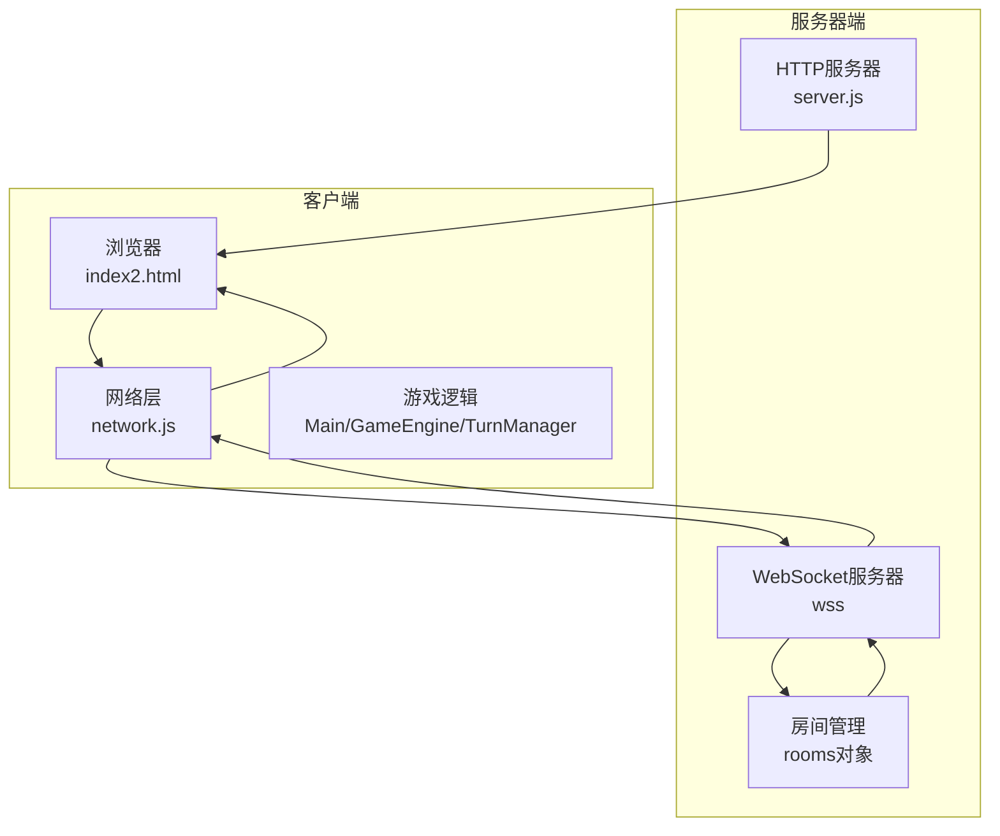
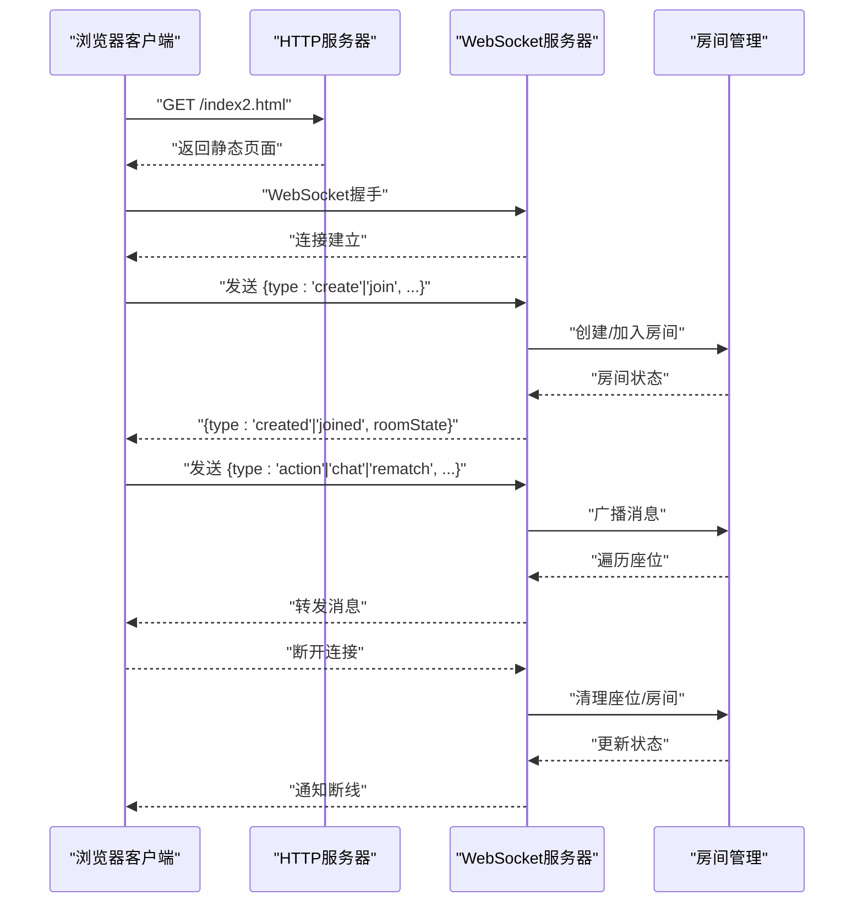
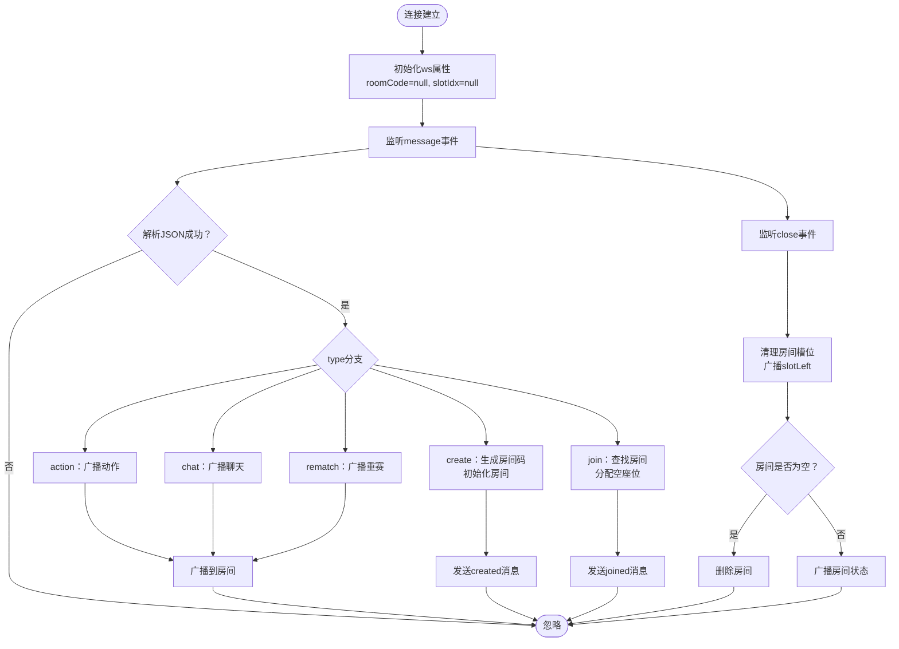
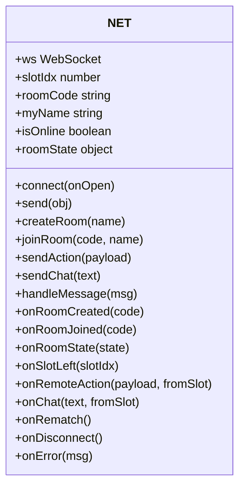
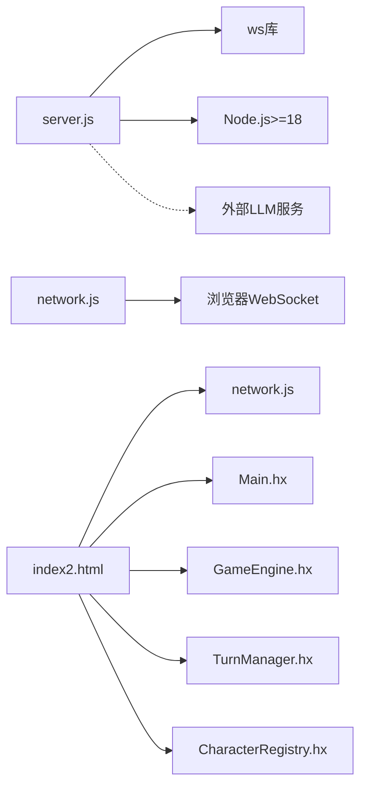

# WebSocket服务器架构

<cite>
**本文档引用的文件**
- [server.js](file://server.js)
- [network.js](file://network.js)
- [js/server.js](file://js/server.js)
- [package.json](file://package.json)
- [index2.html](file://index2.html)
- [Main.hx](file://Main.hx)
- [GameEngine.hx](file://GameEngine.hx)
- [TurnManager.hx](file://TurnManager.hx)
- [character/CharacterRegistry.hx](file://character/CharacterRegistry.hx)
</cite>

## 目录
1. [简介](#简介)
2. [项目结构](#项目结构)
3. [核心组件](#核心组件)
4. [架构总览](#架构总览)
5. [详细组件分析](#详细组件分析)
6. [依赖关系分析](#依赖关系分析)
7. [性能考虑](#性能考虑)
8. [故障排查指南](#故障排查指南)
9. [结论](#结论)
10. [附录](#附录)

## 简介
本项目是一个基于Node.js的WebSocket服务器，采用HTTP服务器与WebSocket服务器集成的方式，提供4人房间联机对战功能。服务器负责房间管理与消息中转，不执行游戏逻辑，游戏逻辑由前端Haxe编译产物与HTML页面共同完成。系统支持房间创建、加入、聊天、动作广播、断线接管等核心能力，并提供AI训练、权重管理、知识库等功能。

## 项目结构
项目采用前后端一体化部署，核心文件组织如下：
- 服务器端：server.js（主服务器）、js/server.js（备用/复制版本）
- 客户端联机层：network.js（WebSocket客户端封装）
- 前端页面：index2.html（2v2对战界面）
- 游戏引擎与逻辑：Main.hx、GameEngine.hx、TurnManager.hx、character/CharacterRegistry.hx
- 依赖配置：package.json（ws依赖、Node版本要求）

**图表来源**
- [server.js:14-215](file://server.js#L14-L215)
- [server.js:217-344](file://server.js#L217-L344)
- [network.js:5-113](file://network.js#L5-L113)

**章节来源**
- [server.js:1-344](file://server.js#L1-L344)
- [package.json:1-16](file://package.json#L1-L16)

## 核心组件
- HTTP服务器与静态文件托管：提供API接口（权重、知识库、AI代理、音乐列表、日志上传）与静态资源服务。
- WebSocket服务器：集成在同一个HTTP服务器之上，负责房间管理与消息中转。
- 房间管理系统：维护房间代码、座位槽位、座位名称、房主信息等。
- 客户端网络层：封装WebSocket连接、消息发送与接收、事件回调处理。
- 前端游戏逻辑：Haxe编译产物与HTML页面，负责渲染、用户交互、AI决策与动作执行。

**章节来源**
- [server.js:14-215](file://server.js#L14-L215)
- [server.js:217-344](file://server.js#L217-L344)
- [network.js:5-113](file://network.js#L5-L113)

## 架构总览
服务器采用“HTTP + WebSocket”一体化架构，HTTP服务器负责：
- 静态文件服务（index2.html及相关资源）
- API接口：权重读写、知识库读写、技能文档查询、AI代理转发、音乐列表、日志上传
- 安全校验：路径安全检查、跨域响应头设置

WebSocket服务器负责：
- 连接建立与握手
- 房间创建与加入
- 消息类型分发（动作、聊天、重赛）
- 断线处理与房间清理
- 房间状态广播

**图表来源**
- [server.js:263-339](file://server.js#L263-L339)
- [network.js:13-30](file://network.js#L13-L30)

## 详细组件分析

### HTTP服务器与静态文件托管
- 路由处理：解析URL、查询参数、请求体，提供JSON/文本响应。
- API接口：
  - /api/weights：GET读取、POST写入权重文件
  - /api/knowledge：GET读取、POST追加知识库内容
  - /api/skill：按名称读取技能文档
  - /api/ai：代理LLM请求（Minimax、千帆、DeepSeek）
  - /api/skill-weight：更新技能权重块与追加复盘
  - /api/log：保存训练日志
  - /api/music：列出音乐文件
- 安全与校验：路径解析与安全检查，防止目录穿越；跨域响应头设置。
- 静态文件：根据扩展名映射MIME类型，支持HTML、CSS、JS、图片、音频等。

**章节来源**
- [server.js:14-215](file://server.js#L14-L215)

### WebSocket服务器与房间管理
- 服务器集成：通过HTTP服务器创建WebSocket服务器实例，共享端口与上下文。
- 房间数据结构：rooms[code]包含slots、slotNames、hostSlot等字段。
- 连接处理：
  - 连接建立：初始化ws.roomCode与ws.slotIdx
  - 消息处理：解析JSON，按type分发到对应处理逻辑
  - 断线处理：清理房间槽位，广播slotLeft，房间空则删除
- 房间操作：
  - create：生成随机房间码，初始化房主座位
  - join：查找房间，分配首个空座位
  - action/chat/rematch：广播到房间内除发送者外的所有人
- 状态广播：broadcastRoomState用于同步房间概要（座位占用、名称、房主）

**图表来源**
- [server.js:263-339](file://server.js#L263-L339)

**章节来源**
- [server.js:217-344](file://server.js#L217-L344)

### 客户端网络层（network.js）
- 连接管理：根据协议选择ws或wss，建立WebSocket连接，处理onopen/onclose/onmessage。
- 消息封装：send方法封装JSON序列化与readyState检查。
- 房间操作：createRoom、joinRoom封装消息发送。
- 消息分发：handleMessage根据type分发到对应回调（onRoomCreated、onRoomJoined、onRoomState、onRemoteAction、onChat、onRematch、onError等）。
- 回调约定：游戏层需实现相应回调以处理房间状态变更与远程动作。

**图表来源**
- [network.js:5-113](file://network.js#L5-L113)

**章节来源**
- [network.js:5-113](file://network.js#L5-L113)

### 前端游戏逻辑与联机集成
- 页面入口：index2.html提供2v2对战界面、角色选择、AI配置、训练面板等。
- 联机集成：加载network.js与game2-online.js，通过NET.connect建立WebSocket连接，处理房间创建/加入、房间状态、远程动作、聊天等。
- 游戏引擎：Main.hx、GameEngine.hx、TurnManager.hx提供完整的回合制战斗逻辑，Haxe编译产物在浏览器中运行。
- 角色注册：CharacterRegistry.hx集中管理角色工厂与元数据，供前端下拉选择与游戏初始化使用。

**章节来源**
- [index2.html:1-988](file://index2.html#L1-L988)
- [Main.hx:1-411](file://Main.hx#L1-L411)
- [GameEngine.hx:1-200](file://GameEngine.hx#L1-L200)
- [TurnManager.hx:1-200](file://TurnManager.hx#L1-L200)
- [character/CharacterRegistry.hx:1-82](file://character/CharacterRegistry.hx#L1-L82)

## 依赖关系分析
- 服务器依赖：ws（WebSocket库）、Node.js 18+
- 客户端依赖：浏览器原生WebSocket API
- 前端依赖：Haxe编译产物、浏览器DOM API
- 外部服务：AI代理（Minimax、千帆、DeepSeek）需要对应API密钥环境变量

**图表来源**
- [package.json:9-14](file://package.json#L9-L14)
- [server.js:5-8](file://server.js#L5-L8)

**章节来源**
- [package.json:1-16](file://package.json#L1-L16)

## 性能考虑
- 连接池与内存：rooms对象存储房间状态，注意房间数量增长导致的内存占用；建议设置最大房间数与超时清理策略。
- 广播效率：broadcastRoomState遍历房间所有座位，4人房间开销较小；若扩展至更大规模，应考虑优化广播算法。
- 消息解析：JSON.parse在消息处理中频繁调用，建议增加消息格式校验与长度限制，避免恶意或异常消息。
- 文件I/O：权重、知识库、日志写入为同步操作，建议异步化并添加队列与错误处理。
- 端口与并发：HTTP与WebSocket共享同一端口，适合开发环境；生产环境建议分离端口并启用负载均衡。
- AI代理：外部API调用可能成为瓶颈，建议引入缓存、限流与降级策略。

[本节为通用性能指导，不直接分析具体文件]

## 故障排查指南
- 连接失败
  - 检查服务器端口与防火墙设置
  - 确认浏览器协议与服务器一致（ws/wss）
  - 查看浏览器开发者工具Network面板的WebSocket握手日志
- 房间创建/加入失败
  - 确认用户名非空
  - 检查房间是否存在与是否已满
  - 查看服务器控制台输出与客户端错误回调
- 消息不转发
  - 确认消息格式为合法JSON
  - 检查消息type是否受支持
  - 验证发送者是否处于有效房间
- 断线处理异常
  - 确认onclose事件是否触发
  - 检查房间清理逻辑与广播slotLeft
- AI代理错误
  - 检查环境变量（MINIMAX_API_KEY、QIANFAN_API_KEY、DEEPSEEK_API_KEY）
  - 查看代理请求的响应状态与错误信息
- 静态资源404
  - 检查路径安全校验与文件存在性
  - 确认MIME类型映射正确

**章节来源**
- [server.js:263-339](file://server.js#L263-L339)
- [network.js:18-29](file://network.js#L18-L29)

## 结论
本WebSocket服务器架构通过HTTP与WebSocket的紧密集成，实现了房间管理与消息中转的核心功能。服务器职责清晰，客户端网络层简洁可靠，前端游戏逻辑完整。建议在生产环境中增强安全校验、性能优化与监控告警，以提升稳定性与可维护性。

[本节为总结性内容，不直接分析具体文件]

## 附录

### 服务器配置选项
- 端口：默认3000，可通过环境变量PORT覆盖
- 权重文件：ai/weights.json
- 知识库文件：ai/knowledge.md
- 音乐目录：music1/
- 日志目录：log/

**章节来源**
- [server.js:10-12](file://server.js#L10-L12)

### 性能调优参数
- 房间清理：房间空闲超时清理
- 广播优化：按房间分片广播，减少遍历成本
- 消息队列：异步处理文件I/O与外部API调用
- 连接限制：设置最大连接数与消息大小限制

[本节为通用优化建议，不直接分析具体文件]

### 监控指标收集
- 连接数：当前活跃WebSocket连接数
- 房间数：当前房间总数与平均房间规模
- 消息统计：不同类型消息的发送/接收计数
- 错误率：连接失败、消息解析失败、断线率
- 外部API：AI代理请求耗时与成功率

[本节为通用监控建议，不直接分析具体文件]