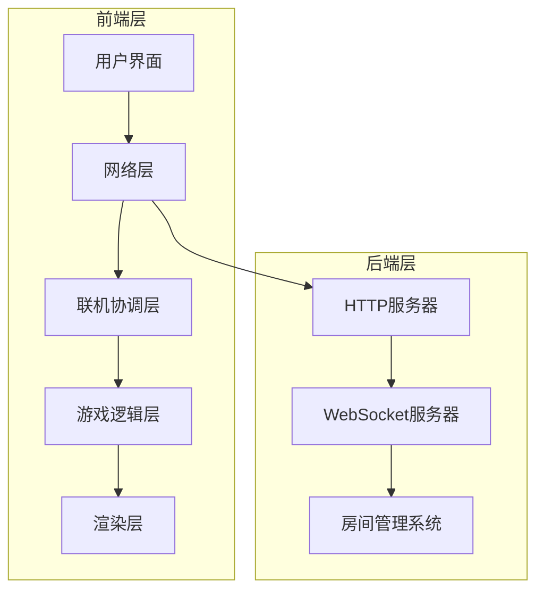
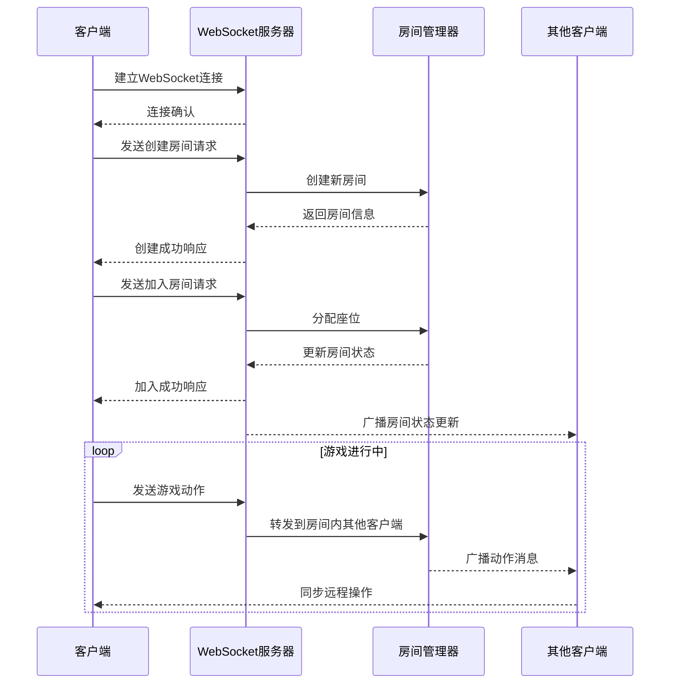
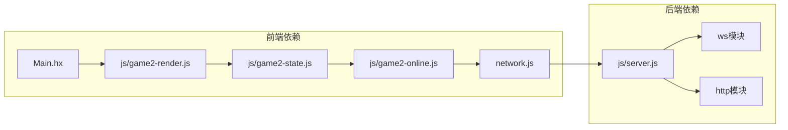

# 客户端集成指南

<cite>
**本文档引用的文件**
- [network.js](file://network.js)
- [game2-online.js](file://js/game2-online.js)
- [server.js](file://js/server.js)
- [package.json](file://package.json)
- [index.html](file://index.html)
- [game2-state.js](file://js/game2-state.js)
- [game2-render.js](file://js/game2-render.js)
- [Main.hx](file://Main.hx)
- [GameEngine.hx](file://GameEngine.hx)
- [TurnManager.hx](file://TurnManager.hx)
- [CharacterRegistry.hx](file://character/CharacterRegistry.hx)
</cite>

## 目录
1. [简介](#简介)
2. [项目结构](#项目结构)
3. [核心组件](#核心组件)
4. [架构概览](#架构概览)
5. [详细组件分析](#详细组件分析)
6. [依赖关系分析](#依赖关系分析)
7. [性能考虑](#性能考虑)
8. [故障排除指南](#故障排除指南)
9. [结论](#结论)
10. [附录](#附录)

## 简介
本指南面向需要集成WebSocket联机功能的开发者，详细说明了如何在现有HTML5/JavaScript项目中实现稳定的多人对战联机功能。项目采用前后端分离架构，前端使用JavaScript实现游戏逻辑和UI交互，后端使用Node.js + WebSocket提供房间管理和消息转发服务。

## 项目结构
该项目采用模块化设计，主要分为以下层次：

**图表来源**
- [network.js:1-113](file://network.js#L1-L113)
- [game2-online.js:1-169](file://js/game2-online.js#L1-L169)
- [server.js:1-344](file://js/server.js#L1-L344)

**章节来源**
- [network.js:1-113](file://network.js#L1-L113)
- [game2-online.js:1-169](file://js/game2-online.js#L1-L169)
- [server.js:1-344](file://js/server.js#L1-L344)

## 核心组件
本项目的核心组件包括网络通信层、联机协调层、游戏逻辑层和渲染层，每个组件都有明确的职责分工：

### 网络通信层 (Network Layer)
负责WebSocket连接管理、消息序列化/反序列化、连接状态维护等底层通信功能。

### 联机协调层 (Online Coordination Layer)
处理房间管理、角色控制分配、远程操作同步等高级联机功能。

### 游戏逻辑层 (Game Logic Layer)
实现核心游戏规则、回合管理、角色行为等业务逻辑。

### 渲染层 (Rendering Layer)
负责UI更新、视觉效果、用户交互响应等前端展示功能。

**章节来源**
- [network.js:5-113](file://network.js#L5-L113)
- [game2-online.js:5-60](file://js/game2-online.js#L5-L60)
- [game2-state.js:5-242](file://js/game2-state.js#L5-L242)
- [game2-render.js:1-304](file://js/game2-render.js#L1-L304)

## 架构概览
系统采用客户端-服务器架构，支持4人房间对战：

**图表来源**
- [server.js:263-339](file://js/server.js#L263-L339)
- [network.js:13-30](file://network.js#L13-L30)

**章节来源**
- [server.js:217-344](file://js/server.js#L217-L344)
- [network.js:1-113](file://network.js#L1-L113)

## 详细组件分析

### WebSocket连接建立与管理

#### 连接URL配置
网络层自动根据当前页面协议选择合适的WebSocket地址：
- HTTPS环境：使用wss://协议
- HTTP环境：使用ws://协议
- 地址：`{protocol}://{host}`

#### 连接状态监听
连接状态通过以下事件进行监听：
- `onopen`: 连接建立时触发，设置在线状态为true
- `onclose`: 连接断开时触发，设置在线状态为false并调用断线处理
- `onmessage`: 接收消息时触发，解析JSON并分发到相应处理器

#### 重连机制实现
当前实现提供了基本的断线检测和错误提示，但未包含自动重连逻辑。建议在生产环境中添加指数退避重连策略。

**章节来源**
- [network.js:13-30](file://network.js#L13-L30)
- [network.js:18-25](file://network.js#L18-L25)
- [network.js:26-29](file://network.js#L26-L29)

### 消息发送接口

#### 房间操作消息
- `createRoom(name)`: 创建房间，房主自动获得座位0
- `joinRoom(code, name)`: 加入指定房间
- `sendAction(payload)`: 发送游戏动作
- `sendChat(text)`: 发送聊天消息

#### 游戏动作消息
支持多种游戏动作类型：
- `attack`: 标准攻击动作
- `wukong02`: 孙悟空特殊技能
- `toggleTank`: 抗伤位切换
- `helpTank`: 帮助抗伤
- `cake`: 藏师使用蛋糕
- `steal`: 大乔抢夺

#### 聊天消息
简单的文本聊天功能，支持房间内所有玩家可见。

**章节来源**
- [network.js:38-54](file://network.js#L38-L54)
- [game2-online.js:25-28](file://js/game2-online.js#L25-L28)
- [server.js:300-311](file://js/server.js#L300-L311)

### 消息接收处理

#### 事件监听机制
网络层通过消息类型分发到相应的处理器：
- `created/joined`: 房间创建/加入确认
- `roomState`: 房间状态更新
- `slotLeft`: 座位离开通知
- `action`: 远程动作同步
- `chat`: 聊天消息
- `rematch`: 重新匹配请求
- `error`: 错误消息

#### 消息解析与UI更新
联机协调层负责解析远程消息并更新UI：
- `onRoomState()`: 更新房间座位显示
- `onRemoteAction()`: 执行远程游戏动作
- `onSlotLeft()`: 处理玩家离线接管
- `onError()`: 显示错误信息

**章节来源**
- [network.js:56-100](file://network.js#L56-L100)
- [game2-online.js:62-168](file://js/game2-online.js#L62-L168)

### 房间状态管理

#### 房间列表获取
房间管理器维护房间字典，支持房间创建、查找和清理：
- `genCode()`: 生成唯一房间码
- `broadcast()`: 向房间内所有客户端广播消息
- `broadcastRoomState()`: 广播房间状态摘要

#### 座位信息显示
房间状态包含以下信息：
- `slotNames`: 座位玩家名称数组
- `slotOccupied`: 座位占用状态布尔数组
- `hostSlot`: 房主座位索引

#### 玩家状态跟踪
支持玩家离线检测和自动接管：
- `onSlotLeft()`: 处理玩家离线
- `handleSlotLeft()`: 自动将离线玩家控制的角色转交给AI

**章节来源**
- [server.js:227-261](file://js/server.js#L227-L261)
- [server.js:321-339](file://js/server.js#L321-L339)
- [game2-online.js:35-43](file://js/game2-online.js#L35-L43)

### 客户端错误处理

#### 连接失败处理
- 断线检测：连接断开时设置在线状态为false
- 错误提示：显示友好的错误信息
- 状态恢复：断线后重置相关状态

#### 消息超时处理
当前实现未包含消息超时检测机制，建议添加消息确认和重发机制。

#### 断线重连处理
- 断线检测：通过WebSocket close事件识别
- 状态清理：断线时清理房间状态
- 用户提示：向用户显示断线信息

**章节来源**
- [network.js:22-25](file://network.js#L22-L25)
- [network.js:160-162](file://js/game2-online.js#L160-L162)
- [network.js:147-149](file://js/game2-online.js#L147-L149)

### 调试工具使用

#### 性能监控
- 日志系统：使用trace函数记录游戏事件
- 状态快照：定期保存游戏状态用于调试
- 性能指标：监控渲染频率和消息延迟

#### 最佳实践建议
- 使用requestAnimationFrame优化渲染
- 实施消息批处理减少DOM操作
- 添加防抖机制处理频繁UI更新

**章节来源**
- [Main.hx:56-76](file://Main.hx#L56-L76)
- [game2-render.js:31-51](file://js/game2-render.js#L31-L51)

## 依赖关系分析

**图表来源**
- [package.json:9-11](file://package.json#L9-L11)
- [network.js:1-113](file://network.js#L1-L113)
- [server.js:5-8](file://js/server.js#L5-L8)

**章节来源**
- [package.json:1-16](file://package.json#L1-L16)
- [network.js:1-113](file://network.js#L1-L113)
- [server.js:1-344](file://js/server.js#L1-L344)

## 性能考虑
- **渲染优化**：使用requestAnimationFrame批量更新DOM
- **消息处理**：实施消息去重和批处理机制
- **内存管理**：及时清理事件监听器和定时器
- **网络优化**：压缩消息负载，实施心跳检测

## 故障排除指南

### 常见问题及解决方案

#### 连接问题
- **问题**：WebSocket连接失败
- **原因**：HTTPS与HTTP混用、防火墙阻拦
- **解决**：确保前后端协议一致，检查服务器端口开放

#### 消息丢失
- **问题**：部分消息未到达
- **原因**：网络不稳定、消息格式错误
- **解决**：添加消息确认机制，验证JSON格式

#### UI不同步
- **问题**：客户端UI状态不一致
- **原因**：消息处理顺序错误、状态更新时机不当
- **解决**：统一消息处理流程，使用状态机管理UI更新

**章节来源**
- [network.js:96-98](file://network.js#L96-L98)
- [game2-online.js:147-158](file://js/game2-online.js#L147-L158)

## 结论
本项目提供了一个完整的WebSocket联机解决方案，具有清晰的模块化架构和良好的扩展性。通过遵循本文档的集成指南，开发者可以快速实现稳定的多人对战功能。建议在生产环境中进一步完善错误处理、性能监控和安全防护机制。

## 附录

### API参考

#### 网络层API
- `NET.connect(onOpen)`: 建立WebSocket连接
- `NET.createRoom(name)`: 创建房间
- `NET.joinRoom(code, name)`: 加入房间
- `NET.sendAction(payload)`: 发送游戏动作
- `NET.sendChat(text)`: 发送聊天消息

#### 联机协调层API
- `ONLINE.sendAction(payload)`: 发送联机动作
- `ONLINE.setControl(playerIdx, controller)`: 设置角色控制
- `ONLINE.handleSlotLeft(leftSlot)`: 处理座位离线

### 配置选项
- 房间最大容量：4人
- 房间码长度：5位字母数字
- 座位索引范围：0-3
- 消息类型：10种标准类型