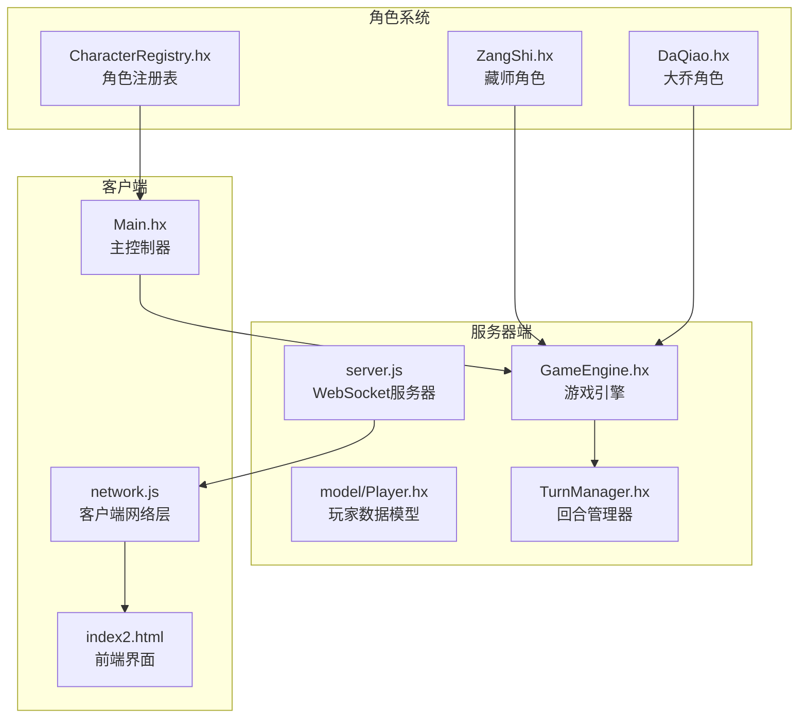
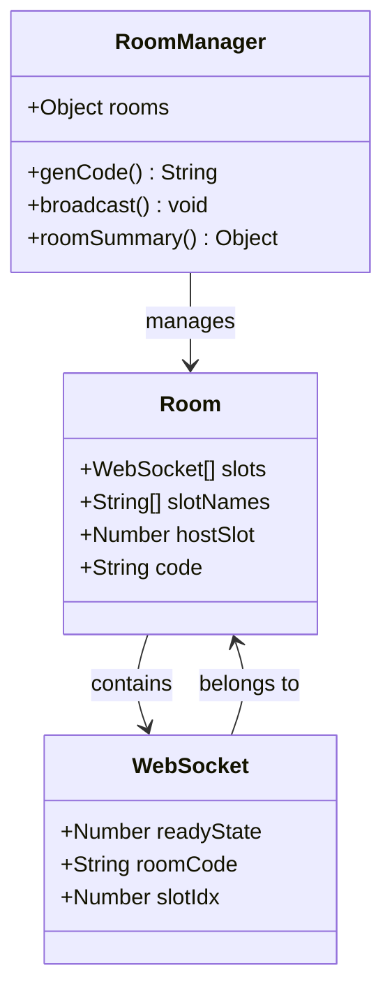
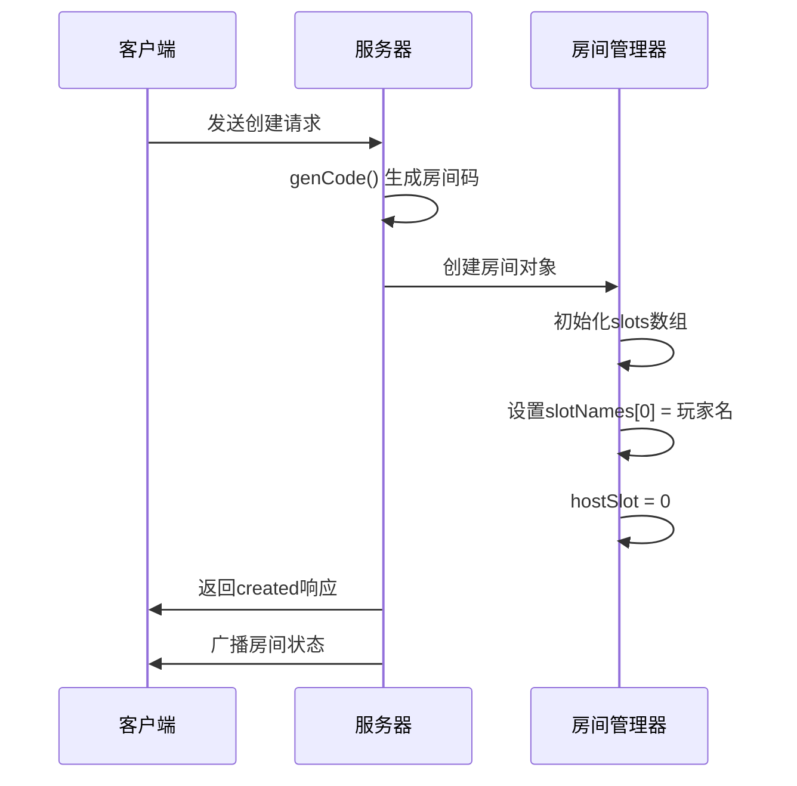
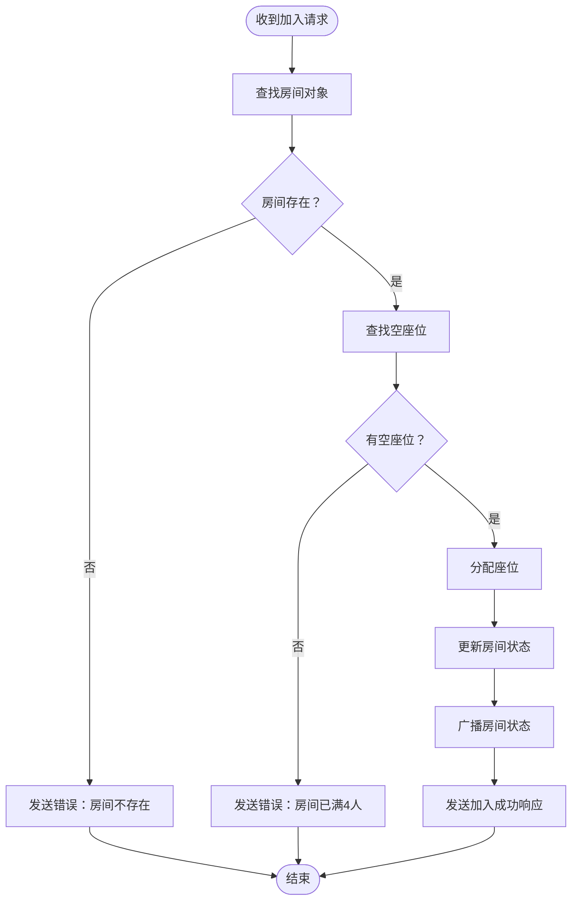
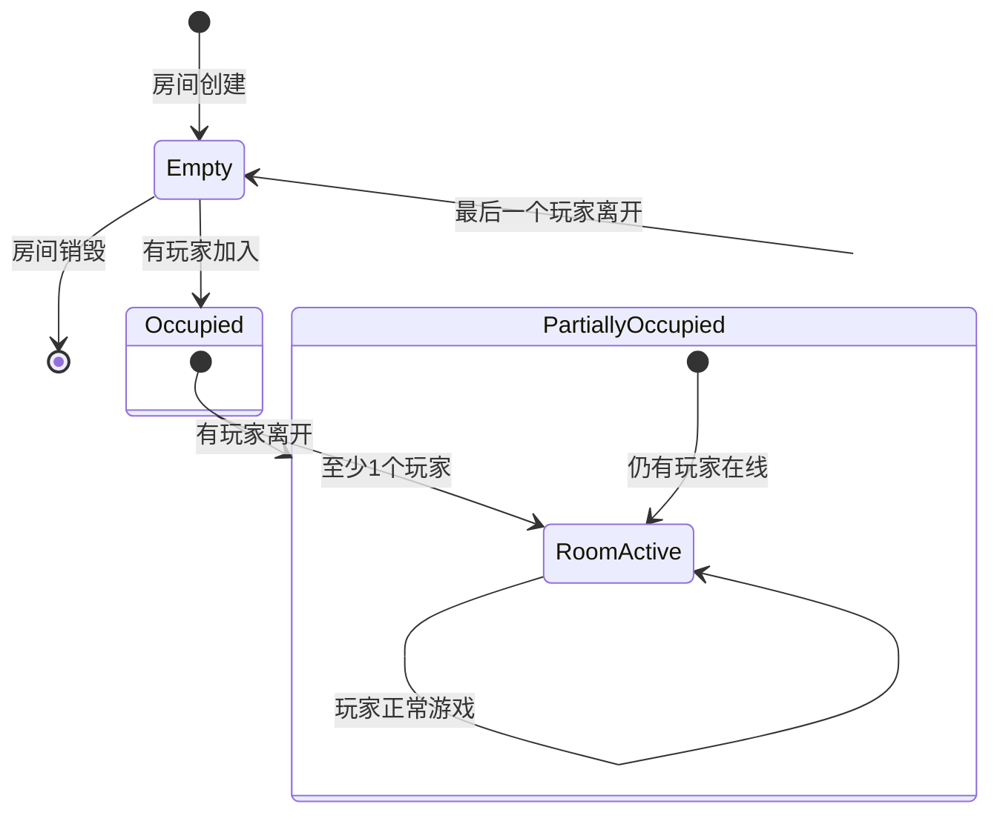
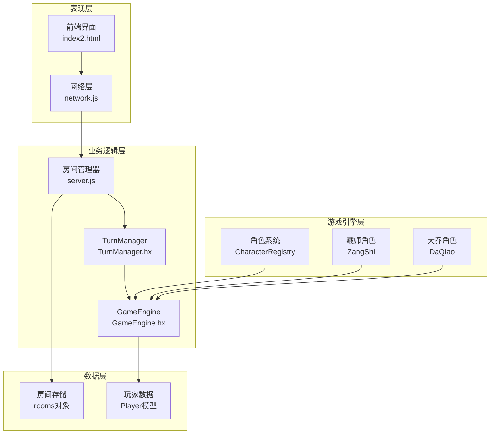
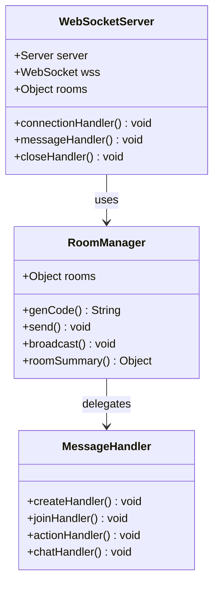
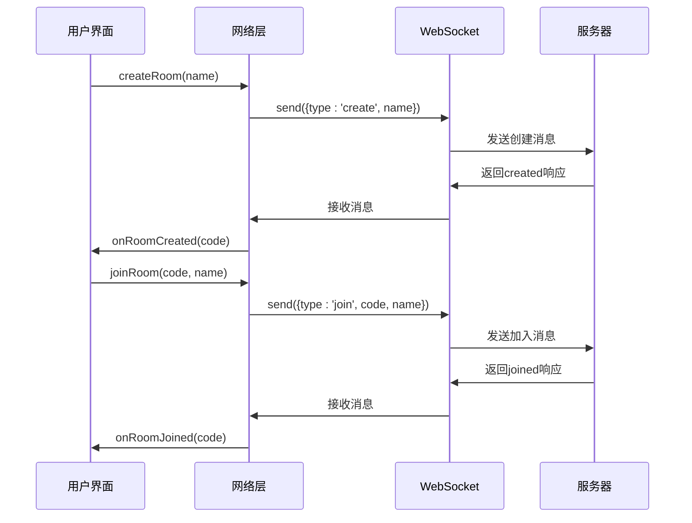
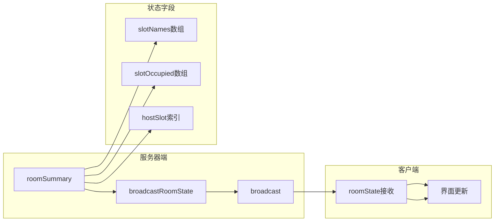
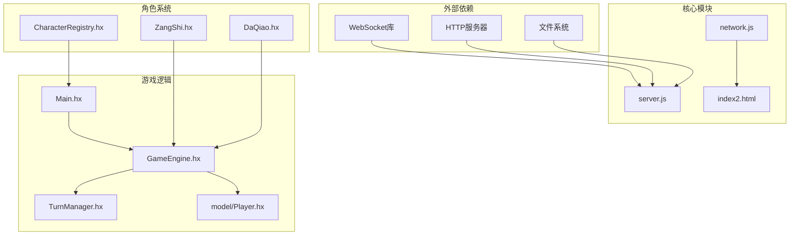

# 房间管理系统

<cite>
**本文档引用的文件**
- [server.js](file://server.js)
- [network.js](file://network.js)
- [index2.html](file://index2.html)
- [Main.hx](file://Main.hx)
- [GameEngine.hx](file://GameEngine.hx)
- [TurnManager.hx](file://TurnManager.hx)
- [Player.hx](file://model/Player.hx)
- [CharacterRegistry.hx](file://character/CharacterRegistry.hx)
- [ZangShi.hx](file://character/ZangShi.hx)
- [DaQiao.hx](file://character/DaQiao.hx)
</cite>

## 目录
1. [简介](#简介)
2. [项目结构](#项目结构)
3. [核心组件](#核心组件)
4. [架构概览](#架构概览)
5. [详细组件分析](#详细组件分析)
6. [依赖关系分析](#依赖关系分析)
7. [性能考量](#性能考量)
8. [故障排除指南](#故障排除指南)
9. [结论](#结论)

## 简介

房间管理系统是一个基于WebSocket的4人在线对战游戏服务器，采用JavaScript/Node.js实现房间管理和消息转发功能。系统支持实时房间创建、玩家加入、座位分配、状态同步和聊天通信等功能。

该系统的核心特点包括：
- **房间数据结构**：使用slots数组管理4个座位，slotNames映射玩家名称，hostSlot固定房主权限
- **实时通信**：通过WebSocket实现实时消息传递和状态同步
- **座位管理**：自动座位查找算法和玩家身份验证
- **状态同步**：完整的房间状态摘要和在线玩家统计
- **权限控制**：基于hostSlot的房主权限管理

## 项目结构

**图表来源**
- [server.js:217-267](file://server.js#L217-L267)
- [network.js:1-113](file://network.js#L1-L113)
- [index2.html:1-200](file://index2.html#L1-L200)

**章节来源**
- [server.js:1-344](file://server.js#L1-L344)
- [network.js:1-113](file://network.js#L1-L113)
- [index2.html:1-200](file://index2.html#L1-L200)

## 核心组件

### 房间数据结构设计

房间管理系统的核心数据结构采用简洁高效的JavaScript对象：

**图表来源**
- [server.js:220-227](file://server.js#L220-L227)
- [server.js:227-228](file://server.js#L227-L228)

房间数据结构的关键特性：
- **slots数组**：固定长度4的座位数组，每个位置存储WebSocket连接或null
- **slotNames映射**：与slots对应的玩家名称数组
- **hostSlot权限**：固定房主座位索引（始终为0）

**章节来源**
- [server.js:220-261](file://server.js#L220-L261)

### 房间创建流程

房间创建采用随机代码生成算法，确保唯一性和易用性：

**图表来源**
- [server.js:229-231](file://server.js#L229-L231)
- [server.js:272-283](file://server.js#L272-L283)

房间创建的关键步骤：
1. **房间码生成**：使用Math.random().toString(36)生成5字符大写字母数字组合
2. **初始状态设置**：创建slots数组，设置房主座位和玩家名称
3. **权限分配**：hostSlot固定为0，确保房主拥有最高权限

**章节来源**
- [server.js:229-283](file://server.js#L229-L283)

### 房间加入机制

房间加入采用座位查找算法，支持动态座位分配：

**图表来源**
- [server.js:285-299](file://server.js#L285-L299)

座位查找算法的实现细节：
- **空座位查找**：使用findIndex()方法查找第一个null位置
- **座位分配**：将WebSocket连接存储到slots数组对应位置
- **状态更新**：更新slotNames数组和玩家房间信息

**章节来源**
- [server.js:285-299](file://server.js#L285-L299)

### 房间状态管理

房间状态管理包括在线玩家统计、座位占用检查和房间销毁条件：

**图表来源**
- [server.js:330-338](file://server.js#L330-L338)

状态管理的关键功能：
- **在线统计**：通过slotOccupied数组统计在线玩家数量
- **座位检查**：使用every()方法检查房间是否完全空闲
- **自动销毁**：房间空闲时自动清理内存资源

**章节来源**
- [server.js:247-261](file://server.js#L247-L261)
- [server.js:330-338](file://server.js#L330-L338)

## 架构概览

房间管理系统采用分层架构设计，清晰分离关注点：

**图表来源**
- [server.js:217-267](file://server.js#L217-L267)
- [network.js:13-36](file://network.js#L13-L36)

## 详细组件分析

### WebSocket服务器组件

WebSocket服务器是房间管理系统的核心基础设施：

**图表来源**
- [server.js:217-267](file://server.js#L217-L267)
- [server.js:263-339](file://server.js#L263-L339)

WebSocket服务器的关键特性：
- **连接管理**：维护WebSocket连接池和房间映射
- **消息路由**：根据消息类型分发到相应处理器
- **状态同步**：实时广播房间状态变化

**章节来源**
- [server.js:217-339](file://server.js#L217-L339)

### 客户端网络层组件

客户端网络层提供统一的网络通信接口：

**图表来源**
- [network.js:38-78](file://network.js#L38-L78)
- [network.js:56-100](file://network.js#L56-L100)

客户端网络层的功能特性：
- **连接管理**：自动建立WebSocket连接
- **消息封装**：提供简化的消息发送接口
- **回调机制**：通过回调函数处理各种事件

**章节来源**
- [network.js:1-113](file://network.js#L1-L113)

### 房间状态同步机制

房间状态同步确保所有客户端保持一致的房间视图：

**图表来源**
- [server.js:247-261](file://server.js#L247-L261)

状态同步的关键机制：
- **状态摘要**：roomSummary函数生成房间状态快照
- **广播机制**：broadcastRoomState函数向所有客户端发送状态
- **实时更新**：客户端收到roomState消息后立即更新界面

**章节来源**
- [server.js:247-261](file://server.js#L247-L261)

## 依赖关系分析

房间管理系统的依赖关系体现了清晰的分层架构：

**图表来源**
- [server.js:5-12](file://server.js#L5-L12)
- [Main.hx:3-12](file://Main.hx#L3-L12)

依赖关系的特点：
- **单向依赖**：客户端依赖服务器，游戏逻辑独立于网络层
- **松耦合设计**：各模块职责明确，相互独立
- **可扩展性**：新增角色不影响现有架构

**章节来源**
- [server.js:1-344](file://server.js#L1-L344)
- [Main.hx:1-411](file://Main.hx#L1-L411)

## 性能考量

房间管理系统的性能优化策略：

### 内存管理
- **自动垃圾回收**：WebSocket连接断开时自动清理房间对象
- **状态压缩**：只传输必要的房间状态信息
- **连接池管理**：合理管理WebSocket连接生命周期

### 网络优化
- **消息批量处理**：合并多个状态更新为单一消息
- **心跳检测**：定期检测连接有效性
- **错误恢复**：自动重连和状态同步

### 扩展性考虑
- **动态扩容**：支持未来增加更多座位
- **负载均衡**：可扩展到多服务器部署
- **缓存策略**：合理使用内存缓存提高响应速度

## 故障排除指南

### 常见问题诊断

**连接问题**
- 检查WebSocket协议是否正确（http/https对应ws/wss）
- 验证服务器端口配置（默认3000）
- 确认防火墙设置允许WebSocket连接

**房间创建失败**
- 验证房间码生成算法是否正常工作
- 检查rooms对象内存分配
- 确认房间状态初始化过程

**座位分配异常**
- 验证findIndex()方法是否正确查找空座位
- 检查slots数组边界检查
- 确认slotNames同步更新

**章节来源**
- [server.js:263-339](file://server.js#L263-L339)
- [network.js:13-36](file://network.js#L13-L36)

## 结论

房间管理系统展现了优秀的软件工程实践，具有以下突出特点：

### 设计优势
- **简洁高效**：采用最小必要功能设计，代码结构清晰
- **可扩展性强**：模块化架构支持功能扩展和性能优化
- **实时性强**：基于WebSocket的实时通信保证用户体验

### 技术亮点
- **智能座位管理**：自动座位查找和分配算法
- **完善的权限控制**：基于hostSlot的房主权限管理
- **状态同步机制**：确保客户端和服务器状态一致性

### 改进建议
- **监控指标**：添加房间使用率和性能监控
- **安全增强**：增加房间密码和访问控制
- **国际化支持**：支持多语言界面和消息

该系统为在线多人游戏提供了稳定可靠的基础设施，为后续功能扩展奠定了良好的技术基础。