# 消息路由与同步

<cite>
**本文档引用的文件**
- [server.js](file://server.js)
- [network.js](file://network.js)
- [game2-online.js](file://js/game2-online.js)
- [game2-state.js](file://js/game2-state.js)
- [game2-dialogs.js](file://js/game2-dialogs.js)
- [game2-render.js](file://js/game2-render.js)
- [Main.hx](file://Main.hx)
- [CharacterRegistry.hx](file://character/CharacterRegistry.hx)
- [ZhangFei.hx](file://character/ZhangFei.hx)
- [DaQiao.hx](file://character/DaQiao.hx)
</cite>

## 目录
1. [简介](#简介)
2. [项目结构](#项目结构)
3. [核心组件](#核心组件)
4. [架构概览](#架构概览)
5. [详细组件分析](#详细组件分析)
6. [依赖关系分析](#依赖关系分析)
7. [性能考虑](#性能考虑)
8. [故障排除指南](#故障排除指南)
9. [结论](#结论)

## 简介

本文档深入分析了指尖博弈项目的消息路由与同步机制。该项目采用WebSocket实现客户端与服务器之间的实时通信，支持四人房间制的多人对战。系统实现了完整的消息类型体系，包括房间管理、聊天、游戏动作同步等功能，并提供了完善的广播机制和错误处理策略。

## 项目结构

项目采用前后端分离的架构设计，主要分为以下层次：

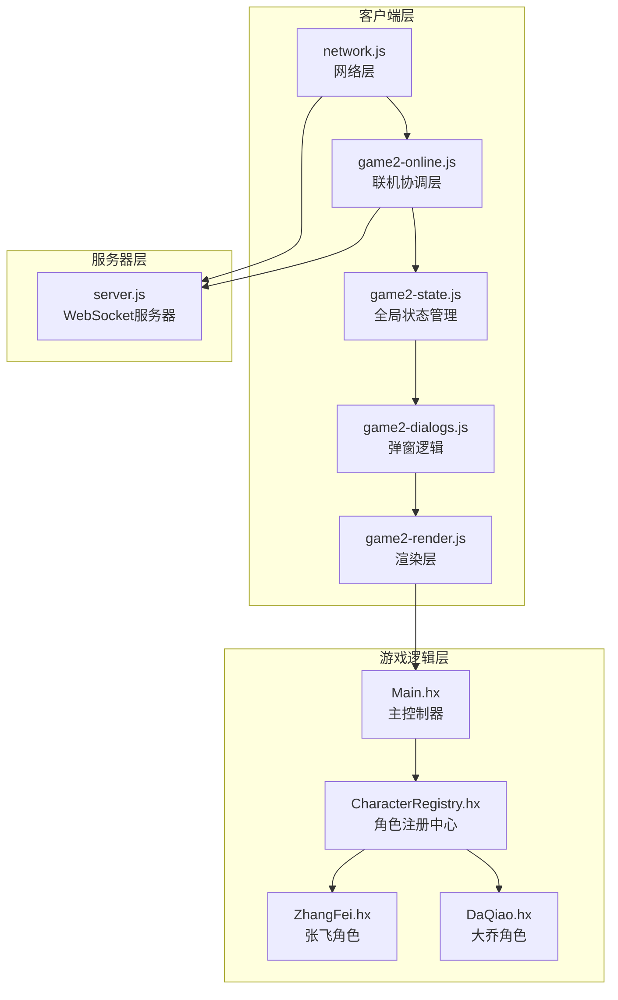

**图表来源**
- [network.js:1-113](file://network.js#L1-L113)
- [game2-online.js:1-169](file://js/game2-online.js#L1-L169)
- [server.js:1-344](file://server.js#L1-L344)

**章节来源**
- [network.js:1-113](file://network.js#L1-L113)
- [server.js:1-344](file://server.js#L1-L344)

## 核心组件

### 消息类型系统

系统定义了以下核心消息类型：

| 消息类型 | 用途 | 消息结构 | 说明 |
|---------|------|----------|------|
| `create` | 创建房间 | `{ type: 'create', name: string }` | 客户端请求创建新房间 |
| `created` | 房间创建结果 | `{ type: 'created', code: string, slotIdx: number }` | 服务器响应房间创建结果 |
| `join` | 加入房间 | `{ type: 'join', code: string, name: string }` | 客户端请求加入指定房间 |
| `joined` | 加入房间结果 | `{ type: 'joined', code: string, slotIdx: number }` | 服务器响应加入结果 |
| `action` | 游戏动作 | `{ type: 'action', payload: object }` | 玩家执行的游戏动作 |
| `chat` | 聊天消息 | `{ type: 'chat', text: string }` | 房间内聊天内容 |
| `rematch` | 重新匹配 | `{ type: 'rematch' }` | 请求重新开始游戏 |
| `roomState` | 房间状态 | `{ type: 'roomState', slotNames: array, slotOccupied: array }` | 房间内座位占用情况 |
| `slotLeft` | 玩家离线 | `{ type: 'slotLeft', slotIdx: number }` | 某座位玩家断开连接 |
| `error` | 错误消息 | `{ type: 'error', msg: string }` | 服务器错误反馈 |

### 广播机制

系统实现了高效的房间内广播机制：

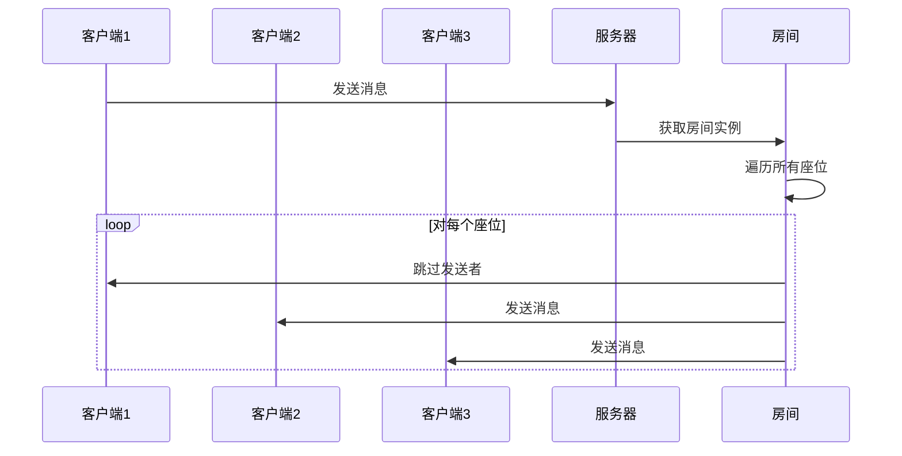

**图表来源**
- [server.js:240-245](file://server.js#L240-L245)

**章节来源**
- [server.js:240-261](file://server.js#L240-L261)
- [network.js:56-100](file://network.js#L56-L100)

## 架构概览

系统采用分层架构设计，实现了清晰的职责分离：

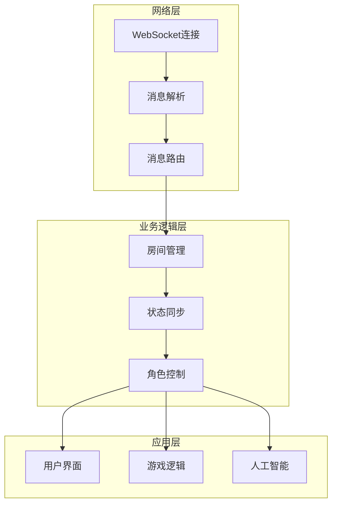

**图表来源**
- [server.js:263-339](file://server.js#L263-L339)
- [network.js:13-30](file://network.js#L13-L30)

## 详细组件分析

### 服务器端实现

服务器端负责房间管理和消息转发，采用事件驱动的异步处理模式：

#### 房间管理系统

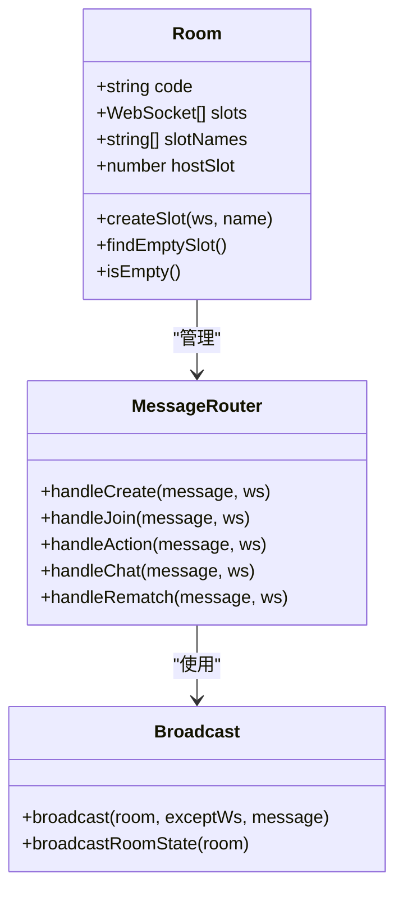

**图表来源**
- [server.js:220-227](file://server.js#L220-L227)
- [server.js:267-318](file://server.js#L267-L318)

#### 消息处理流程

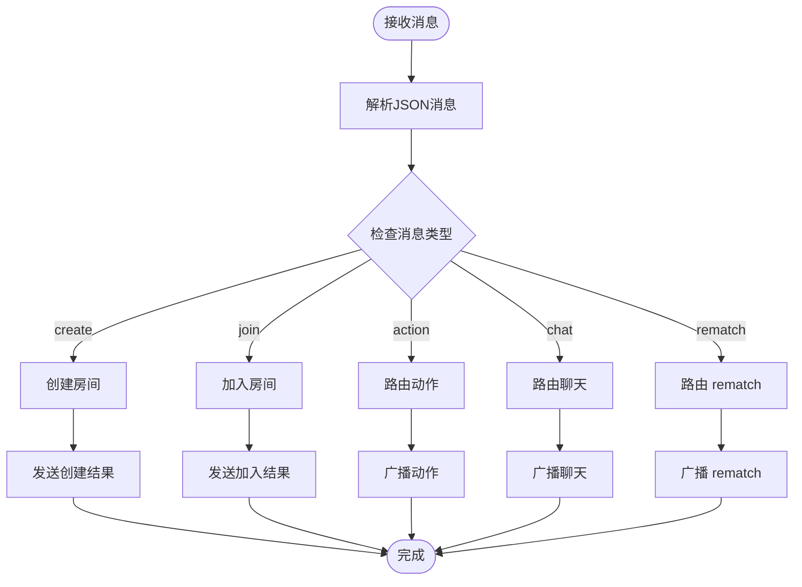

**图表来源**
- [server.js:267-318](file://server.js#L267-L318)

**章节来源**
- [server.js:220-339](file://server.js#L220-L339)

### 客户端网络层

客户端网络层负责WebSocket连接管理和消息收发：

#### 连接管理

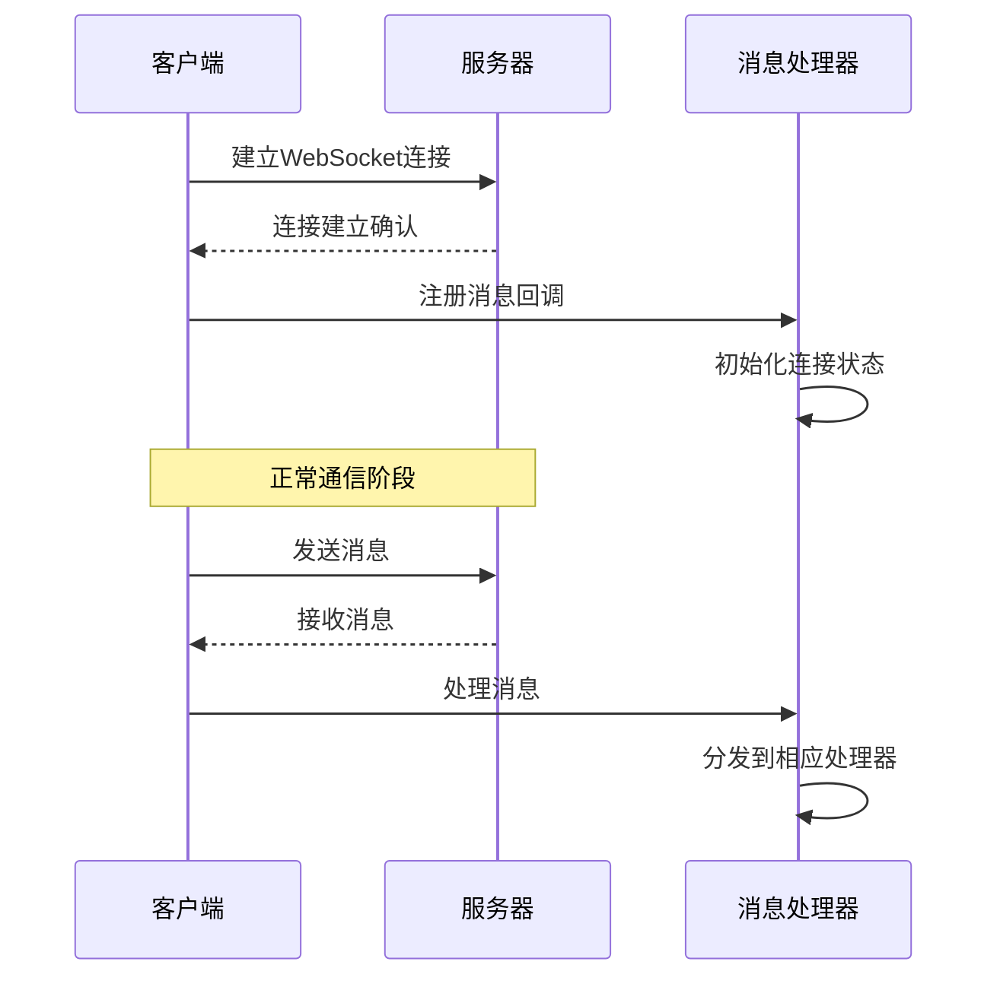

**图表来源**
- [network.js:13-30](file://network.js#L13-L30)

#### 消息处理机制

客户端采用消息类型分发机制：

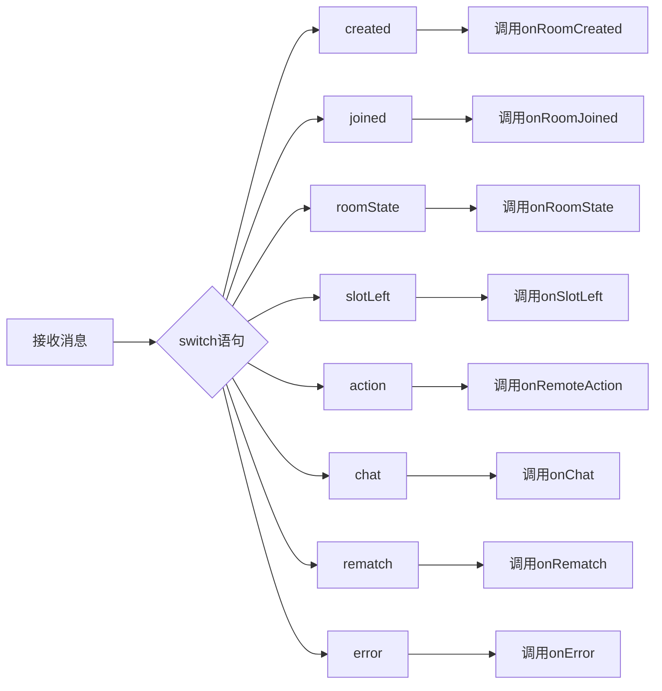

**图表来源**
- [network.js:56-100](file://network.js#L56-L100)

**章节来源**
- [network.js:1-113](file://network.js#L1-L113)

### 联机协调层

联机协调层负责角色控制权管理和状态同步：

#### 角色控制机制

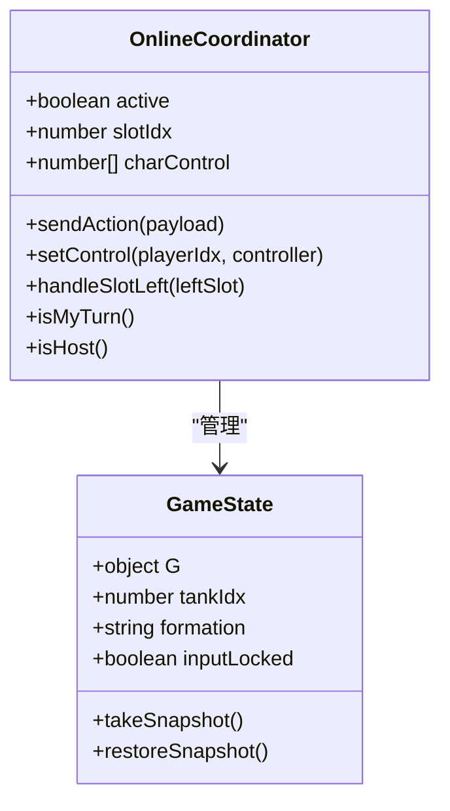

**图表来源**
- [game2-online.js:5-60](file://js/game2-online.js#L5-L60)

#### 远端动作处理

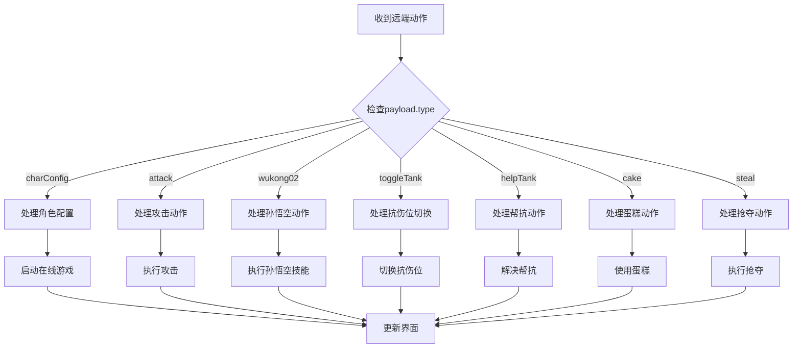

**图表来源**
- [game2-online.js:63-121](file://js/game2-online.js#L63-L121)

**章节来源**
- [game2-online.js:1-169](file://js/game2-online.js#L1-L169)

### 游戏状态管理

游戏状态管理模块负责全局状态维护和同步：

#### 状态快照机制

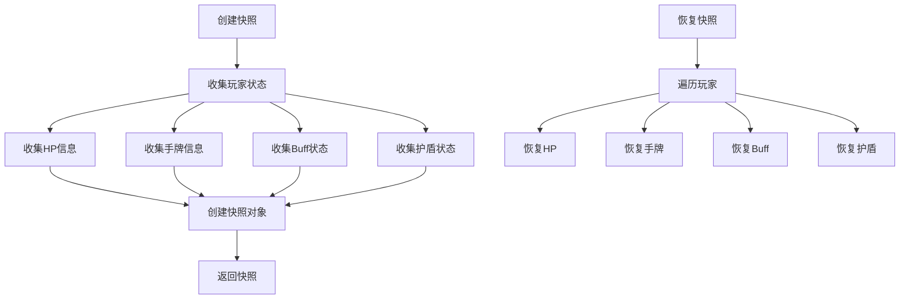

**图表来源**
- [game2-state.js:180-220](file://js/game2-state.js#L180-L220)

**章节来源**
- [game2-state.js:1-242](file://js/game2-state.js#L1-L242)

## 依赖关系分析

系统各组件之间的依赖关系如下：

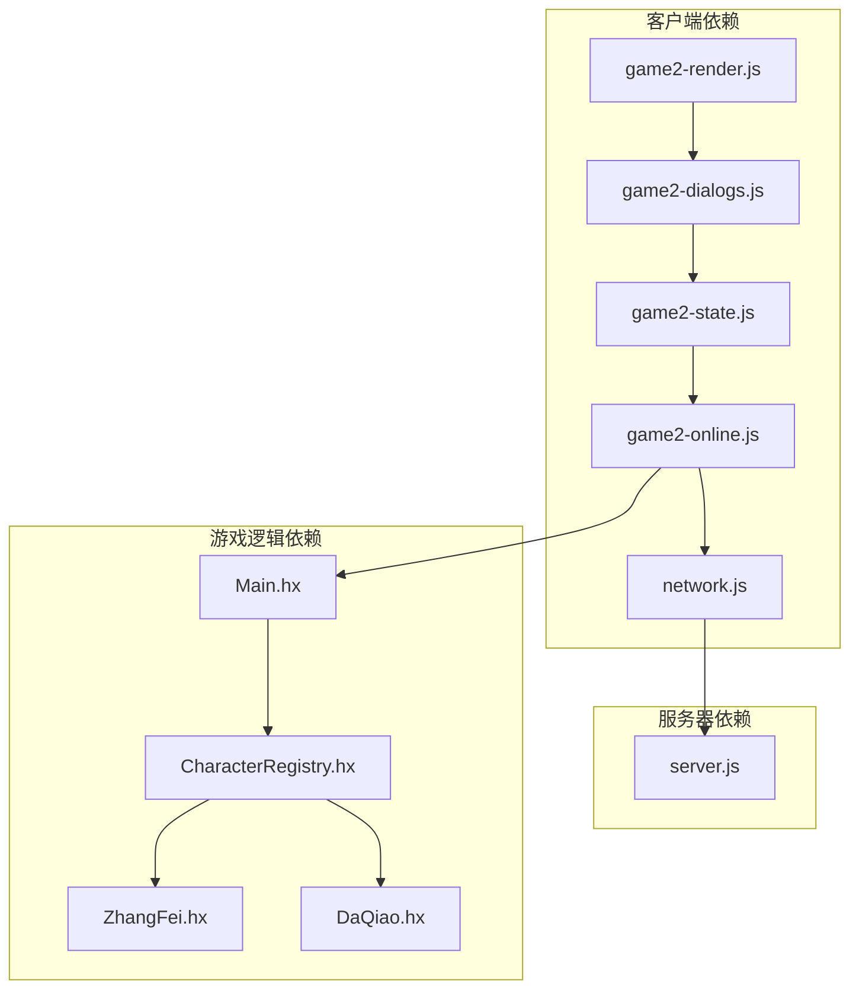

**图表来源**
- [network.js:1-113](file://network.js#L1-L113)
- [server.js:1-344](file://server.js#L1-L344)
- [Main.hx:1-411](file://Main.hx#L1-L411)

**章节来源**
- [Main.hx:1-411](file://Main.hx#L1-L411)
- [CharacterRegistry.hx:1-82](file://character/CharacterRegistry.hx#L1-L82)

## 性能考虑

### 广播优化

系统采用了高效的广播策略，避免不必要的消息传递：

1. **例外过滤**：广播时自动跳过消息发送者，防止消息回环
2. **房间范围限制**：只在房间内进行广播，避免跨房间通信
3. **连接状态检查**：发送前检查WebSocket连接状态

### 内存管理

1. **连接池管理**：房间关闭时自动清理连接资源
2. **状态快照优化**：只存储必要的状态信息
3. **事件监听清理**：断开连接时清理相关事件监听器

### 网络优化

1. **批量处理**：客户端使用requestAnimationFrame进行批量渲染
2. **消息压缩**：传输的消息结构经过优化，减少带宽占用
3. **连接复用**：单个WebSocket连接承载多种消息类型

## 故障排除指南

### 常见问题及解决方案

#### 连接问题

| 问题症状 | 可能原因 | 解决方案 |
|----------|----------|----------|
| 无法连接服务器 | 网络中断或服务器宕机 | 检查网络连接，重启服务器 |
| 连接频繁断开 | WebSocket超时 | 检查防火墙设置，调整超时参数 |
| 消息发送失败 | 连接状态异常 | 重新建立连接，检查消息格式 |

#### 消息处理问题

| 问题症状 | 可能原因 | 解决方案 |
|----------|----------|----------|
| 消息丢失 | 网络延迟或丢包 | 实现消息确认机制，增加重传逻辑 |
| 消息乱序 | 网络传输特性 | 使用序列号排序，实现有序处理 |
| 广播异常 | 房间状态不一致 | 检查房间管理逻辑，同步状态更新 |

#### 性能问题

| 问题症状 | 可能原因 | 解决方案 |
|----------|----------|----------|
| 渲染卡顿 | 频繁DOM操作 | 使用requestAnimationFrame批量渲染 |
| 内存泄漏 | 事件监听未清理 | 检查连接断开时的清理逻辑 |
| CPU占用过高 | 重复计算 | 实现缓存机制，避免重复计算 |

**章节来源**
- [server.js:321-339](file://server.js#L321-L339)
- [network.js:22-29](file://network.js#L22-L29)

## 结论

指尖博弈项目的消息路由与同步机制展现了良好的架构设计和实现质量。系统通过清晰的分层架构、完善的错误处理机制和高效的广播策略，实现了可靠的多人在线游戏体验。

### 主要优势

1. **架构清晰**：分层设计使得各组件职责明确，便于维护和扩展
2. **性能优秀**：采用多种优化策略，确保系统在高并发下的稳定性
3. **扩展性强**：消息类型系统支持灵活的功能扩展
4. **用户体验好**：完整的错误处理和状态同步机制提升了用户满意度

### 改进建议

1. **消息持久化**：可考虑添加消息持久化机制，支持断线重连后的状态恢复
2. **监控告警**：增加系统监控和告警机制，及时发现和处理异常情况
3. **安全增强**：实现更严格的消息验证和权限控制机制
4. **协议版本化**：建立消息协议版本管理机制，确保向前兼容性

该系统为类似多人在线游戏项目提供了优秀的参考模板，其设计理念和实现方式值得进一步研究和借鉴。