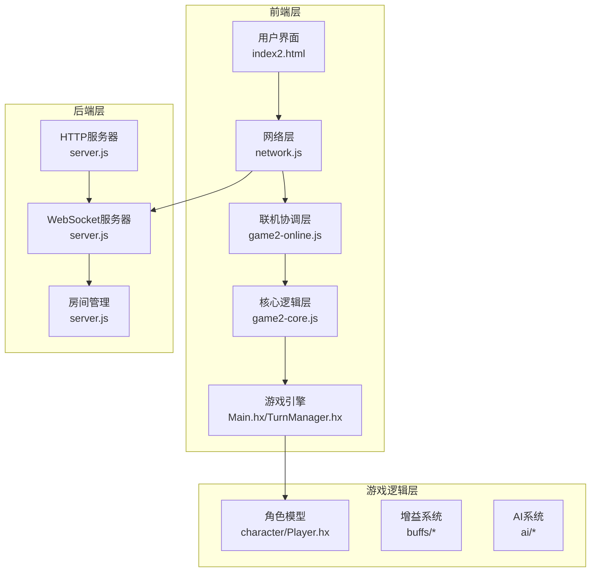
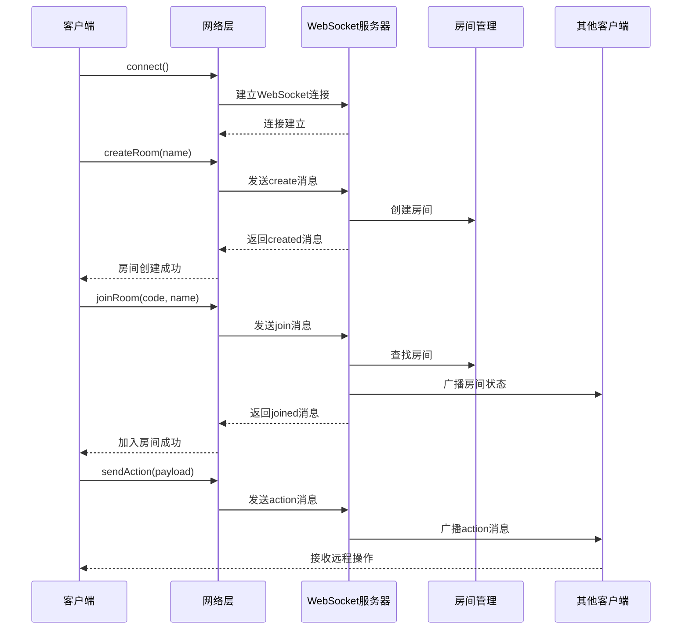
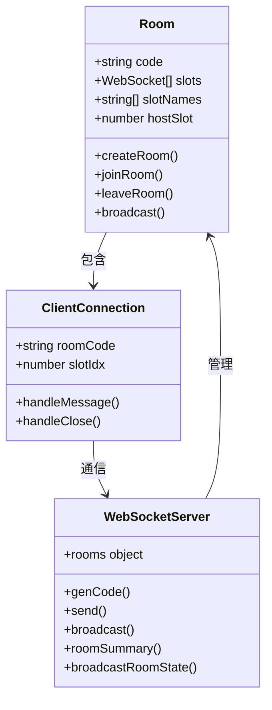
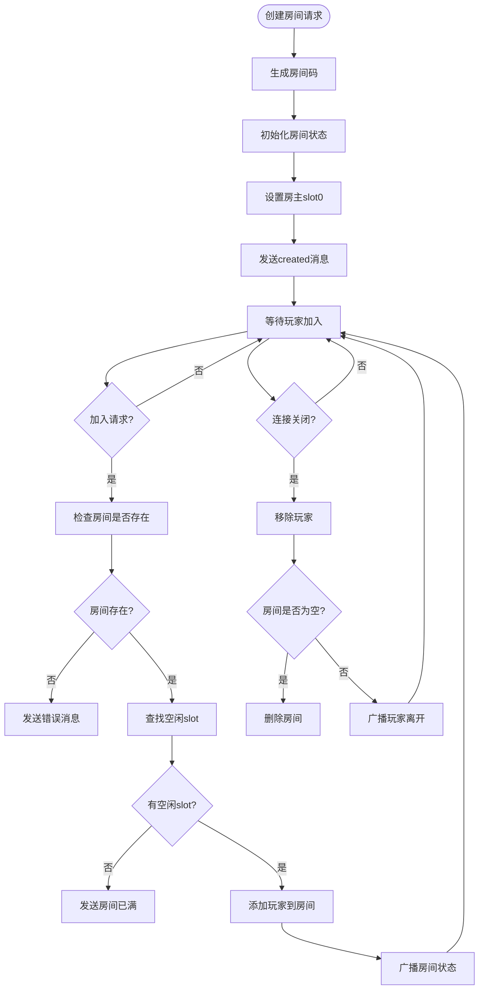
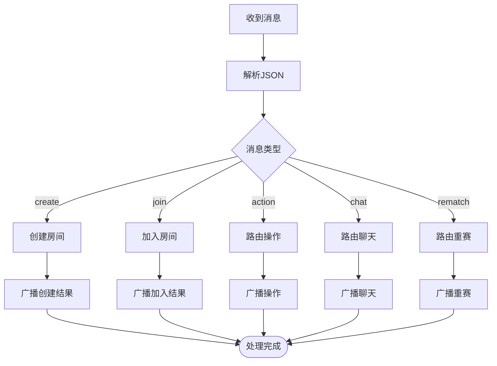
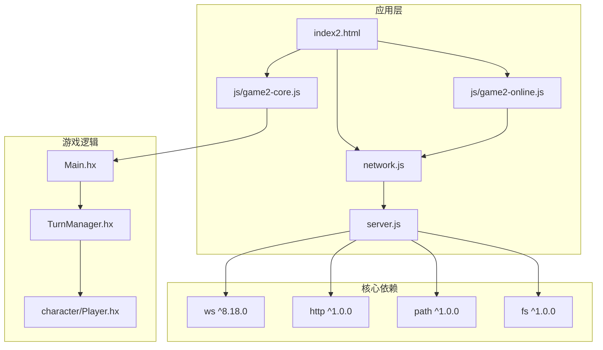

# 联机对战系统

<cite>
**本文档引用的文件**
- [server.js](file://server.js)
- [network.js](file://network.js)
- [js/server.js](file://js/server.js)
- [js/game2-online.js](file://js/game2-online.js)
- [index2.html](file://index2.html)
- [js/game2-core.js](file://js/game2-core.js)
- [Main.hx](file://Main.hx)
- [TurnManager.hx](file://TurnManager.hx)
- [character/Player.hx](file://character/Player.hx)
- [package.json](file://package.json)
</cite>

## 目录
1. [简介](#简介)
2. [项目结构](#项目结构)
3. [核心组件](#核心组件)
4. [架构概览](#架构概览)
5. [详细组件分析](#详细组件分析)
6. [依赖关系分析](#依赖关系分析)
7. [性能考虑](#性能考虑)
8. [故障排除指南](#故障排除指南)
9. [结论](#结论)
10. [附录](#附录)

## 简介
本项目是一个基于WebSocket的联机对战系统，支持最多4人房间对战。系统采用前后端分离架构，前端使用JavaScript和HTML5，后端使用Node.js + WebSocket，游戏逻辑基于Haxe编译到JavaScript。系统实现了完整的房间管理、玩家匹配、消息路由、断线重连处理等功能。

## 项目结构
项目采用模块化设计，主要分为以下层次：

**图表来源**
- [server.js:186-313](file://server.js#L186-L313)
- [network.js:1-113](file://network.js#L1-L113)
- [js/game2-online.js:1-169](file://js/game2-online.js#L1-L169)

**章节来源**
- [server.js:1-313](file://server.js#L1-L313)
- [network.js:1-113](file://network.js#L1-L113)
- [js/game2-online.js:1-169](file://js/game2-online.js#L1-L169)

## 核心组件

### WebSocket服务器
系统的核心是基于Node.js的WebSocket服务器，提供房间管理和消息转发功能。

**房间管理系统特性：**
- 支持最多4人房间
- 房主固定在slot 0
- 自动房间清理机制
- 断线重连处理

**消息路由机制：**
- create：创建房间
- join：加入房间
- action：游戏操作消息
- chat：聊天消息
- rematch：重新匹配

**章节来源**
- [server.js:189-308](file://server.js#L189-L308)

### 客户端网络层
客户端网络层提供了简洁的API接口，封装了WebSocket连接和消息处理。

**核心功能：**
- 自动连接检测和重连
- 消息发送和接收
- 房间状态管理
- 错误处理和回调

**章节来源**
- [network.js:5-113](file://network.js#L5-L113)

### 联机协调层
联机协调层负责处理复杂的联机逻辑，包括角色控制权分配和断线处理。

**关键特性：**
- 角色控制权映射（charControl）
- 断线接管机制
- 房主权限管理
- AI模型同步

**章节来源**
- [js/game2-online.js:5-169](file://js/game2-online.js#L5-L169)

## 架构概览

**图表来源**
- [server.js:232-288](file://server.js#L232-L288)
- [network.js:13-54](file://network.js#L13-L54)

## 详细组件分析

### 房间管理系统

**图表来源**
- [server.js:189-230](file://server.js#L189-L230)
- [server.js:232-308](file://server.js#L232-L308)

**房间生命周期流程：**

**图表来源**
- [server.js:240-308](file://server.js#L240-L308)

**章节来源**
- [server.js:189-308](file://server.js#L189-L308)

### 消息同步机制

系统实现了多种消息类型的同步机制：

**消息类型分类：**
1. **房间管理消息**：create、join、roomState、slotLeft
2. **游戏操作消息**：action、chat、rematch
3. **角色控制消息**：charConfig、ctrlUpdate、aiModelUpdate

**消息处理流程：**

**图表来源**
- [server.js:236-288](file://server.js#L236-L288)

**章节来源**
- [server.js:236-288](file://server.js#L236-L288)

### 断线重连处理

系统实现了完善的断线重连机制：

**断线检测流程：**
1. WebSocket连接断开事件触发
2. 服务器检测到连接丢失
3. 广播slotLeft消息给其他客户端
4. 自动将该slot的角色控制权转交给AI
5. 房间状态更新和广播

**客户端重连处理：**
1. 自动检测连接状态
2. 断线提示和状态更新
3. 重新连接尝试
4. 状态恢复和同步

**章节来源**
- [server.js:290-308](file://server.js#L290-L308)
- [network.js:22-30](file://network.js#L22-L30)

### 网络通信协议

**消息格式定义：**
所有消息采用JSON格式，包含type字段标识消息类型和相应的负载数据。

**事件类型分类：**
- **连接事件**：created、joined、roomState
- **游戏事件**：action、chat、rematch、slotLeft
- **配置事件**：charConfig、ctrlUpdate、aiModelUpdate

**数据序列化方案：**
- 使用标准JSON.stringify进行序列化
- 采用UTF-8编码传输
- 支持二进制和文本混合内容

**章节来源**
- [network.js:56-100](file://network.js#L56-L100)
- [server.js:236-288](file://server.js#L236-L288)

## 依赖关系分析

**图表来源**
- [package.json:9-11](file://package.json#L9-L11)
- [server.js:5-8](file://server.js#L5-L8)

**章节来源**
- [package.json:1-16](file://package.json#L1-L16)

## 性能考虑

### 服务器性能优化

**内存管理：**
- 房间对象及时清理，避免内存泄漏
- WebSocket连接池管理
- 消息队列长度限制

**并发处理：**
- 单线程事件循环模型
- 非阻塞I/O操作
- 异步消息处理

**网络优化：**
- 连接复用和持久化
- 消息压缩和批处理
- 心跳检测和超时处理

### 客户端性能优化

**渲染优化：**
- DOM操作批量处理
- 请求动画帧优化
- 事件委托减少绑定

**网络优化：**
- 连接状态缓存
- 消息去重和合并
- 自适应重连策略

## 故障排除指南

### 常见问题诊断

**连接问题：**
1. 检查服务器端口占用情况
2. 验证防火墙设置
3. 确认SSL证书配置

**房间问题：**
1. 房间码格式验证
2. 房间容量检查
3. 房主权限验证

**消息问题：**
1. JSON格式验证
2. 消息类型检查
3. 数据完整性校验

### 调试技巧

**服务器端调试：**
- 启用详细日志记录
- 监控内存使用情况
- 分析连接建立时间

**客户端调试：**
- 使用浏览器开发者工具
- WebSocket帧监控
- 网络延迟测试

**章节来源**
- [server.js:310-313](file://server.js#L310-L313)
- [network.js:102-112](file://network.js#L102-L112)

## 结论

本联机对战系统采用简洁高效的架构设计，实现了完整的房间管理、消息路由和断线重连功能。系统具有良好的扩展性和维护性，为后续的功能增强奠定了坚实基础。

**主要优势：**
- 架构清晰，职责分离明确
- 实现简洁，易于理解和维护
- 功能完整，满足基本联机需求
- 性能良好，适合中小型对战场景

**改进建议：**
- 添加消息确认机制
- 实现延迟补偿算法
- 增强安全防护措施
- 优化大规模并发处理

## 附录

### 部署指南

**环境要求：**
- Node.js >= 18.0.0
- npm包管理器
- 开放的网络端口

**安装步骤：**
1. 克隆项目代码
2. 安装依赖包：`npm install`
3. 启动服务器：`npm start`
4. 访问 `http://localhost:3000`

**配置选项：**
- 端口设置：通过环境变量PORT配置
- API密钥：设置MINIMAX_API_KEY等
- 文件路径：根据部署环境调整

### 客户端使用指南

**基本使用：**
1. 打开游戏页面
2. 输入昵称
3. 创建或加入房间
4. 选择角色和控制者
5. 开始游戏对战

**高级功能：**
- AI模型配置
- 自动训练模式
- 战斗日志导出
- 音乐播放器

### 开发者指南

**扩展开发：**
- 新增消息类型：在server.js和network.js中添加处理逻辑
- 新增角色：在character目录下添加新角色类
- 新增AI模型：在ai目录下添加模型文件
- 新增游戏逻辑：在Haxe源码中扩展功能

**测试方法：**
- 单元测试：针对核心逻辑编写测试用例
- 集成测试：模拟多客户端联机场景
- 性能测试：评估高并发下的系统表现
- 安全测试：验证消息认证和权限控制