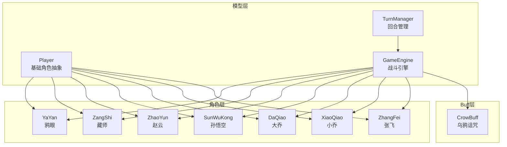
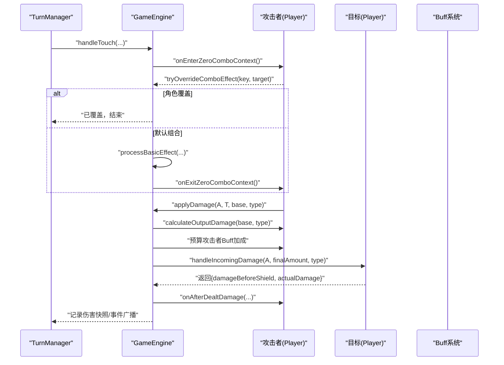
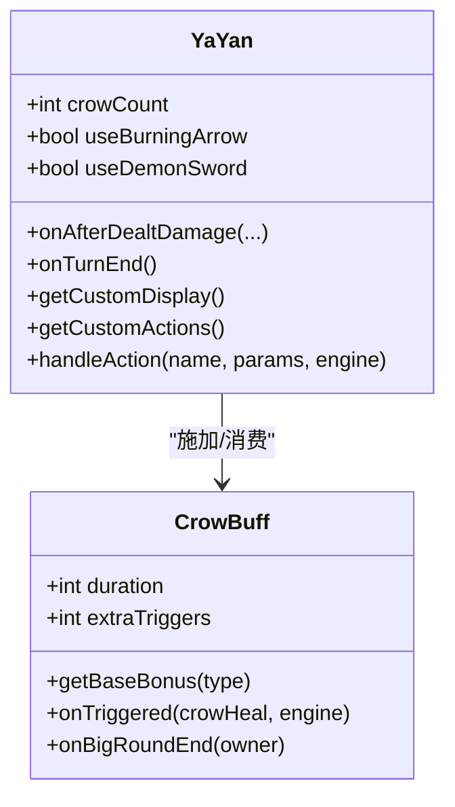
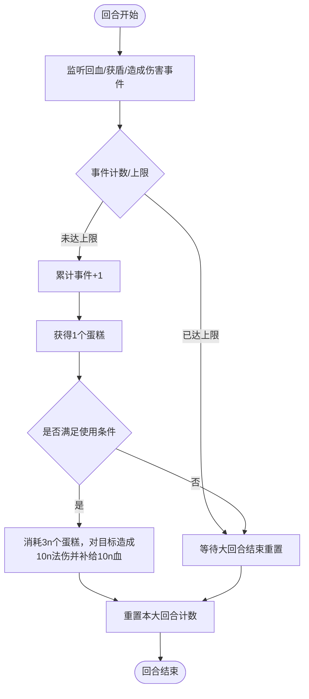
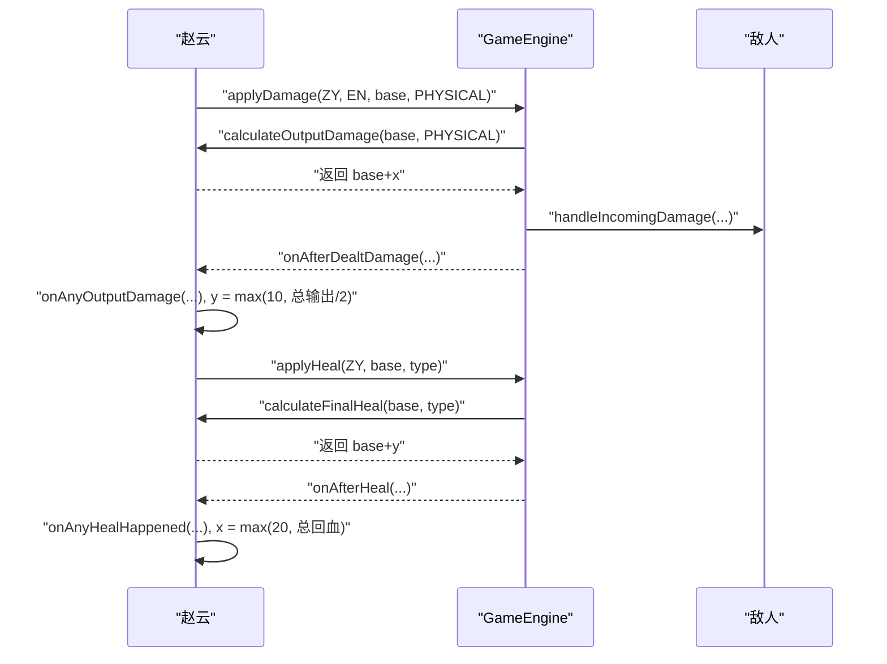
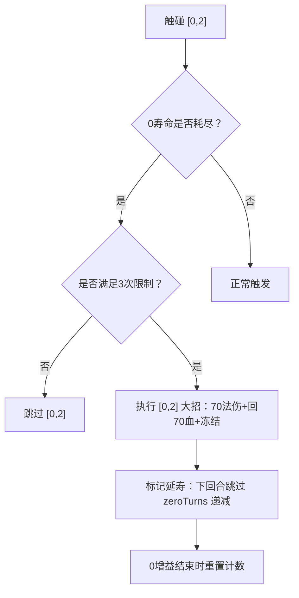
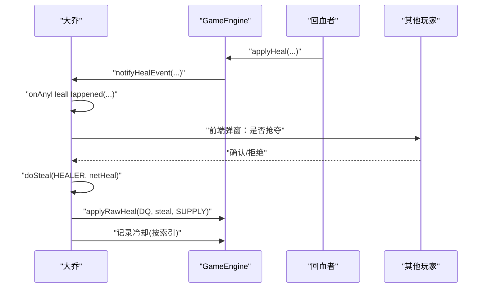
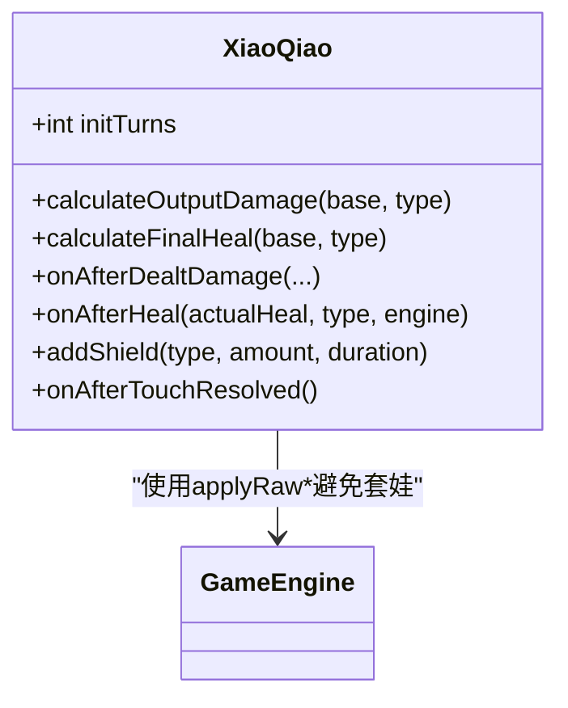
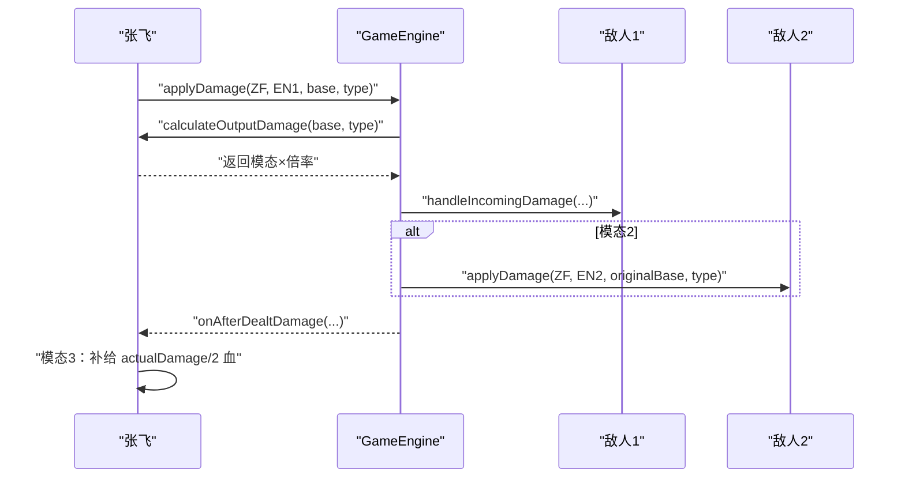
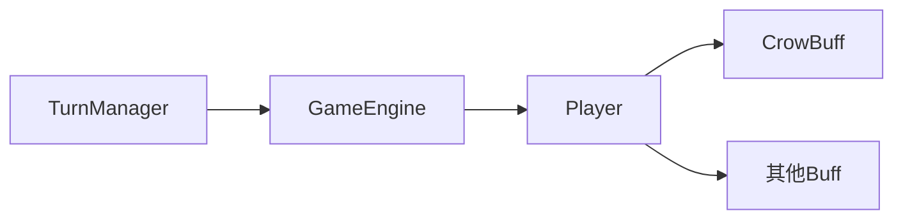

# 其他角色详解

<cite>
**本文档引用的文件**
- [YaYan.hx](file://character/YaYan.hx)
- [ZangShi.hx](file://character/ZangShi.hx)
- [ZhaoYun.hx](file://character/ZhaoYun.hx)
- [SunWuKong.hx](file://character/SunWuKong.hx)
- [DaQiao.hx](file://character/DaQiao.hx)
- [XiaoQiao.hx](file://character/XiaoQiao.hx)
- [ZhangFei.hx](file://character/ZhangFei.hx)
- [Player.hx](file://model/Player.hx)
- [GameEngine.hx](file://GameEngine.hx)
- [TurnManager.hx](file://TurnManager.hx)
- [CrowBuff.hx](file://buffs/CrowBuff.hx)
- [鸦眼.md](file://ai/skills/鸦眼.md)
- [忍者.md](file://ai/skills/忍者.md)
- [法师.md](file://ai/skills/法师.md)
- [阴阳师.md](file://ai/skills/阴阳师.md)
</cite>

## 目录
1. [简介](#简介)
2. [项目结构](#项目结构)
3. [核心组件](#核心组件)
4. [架构总览](#架构总览)
5. [详细角色分析](#详细角色分析)
   - [雅眼（鸦眼）](#雅眼鸦眼)
   - [杨大力（藏师）](#杨大力藏师)
   - [赵云](#赵云)
   - [孙悟空](#孙悟空)
   - [大乔](#大乔)
   - [小乔](#小乔)
   - [张飞](#张飞)
6. [依赖关系分析](#依赖关系分析)
7. [性能考量](#性能考量)
8. [故障排查指南](#故障排查指南)
9. [结论](#结论)

## 简介
本文件为其他7种角色提供综合性技术文档，覆盖雅眼（鸦眼）、杨大力（藏师）、赵云、孙悟空、大乔、小乔、张飞等角色。内容包括：角色定位与设计理念、核心技能实现机制、属性配置与平衡性考虑、在不同对战模式中的适用性、技能冷却与连携关系，以及使用技巧、最佳搭档推荐、战术应用场景与新手入门指导。重点分析这些角色与核心游戏机制（伤害结算、回血/护盾、0组合、双子星、回合管理、Buff系统）的结合方式。

## 项目结构
- 角色实现位于 character/ 目录，每个角色继承自 model/Player 并重写关键钩子函数。
- 核心战斗逻辑位于 GameEngine.hx，负责伤害/回血/护盾/事件广播与组合特效触发。
- 回合管理位于 TurnManager.hx，负责回合推进、0手寿命、连击与胜负判定。
- Buff 系统位于 buffs/ 目录，如 CrowBuff（乌鸦诅咒）等。
- AI 技能说明位于 ai/skills/ 目录，提供权重与玩法要点。

**图表来源**
- [Player.hx](file://model/Player.hx)
- [GameEngine.hx](file://GameEngine.hx)
- [TurnManager.hx](file://TurnManager.hx)
- [YaYan.hx](file://character/YaYan.hx)
- [ZangShi.hx](file://character/ZangShi.hx)
- [ZhaoYun.hx](file://character/ZhaoYun.hx)
- [SunWuKong.hx](file://character/SunWuKong.hx)
- [DaQiao.hx](file://character/DaQiao.hx)
- [XiaoQiao.hx](file://character/XiaoQiao.hx)
- [ZhangFei.hx](file://character/ZhangFei.hx)
- [CrowBuff.hx](file://buffs/CrowBuff.hx)

**章节来源**
- [GameEngine.hx](file://GameEngine.hx)
- [TurnManager.hx](file://TurnManager.hx)
- [Player.hx](file://model/Player.hx)

## 核心组件
- Player 抽象类：定义伤害/回血/护盾/事件钩子、0手寿命与组合覆盖接口。
- GameEngine：统一的伤害/回血/护盾流程，事件广播（回血、护盾、输出、毒、雷霆等），组合特效触发。
- TurnManager：回合推进、0手寿命递减、强制手锁定、胜负判定与复活检查。
- Buff 系统：提供基础 Buff 抽象与具体 Buff（如 CrowBuff）。

**章节来源**
- [Player.hx](file://model/Player.hx)
- [GameEngine.hx](file://GameEngine.hx)
- [TurnManager.hx](file://TurnManager.hx)

## 架构总览
角色通过重写 Player 的钩子参与核心机制：
- 伤害结算：calculateOutputDamage → 攻击者 Buff（如双4）→ 目标 handleIncomingDamage（护盾/减伤）→ onAfterDealtDamage。
- 回血流程：calculateFinalHeal → doHealing（解毒/溢出）→ onAfterHeal → 事件广播。
- 组合触发：0组合/双子星由 GameEngine 分派至角色 tryOverrideComboEffect/onEnterZeroComboContext/onExitZeroComboContext。

**图表来源**
- [GameEngine.hx](file://GameEngine.hx)
- [Player.hx](file://model/Player.hx)
- [TurnManager.hx](file://TurnManager.hx)

## 详细角色分析

### 雅眼（鸦眼）
- 定位与理念：输出型刺客，通过“乌鸦诅咒”削弱敌方并叠加触发次数，配合“灼燃箭”与“魔王剑”形成高爆发循环。
- 核心机制：
  - 乌鸦诅咒：对目标阵营施加 CrowBuff（物理/真实+20×触发次数，法术/毒+10×触发次数，持续2回合，不叠加）。
  - 灼燃箭：toggle 开启，攻击时为目标 CrowBuff 注入 extraTriggers+2；攻击后造成“手和差绝对值×10”的法伤，等量补给自身，自身自耗60物伤。
  - 魔王剑：消耗6只乌鸦，需灼燃箭开启；额外 extraTriggers 再+2（共+4），法伤与回血×2；行动结束自耗150物伤。
- 与核心机制结合：
  - 伤害结算：GameEngine 在 applyDamage 前对目标 Buff 做基础加算（CrowBuff 的加算在乘算前），再走 calculateOutputDamage 与攻击者 Buff，最后 target.handleIncomingDamage。
  - 回血联动：CrowBuff 触发后回调鸦眼，基于乘算后的额外增量进行 RECOVERY 回血，并获得触发次数对应的乌鸦计数。
- 属性与平衡：
  - 初始HP：140；技能代价较高（自耗物伤），需在爆发与续航间平衡。
  - 乌鸦计数与触发次数：extraTriggers 由灼燃箭与魔王剑叠加，最大+4，显著提升法伤与回血。
- 适用模式：
  - 适合快速压制与收割，尤其在敌方有乌鸦buff时收益极高。
- 技能冷却与连携：
  - 灼燃箭 toggle 使用，魔王剑需6只乌鸦且在灼燃箭开启后激活；行动结束自耗150物伤，需谨慎使用。
- 使用技巧与搭档：
  - 先施加乌鸦诅咒，再开启灼燃箭，利用乌鸦触发次数叠加打出高爆发；与能提供额外触发次数的角色协同（如特定组合）可进一步放大收益。

**图表来源**
- [YaYan.hx](file://character/YaYan.hx)
- [CrowBuff.hx](file://buffs/CrowBuff.hx)

**章节来源**
- [YaYan.hx](file://character/YaYan.hx)
- [CrowBuff.hx](file://buffs/CrowBuff.hx)
- [GameEngine.hx](file://GameEngine.hx)

### 杨大力（藏师）
- 定位与理念：坦克型辅助，通过“物伤减半+反弹+回复×2.5+护盾×2+草莓蛋糕”构建稳定生存与团队增益。
- 核心机制：
  - 物理伤害减半：在受击阶段将物理伤害减半，再走护盾/扣血。
  - 反弹：物理伤害减半后，对攻击者造成“实际扣血量50%”的物理反弹（上限200，且不致死）。
  - 回复×2.5与护盾×2：自身回复与护盾厚度均×2.5；物理盾同时附加一半厚度的法术盾。
  - 草莓蛋糕：每大回合监听“自身回血/获盾/造成伤害（不含技能内自身回血/补给）”，累计事件达上限（8次）后获得1个蛋糕；3个蛋糕可对任一目标造成10点法伤并自身补给10血。
- 与核心机制结合：
  - 伤害结算：重写 handleIncomingDamage 在受击前对物理伤害减半，再调用父类处理护盾/扣血。
  - 事件监听：重写 onAnyHealHappened、onAnyShieldGained、onAfterDealtDamage 监听事件并计数，每大回合结束重置。
  - 护盾升级：重写 addShield 将物理盾升级为物法盾，厚度×1.5，持续+1。
- 属性与平衡：
  - 初始HP：660；高生存与团队增益，但自身输出较低。
- 适用模式：
  - 适合团队持久战与控场，尤其在需要稳定抗压与回血保障时。
- 技能冷却与连携：
  - 草莓蛋糕每大回合上限8次，需合理规划事件触发；与能制造回血/获盾的阵容协同效果更佳。
- 使用技巧与搭档：
  - 优先保证自身回血/获盾事件，利用护盾升级增强抗性；在合适时机使用蛋糕对敌方造成法伤并补给自身。

**图表来源**
- [ZangShi.hx](file://character/ZangShi.hx)

**章节来源**
- [ZangShi.hx](file://character/ZangShi.hx)
- [GameEngine.hx](file://GameEngine.hx)
- [TurnManager.hx](file://TurnManager.hx)

### 赵云
- 定位与理念：半肉输出，通过“攻防联动”与“单手被动”形成自我强化闭环，x/y 值随输出与回血动态增长。
- 核心机制：
  - 初始增益：x=20（物伤加成），y=10（回血加成）。
  - 攻防联动：
    - 造成物理伤害时：在 calculateOutputDamage 合并 x，随后 onAnyOutputDamage 用“总输出/2”更新 y。
    - 回血时：在 calculateFinalHeal 合并 y，随后 onAnyHealHappened 用“总回血量”更新 x。
  - 单手被动：新变出 1/4 → 回复 10+y 血；5/8/9 → 造成 20+x 物伤；0组合期间禁用。
- 与核心机制结合：
  - 伤害结算：calculateOutputDamage 合并 x，onAnyOutputDamage 监听总输出更新 y；onAfterDealtDamage 触发单手被动。
  - 回血流程：calculateFinalHeal 合并 y，onAnyHealHappened 监听总回血更新 x。
- 属性与平衡：
  - 初始HP：200；通过攻防联动实现持续增强，适合持续输出与生存兼顾。
- 适用模式：
  - 适合需要持续输出与自我维持的对局，尤其在配合双子星/0组合时收益更高。
- 技能冷却与连携：
  - x/y 动态增长，避免无限膨胀；0组合期间禁用单手被动，防止重复触发。
- 使用技巧与搭档：
  - 优先创造物理伤害与回血事件，利用联动快速提升 x/y；在0组合期间谨慎使用单手被动。

**图表来源**
- [ZhaoYun.hx](file://character/ZhaoYun.hx)
- [GameEngine.hx](file://GameEngine.hx)

**章节来源**
- [ZhaoYun.hx](file://character/ZhaoYun.hx)
- [GameEngine.hx](file://GameEngine.hx)

### 孙悟空
- 定位与理念：半肉输出，通过“0组合大招[0,2]”与“被动增益”形成爆发与持续增强。
- 核心机制：
  - 初始增益：x=40（物伤增益），y=30（回血增益）。
  - 被动：自己出伤时在 calculateOutputDamage 合并 x；监听全场物伤更新 x；回血时在 calculateFinalHeal 合并 y；监听全场回血更新 y。
  - [0,2] 大招：0增益期间最多3次，每次70法伤+回70血+冻结目标1回合；触发后标记延寿，下回合跳过 zeroTurns 递减。
- 与核心机制结合：
  - 触碰合法性：重写 isValidTouch 与 interceptAttackForDialog，预测 [0,2] 触发并放行。
  - 组合覆盖：重写 tryOverrideComboEffect，拦截 "0_2" 组合并执行大招。
  - 零组合上下文：重写 shouldSkipZeroTurnsDecrement 与 checkZeroComboReset，控制延寿与计数重置。
- 属性与平衡：
  - 初始HP：260；高爆发与自我增强，需控制 [0,2] 使用次数。
- 适用模式：
  - 适合需要爆发与持续输出的对局，尤其在0增益期间最大化收益。
- 技能冷却与连携：
  - [0,2] 最多3次，触发后延寿；需与能提供0增益的阵容协同。
- 使用技巧与搭档：
  - 优先凑出0增益，利用 [0,2] 大招打出爆发；在0增益结束时重置计数。

**图表来源**
- [SunWuKong.hx](file://character/SunWuKong.hx)
- [TurnManager.hx](file://TurnManager.hx)

**章节来源**
- [SunWuKong.hx](file://character/SunWuKong.hx)
- [TurnManager.hx](file://TurnManager.hx)
- [GameEngine.hx](file://GameEngine.hx)

### 大乔
- 定位与理念：半肉辅助，通过“抢夺回复”与“复活甲/进化”构建强控场与生存能力。
- 核心机制：
  - 抢夺：监听全场非技能 RECOVERY 回血事件，5秒内可选择抢夺50%（神大乔额外+10）；冷却按“被抢者索引”记录，每大回合重置。
  - 回血：造成物理伤害时回复50%伤害值的血（RECOVERY，可解毒，可被其他大乔抢）。
  - 进化：当前HP突破300后，可选择扣300血进化为“神大乔”，获得物伤×1.5、物免1/4、抢夺额外+10；复活甲废弃。
  - 复活甲：死后获得 InvincibleBuff 2回合，之后以50血复活（仅限一次）。
- 与核心机制结合：
  - 事件监听：重写 onAnyHealHappened 触发前端抢夺弹窗；重写 tryRevive 与 onTurnEnd 实现复活。
  - 抢夺执行：doSteal 计算可抢夺量并落地，同时标记冷却。
  - 进化检测：canEvolve 与 evolve 控制进化条件与切换。
- 属性与平衡：
  - 初始HP：120；高生存与团队控制，进化后大幅提升。
- 适用模式：
  - 适合控场与团队资源分配，尤其在需要稳定回血与复活保障时。
- 技能冷却与连携：
  - 抢夺冷却按被抢者索引记录，避免同一大回合重复触发；复活甲与进化二选一。
- 使用技巧与搭档：
  - 优先抢夺友方回血，利用进化提升团队整体强度；在危险时刻依靠复活甲保命。

**图表来源**
- [DaQiao.hx](file://character/DaQiao.hx)
- [GameEngine.hx](file://GameEngine.hx)

**章节来源**
- [DaQiao.hx](file://character/DaQiao.hx)
- [GameEngine.hx](file://GameEngine.hx)
- [TurnManager.hx](file://TurnManager.hx)

### 小乔
- 定位与理念：半肉输出，通过“物伤×1.5/回血×1.5”与“回血反伤/护盾升级”构建攻守一体。
- 核心机制：
  - 物伤×1.5 与回血×1.5：重写 calculateOutputDamage 与 calculateFinalHeal。
  - 回血反伤：回血时对敌方造成等量物理伤害（绕过钩子链，防止套娃）。
  - 打人补给：造成物伤时给自己补给等量血（绕过钩子链，防止套娃）。
  - 护盾升级：获得物理护盾时升级为物法盾，厚度×1.5，持续+1；单手2或3新变出时触发护盾。
- 与核心机制结合：
  - 伤害/回血流程：applyRawDamage/applyRawHeal 避免钩子链套娃。
  - 护盾升级：重写 addShield 实现物法盾与持续时间增强。
- 属性与平衡：
  - 初始HP：360；高输出与高生存，适合持续消耗。
- 适用模式：
  - 适合需要持续输出与自我维持的对局，尤其在配合护盾与回血事件时收益更高。
- 技能冷却与连携：
  - 0可停留3回合，利于稳定输出与护盾叠加。
- 使用技巧与搭档：
  - 优先创造回血与护盾事件，利用回血反伤与护盾升级增强团队抗性。

**图表来源**
- [XiaoQiao.hx](file://character/XiaoQiao.hx)
- [GameEngine.hx](file://GameEngine.hx)

**章节来源**
- [XiaoQiao.hx](file://character/XiaoQiao.hx)
- [GameEngine.hx](file://GameEngine.hx)

### 张飞
- 定位与理念：坦克/输出，通过“模态切换+怒气系统+狂暴”构建多形态战斗风格。
- 核心机制：
  - 行动结束补给：10血（狂暴翻倍=20）。
  - 物理伤害免疫：双手差值×10（狂暴翻倍）。
  - 三模态：
    - ① 物伤×1.5
    - ② 0.75倍伤害打两个敌人（1v1禁用）
    - ③ 补给造成的物伤一半的血（RECOVERY，按actualDamage算）
  - 怒气与狂暴：每大回合上限+4层怒气；≥24层可主动进入【狂暴】3回合，扣24怒气；狂暴期间0使用回合数+1，免伤×2，物伤再×1.5。
- 与核心机制结合：
  - 伤害结算：重写 calculateOutputDamage 与 onAfterDealtDamage，模态2对第二目标重新走伤害流程。
  - 受击免疫：重写 handleIncomingDamage 实现差值免疫与受击加怒气。
  - 怒气系统：重写 onAnyHealHappened 与 onAfterDealtDamage 监听回血与造伤事件。
- 属性与平衡：
  - 初始HP：460；高生存与多形态输出，需合理管理怒气与模态切换。
- 适用模式：
  - 适合需要多形态切换与爆发输出的对局，尤其在狂暴期间最大化收益。
- 技能冷却与连携：
  - 怒气每大回合重置；模态切换与狂暴需根据局势灵活使用。
- 使用技巧与搭档：
  - 优先积累怒气，利用模态2与狂暴打出高爆发；在1v1时谨慎使用模态2。

**图表来源**
- [ZhangFei.hx](file://character/ZhangFei.hx)
- [GameEngine.hx](file://GameEngine.hx)

**章节来源**
- [ZhangFei.hx](file://character/ZhangFei.hx)
- [GameEngine.hx](file://GameEngine.hx)

## 依赖关系分析
- 角色对 GameEngine 的依赖：所有伤害/回血/护盾均通过 GameEngine 统一流程处理，角色通过钩子参与。
- 角色对 TurnManager 的依赖：0手寿命、强制手锁定、连击与胜负判定由 TurnManager 统一管理。
- 角色对 Buff 的依赖：CrowBuff 等 Buff 通过 GameEngine 与角色钩子协作，实现伤害加算与回血联动。

**图表来源**
- [GameEngine.hx](file://GameEngine.hx)
- [TurnManager.hx](file://TurnManager.hx)
- [Player.hx](file://model/Player.hx)
- [CrowBuff.hx](file://buffs/CrowBuff.hx)

**章节来源**
- [GameEngine.hx](file://GameEngine.hx)
- [TurnManager.hx](file://TurnManager.hx)
- [Player.hx](file://model/Player.hx)

## 性能考量
- 钩子链与套娃防护：角色在需要绕过钩子链时使用 applyRaw* 方法，避免重复触发与无限循环。
- 事件广播：GameEngine 统一广播回血/护盾/输出/毒/雷霆事件，监听器按需处理，降低耦合。
- Buff 生命周期：Buff 在回合结束与大回合结束时自动衰减与清理，避免长期占用内存。
- 0手寿命与强制锁定：TurnManager 对0手寿命进行递减与提示，减少无效交互导致的性能损耗。

## 故障排查指南
- 乌鸦触发异常：检查 CrowBuff 的 extraTriggers 注入与 onTriggered 回调是否正确执行。
- 草莓蛋糕计数异常：确认 onAnyHealHappened、onAnyShieldGained、onAfterDealtDamage 是否正确监听事件，且技能内回血/补给不计入。
- 孙悟空 [0,2] 无法触发：检查 isValidTouch 与 interceptAttackForDialog 的预测逻辑，确保在0寿命耗尽时仍可触发。
- 大乔抢夺失败：确认 onAnyHealHappened 是否触发弹窗，doSteal 的冷却键是否按被抢者索引设置。
- 张飞模态2第二刀未触发：检查 _inSecondHit 守卫与 _lastOutputDmg 缓存，确保不重复触发且能正确取回原始 base。

**章节来源**
- [YaYan.hx](file://character/YaYan.hx)
- [ZangShi.hx](file://character/ZangShi.hx)
- [SunWuKong.hx](file://character/SunWuKong.hx)
- [DaQiao.hx](file://character/DaQiao.hx)
- [ZhangFei.hx](file://character/ZhangFei.hx)

## 结论
本文档系统梳理了雅眼、藏师、赵云、孙悟空、大乔、小乔、张飞七个角色的设计理念、核心机制与与核心游戏机制的结合方式。通过深入分析伤害/回血/护盾流程、事件监听、0组合与双子星、回合管理与 Buff 生命周期，为不同对战模式下的适用性、技能冷却与连携关系提供了清晰的技术视角。建议在实战中根据阵容与局势灵活运用角色特性，最大化团队协同与个人收益。