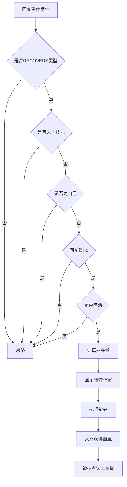
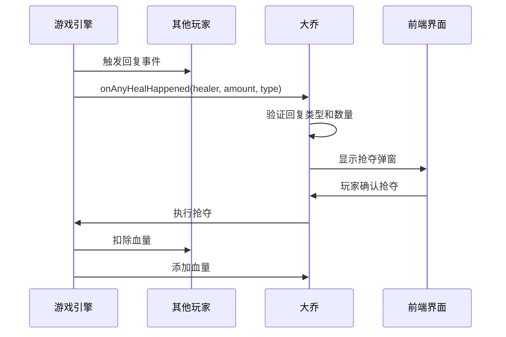
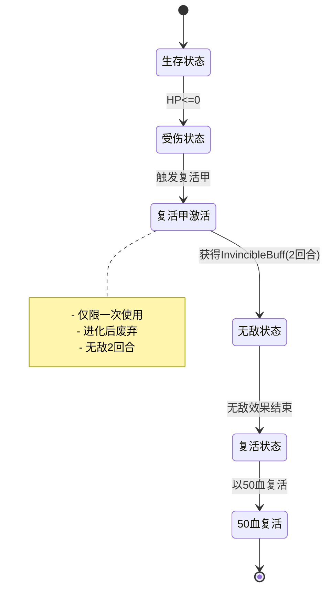
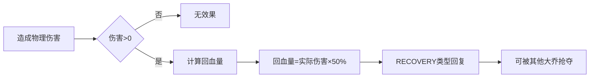
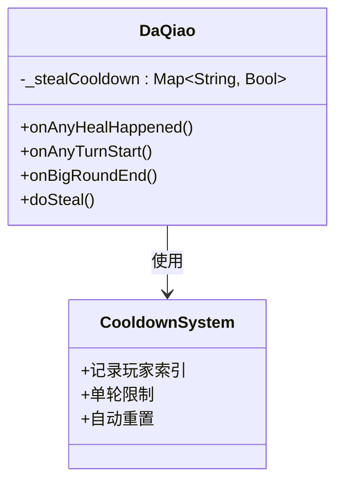

# 大乔角色详解

<cite>
**本文档引用的文件**
- [DaQiao.hx](file://character/DaQiao.hx)
- [大乔.md](file://ai/skills/大乔.md)
- [CharacterRegistry.hx](file://character/CharacterRegistry.hx)
- [Player.hx](file://model/Player.hx)
- [HealType.hx](file://model/HealType.hx)
- [DamageType.hx](file://model/DamageType.hx)
- [InvincibleBuff.hx](file://buffs/InvincibleBuff.hx)
- [GameEngine.hx](file://GameEngine.hx)
- [XiaoQiao.hx](file://character/XiaoQiao.hx)
</cite>

## 目录
1. [简介](#简介)
2. [角色定位与设计理念](#角色定位与设计理念)
3. [核心技能机制](#核心技能机制)
4. [团队支援能力](#团队支援能力)
5. [控制效果机制](#控制效果机制)
6. [半肉定位属性配置](#半肉定位属性配置)
7. [特殊技能效果分析](#特殊技能效果分析)
8. [团队增益与战术价值](#团队增益与战术价值)
9. [技能冷却时间与限制](#技能冷却时间与限制)
10. [差异化优势分析](#差异化优势分析)
11. [阵容适应性](#阵容适应性)
12. [使用技巧与实战指导](#使用技巧与实战指导)
13. [最佳搭档选择](#最佳搭档选择)
14. [技能释放优先级](#技能释放优先级)
15. [性能考虑与优化](#性能考虑与优化)
16. [故障排除指南](#故障排除指南)
17. [结论](#结论)

## 简介

大乔是《大乔》游戏中的一名半肉辅助型角色，以其独特的"抢夺回复"机制为核心设计理念。她通过主动抢夺全场任意玩家的回复行为，实现快速积累血量并进化为强大的"神大乔"形态。这种设计使得大乔成为团队中不可或缺的支援型角色，既能保护队友，又能通过抢夺机制增强自身实力。

## 角色定位与设计理念

### 半肉定位
大乔采用半肉定位，初始血量为120点，属于中等血量的辅助角色。这种设计平衡了生存能力和支援能力，既能在前线承受一定伤害，又能发挥辅助作用。

### 设计理念核心
- **抢夺为核心**：大乔必须永远抢血，抢血是她唯一的成长路径
- **团队支援**：通过抢夺他人回复来增强团队整体续航能力
- **进化机制**：通过达到特定血量阈值来解锁更强力的形态
- **被动增益**：通过造成伤害来获得额外回复

**章节来源**
- [DaQiao.hx:9-19](file://character/DaQiao.hx#L9-L19)
- [CharacterRegistry.hx:38-39](file://character/CharacterRegistry.hx#L38-L39)

## 核心技能机制

### 抢夺回复机制
大乔的核心机制是能够抢夺全场任意玩家的回复行为，具体规则如下：

**图表来源**
- [DaQiao.hx:36-68](file://character/DaQiao.hx#L36-L68)

### 技能冷却系统
大乔实现了复杂的冷却系统来防止滥用：

- **单轮冷却**：每人每轮只能被抢夺一次
- **冷却键值**：使用玩家索引而非ID作为冷却键，避免多实例冲突
- **冷却重置**：当被抢夺的玩家开始行动时，冷却自动解除

**章节来源**
- [DaQiao.hx:26-27](file://character/DaQiao.hx#L26-L27)
- [DaQiao.hx:244-257](file://character/DaQiao.hx#L244-L257)

## 团队支援能力

### 回复事件监听
大乔通过重写`onAnyHealHappened`方法监听全场景的回复事件：

**图表来源**
- [DaQiao.hx:36-68](file://character/DaQiao.hx#L36-L68)
- [GameEngine.hx:56-62](file://GameEngine.hx#L56-L62)

### 回复量计算
大乔的回复量计算遵循以下规则：
- 基础抢夺：回复量的50%
- 神大乔：额外+10点
- 最终量：取整数

**章节来源**
- [DaQiao.hx:166-171](file://character/DaQiao.hx#L166-L171)

## 控制效果机制

### 复活甲机制
大乔拥有独特的复活甲机制，在死亡时提供保护：

**图表来源**
- [DaQiao.hx:112-135](file://character/DaQiao.hx#L112-L135)
- [InvincibleBuff.hx:11-43](file://buffs/InvincibleBuff.hx#L11-L43)

### 伤害减免机制
神大乔形态下，大乔获得物理伤害减免：

- **减免比例**：物理伤害减少25%（乘0.75）
- **生效条件**：仅在进化为神大乔时生效
- **持续效果**：永久性被动效果

**章节来源**
- [DaQiao.hx:95-102](file://character/DaQiao.hx#L95-L102)

## 半肉定位属性配置

### 基础属性
- **血量**：120点（半肉定位）
- **初始手牌**：[1,1]（标准起始手牌）
- **初始回合停留**：2回合
- **零组合初始停留**：2回合

### 进化条件
- **血量阈值**：超过300点
- **触发方式**：手动进化
- **代价**：扣除300点血量
- **限制**：复活甲使用后无法再次进化

**章节来源**
- [DaQiao.hx:29-31](file://character/DaQiao.hx#L29-L31)
- [DaQiao.hx:145-159](file://character/DaQiao.hx#L145-L159)

## 特殊技能效果分析

### 造成伤害回血
大乔的被动技能允许她在造成物理伤害后获得回复：

**图表来源**
- [DaQiao.hx:72-78](file://character/DaQiao.hx#L72-L78)

### 神大乔进化效果
进化为神大乔后，大乔获得以下增强：

| 效果类型 | 基础效果 | 神大乔效果 |
|---------|----------|-----------|
| 物理伤害 | 基础伤害 | ×1.5倍 |
| 物理伤害减免 | 无 | 减少25% |
| 抢夺量 | +50% | +50%+10 |
| 复活甲 | 可用 | 废弃 |

**章节来源**
- [DaQiao.hx:83-102](file://character/DaQiao.hx#L83-L102)
- [DaQiao.hx:152-159](file://character/DaQiao.hx#L152-L159)

## 团队增益与战术价值

### 团队续航增强
大乔通过抢夺机制为团队提供稳定的续航保障：

- **被动回血**：每回合都能从队友的回复中获益
- **主动抢夺**：在关键时刻可以抢夺关键回复
- **团队配合**：鼓励队友使用回复技能，形成良性循环

### 战术价值评估
- **前期**：主要提供回复支援，帮助团队维持战斗持久性
- **中期**：通过抢夺积累血量，为后期进化做准备
- **后期**：进化为神大乔后，既能支援又能输出

**章节来源**
- [大乔.md:17-18](file://ai/skills/大乔.md#L17-L18)

## 技能冷却时间与限制

### 冷却系统设计
大乔的冷却系统采用"单轮限制"机制：

**图表来源**
- [DaQiao.hx:26-27](file://character/DaQiao.hx#L26-L27)
- [DaQiao.hx:244-262](file://character/DaQiao.hx#L244-L262)

### 冷却重置机制
- **每回合重置**：当被抢夺的玩家开始行动时，冷却自动解除
- **大回合重置**：每大回合结束时，所有冷却状态重置
- **避免滥用**：确保抢夺机制的平衡性

**章节来源**
- [DaQiao.hx:259-262](file://character/DaQiao.hx#L259-L262)

## 差异化优势分析

### 与其他辅助角色的对比

| 角色 | 定位 | 主要机制 | 优势 | 劣势 |
|------|------|----------|------|------|
| 大乔 | 半肉辅助 | 抢夺回复 | 团队续航强，可进化 | 血量较低，生存能力一般 |
| 小乔 | 半肉辅助 | 回血加成 | 回血效率高 | 依赖队友配合 |
| 藏师 | 坦克 | 护盾和治疗 | 生存能力强 | 回复能力有限 |
| 张飞 | 坦克 | 真伤输出 | 输出能力强 | 辅助能力弱 |

### 大乔的独特优势
1. **团队协同性**：鼓励队友使用回复技能
2. **成长性**：通过抢夺实现持续增强
3. **灵活性**：可进化为不同形态适应不同局面
4. **控制能力**：复活甲提供额外的生存保障

**章节来源**
- [XiaoQiao.hx:9-16](file://character/XiaoQiao.hx#L9-L16)

## 阵容适应性

### 适合的阵容类型
- **回复型阵容**：鼓励队友使用大量回复技能
- **持久型阵容**：重视团队续航能力
- **控制型阵容**：配合复活甲的生存能力

### 不适合的阵容类型
- **纯输出阵容**：缺乏回复技能，无法最大化大乔效果
- **高爆发阵容**：可能在抢夺前就被击杀
- **真实伤害阵容**：复活甲只对物理/法术伤害有效

### 配合角色分析
- **与回复型角色配合**：如藏师、小乔等
- **与坦克角色配合**：如张飞、赵云等
- **与输出型角色配合**：如法师、阴阳师等

**章节来源**
- [大乔.md:48-51](file://ai/skills/大乔.md#L48-L51)

## 使用技巧与实战指导

### 基本操作技巧
1. **优先抢夺**：在有回复事件时优先选择抢夺
2. **血量管理**：合理控制血量，避免过早或过晚进化
3. **时机把握**：在团队需要时进行抢夺，提升团队整体表现

### 进化时机策略
- **安全情况**：优先进化，获得更强的团队支援能力
- **危险情况**：保留复活甲，确保生存能力
- **血量阈值**：建议在超过300点血量时进行进化

### 阵容搭配建议
- **前期**：搭配回复型角色，快速建立团队续航
- **中期**：根据战况决定是否进化
- **后期**：进化为神大乔，提供更强的团队支援

**章节来源**
- [大乔.md:44-46](file://ai/skills/大乔.md#L44-L46)

## 最佳搭档选择

### 推荐搭档
1. **藏师**：大量回复技能，为大乔提供稳定的抢夺来源
2. **小乔**：回血加成，提升团队整体回复效率
3. **张飞**：坦克角色，为大乔提供保护
4. **赵云**：高机动性，配合大乔的团队支援能力

### 搭档选择原则
- **回复能力**：搭档应具备较强的回复技能
- **生存能力**：搭档应能在前线承受一定伤害
- **配合度**：搭档技能应与大乔的抢夺机制相配合

**章节来源**
- [大乔.md:49-50](file://ai/skills/大乔.md#L49-L50)

## 技能释放优先级

### 优先级排序
1. **有0时**：优先选择[0,1/5/8/9]组合，既能造成伤害又能获得回复
2. **凑[x,6]或[6,6]**：触发大量回复同时进行攻击
3. **HP>280时**：优先考虑进化，提升团队整体实力
4. **进化后**：更加积极地参与战斗，发挥更强的支援能力

### 实战应用
- **前期**：注重回复和生存，避免过度激进
- **中期**：根据血量情况决定是否进化
- **后期**：充分利用神大乔的能力，为团队提供最强支援

**章节来源**
- [大乔.md:38-42](file://ai/skills/大乔.md#L38-L42)

## 性能考虑与优化

### 冷却系统优化
大乔的冷却系统采用了高效的键值存储机制：

- **索引键值**：使用玩家索引而非ID，避免多实例冲突
- **内存管理**：及时清理无效的冷却状态
- **性能优化**：通过Map结构实现O(1)的查找和更新

### 事件监听优化
- **条件过滤**：在事件发生时立即进行条件检查
- **早期返回**：对于不符合条件的情况立即返回
- **批量处理**：在大回合结束时统一重置冷却状态

**章节来源**
- [DaQiao.hx:244-262](file://character/DaQiao.hx#L244-L262)

## 故障排除指南

### 常见问题及解决方案

#### 问题1：抢夺功能异常
**症状**：无法正常抢夺他人回复
**可能原因**：
- 冷却状态未正确重置
- 玩家索引获取失败
- 回复类型判断错误

**解决方法**：
1. 检查冷却系统的重置逻辑
2. 验证玩家索引的获取过程
3. 确认回复类型的判断条件

#### 问题2：进化功能失效
**症状**：无法进行进化或进化后效果异常
**可能原因**：
- 血量阈值检查失败
- 复活甲状态影响
- 进化逻辑错误

**解决方法**：
1. 验证血量阈值的检查逻辑
2. 检查复活甲的状态标志
3. 重新审视进化函数的实现

#### 问题3：复活甲效果异常
**症状**：复活甲无法正常触发或效果异常
**可能原因**：
- 复活甲触发条件错误
- 无敌状态管理异常
- 复活后血量恢复错误

**解决方法**：
1. 检查HP归零的判断逻辑
2. 验证无敌Buff的添加和移除
3. 确认复活后血量的正确恢复

**章节来源**
- [DaQiao.hx:112-135](file://character/DaQiao.hx#L112-L135)
- [DaQiao.hx:152-159](file://character/DaQiao.hx#L152-L159)

## 结论

大乔是一个设计精良的辅助型角色，其独特的抢夺机制为团队提供了强大的续航保障。通过合理的使用技巧和阵容搭配，大乔能够在各种战斗情况下发挥重要作用。

### 核心优势总结
1. **团队协同性强**：鼓励队友使用回复技能，形成良性循环
2. **成长性明显**：通过抢夺实现持续增强，从半肉辅助成长为团队核心
3. **生存能力均衡**：既有复活甲的保护，又有进化后的减伤能力
4. **战术价值高**：既能支援又能输出，适应多种战斗局面

### 使用建议
- 重视团队配合，鼓励队友使用回复技能
- 合理控制血量，把握进化时机
- 根据战况灵活调整策略，必要时保留复活甲
- 选择合适的搭档，最大化团队整体实力

大乔的设计体现了辅助型角色的核心价值——通过团队协作实现个人和团队的共同成长，是《大乔》游戏中不可或缺的重要角色。