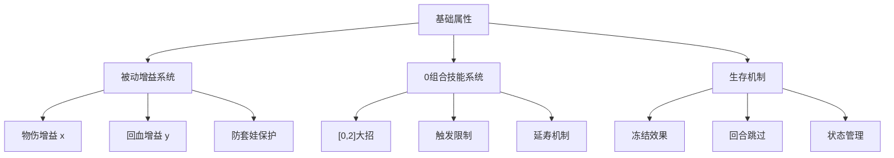
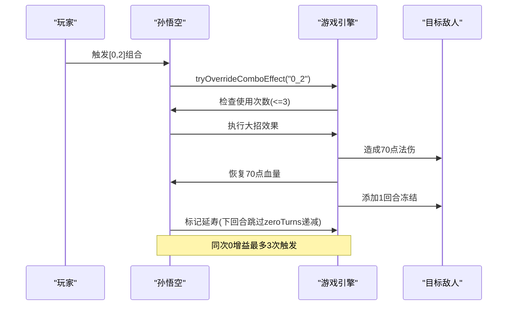
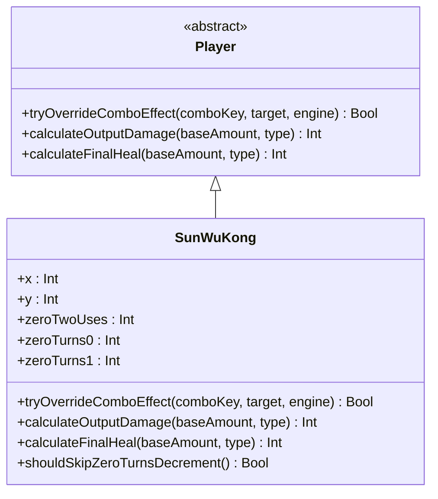
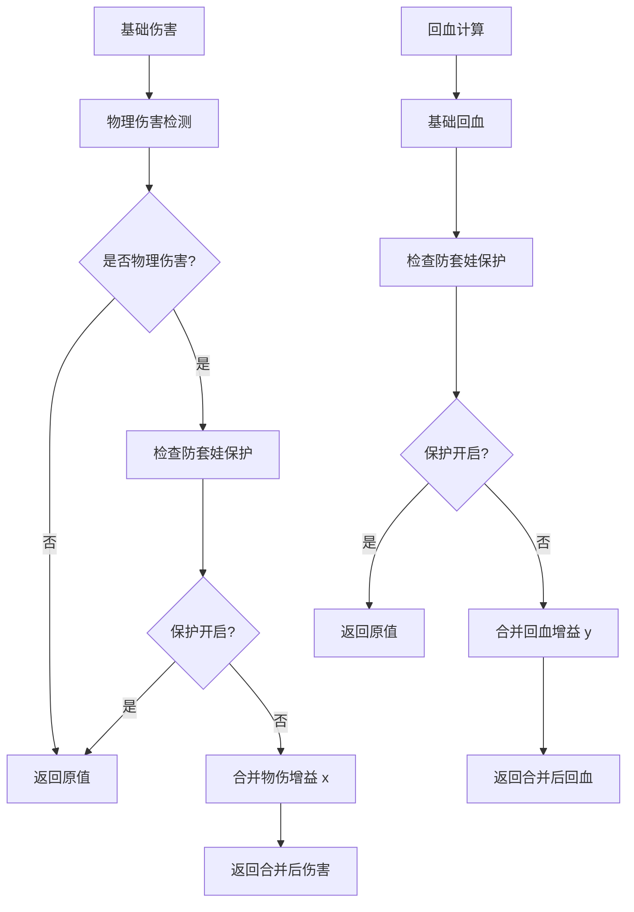
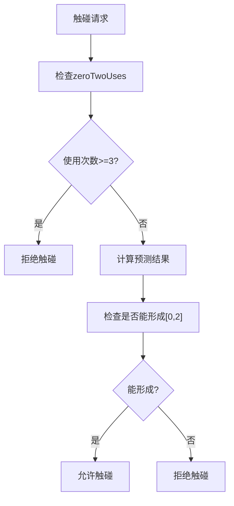

# 孙悟空角色详解

<cite>
**本文档引用的文件**
- [SunWuKong.hx](file://character/SunWuKong.hx)
- [CharacterRegistry.hx](file://character/CharacterRegistry.hx)
- [Player.hx](file://model/Player.hx)
- [GameEngine.hx](file://GameEngine.hx)
- [TurnManager.hx](file://TurnManager.hx)
- [FrozenBuff.hx](file://buffs/FrozenBuff.hx)
- [main.js](file://main.js)
</cite>

## 目录
1. [角色概述](#角色概述)
2. [设计理念](#设计理念)
3. [核心机制分析](#核心机制分析)
4. [技能系统详解](#技能系统详解)
5. [战斗定位与属性配置](#战斗定位与属性配置)
6. [连招与操作技巧](#连招与操作技巧)
7. [实战应用指南](#实战应用指南)
8. [性能与优化](#性能与优化)
9. [故障排除](#故障排除)
10. [总结](#总结)

## 角色概述

孙悟空是《斗阵VS》中的核心机动型角色，定位为"半肉"战士，拥有独特的高机动性技能体系和爆发伤害机制。作为游戏中最具特色的角色之一，孙悟空通过其特殊的0组合技能实现了独特的战术价值。

### 基础信息
- **角色名称**: 孙悟空
- **定位**: 半肉战士
- **初始生命值**: 260
- **初始回合数**: 2
- **特色标签**: 机动性、爆发伤害、半肉生存

## 设计理念

孙悟空的设计体现了"高机动性+爆发输出+半肉生存"的平衡理念。其设计核心在于通过特殊的0组合技能系统，为玩家提供灵活的战术选择和强大的爆发能力。

### 设计哲学
1. **机动性优先**: 通过0组合技能实现快速位移和战术转换
2. **爆发输出**: 利用被动机制实现持续增强的伤害输出
3. **半肉生存**: 在保持输出能力的同时具备一定的生存保障
4. **策略深度**: 通过多重触发条件创造丰富的战术可能性

## 核心机制分析

### 主被动机制架构

孙悟空的核心机制围绕三个主要方面构建：

**图表来源**
- [SunWuKong.hx:9-34](file://character/SunWuKong.hx#L9-L34)
- [SunWuKong.hx:19-30](file://character/SunWuKong.hx#L19-L30)

### 被动增益系统

孙悟空的被动系统包含两个核心增益值：

#### 物伤增益 (x)
- **初始值**: 40
- **更新机制**: 监听全场物理伤害输出，取最大值更新
- **作用范围**: 仅影响物理伤害输出
- **防套娃设计**: 通过_inExtraEffect保护锁防止无限循环

#### 回血增益 (y)
- **初始值**: 30  
- **更新机制**: 监听全场回血事件，取最大值更新
- **作用范围**: 仅影响回血效果
- **单段广播**: 回血时额外回血采用单段广播，避免重复触发

**章节来源**
- [SunWuKong.hx:19-20](file://character/SunWuKong.hx#L19-L20)
- [SunWuKong.hx:90-117](file://character/SunWuKong.hx#L90-L117)

### 0组合技能系统

#### [0,2]大招机制
孙悟空最独特的技能是将标准的[0,2]组合技能替换为强力的爆发技能：

**图表来源**
- [SunWuKong.hx:136-166](file://character/SunWuKong.hx#L136-L166)
- [GameEngine.hx:554-591](file://GameEngine.hx#L554-L591)

#### 触发限制与延寿机制
- **触发上限**: 同次0增益期间最多3次
- **延寿效果**: 触发后下回合跳过zeroTurns递减
- **计数重置**: 当双手都不为0时重置使用计数

**章节来源**
- [SunWuKong.hx:140-166](file://character/SunWuKong.hx#L140-L166)
- [SunWuKong.hx:182-194](file://character/SunWuKong.hx#L182-L194)

## 技能系统详解

### 技能覆盖机制

孙悟空通过重写`tryOverrideComboEffect`方法实现了对标准组合技能的覆盖：

**图表来源**
- [Player.hx:164](file://model/Player.hx#L164)
- [SunWuKong.hx:136-166](file://character/SunWuKong.hx#L136-L166)

### 伤害计算流程

孙悟空的伤害计算遵循特定的处理顺序：

**图表来源**
- [SunWuKong.hx:77-83](file://character/SunWuKong.hx#L77-L83)
- [SunWuKong.hx:122-131](file://character/SunWuKong.hx#L122-L131)

**章节来源**
- [SunWuKong.hx:77-83](file://character/SunWuKong.hx#L77-L83)
- [SunWuKong.hx:122-131](file://character/SunWuKong.hx#L122-L131)

## 战斗定位与属性配置

### 半肉定位分析

孙悟空的半肉定位体现在其属性配置和生存机制上：

#### 生存特性
- **初始生命值**: 260（半肉标准）
- **回合开始**: 2回合初始回合数
- **抗伤机制**: 通过被动回血和护盾获得生存保障
- **控制免疫**: 冰冻效果提供额外的生存能力

#### 输出特性
- **物理伤害**: 通过被动x增益实现持续增强
- **法术伤害**: [0,2]大招提供爆发伤害
- **伤害类型**: 物理为主，法术为辅

**章节来源**
- [SunWuKong.hx:31-34](file://character/SunWuKong.hx#L31-L34)
- [CharacterRegistry.hx:35](file://character/CharacterRegistry.hx#L35)

### 属性配置要点

1. **高机动性**: 通过0组合技能实现快速位移
2. **持续输出**: 被动增益系统确保伤害持续提升
3. **生存保障**: 回血增益和控制效果提供安全保障
4. **战术灵活性**: 多种触发条件创造丰富战术选择

## 连招与操作技巧

### 基础连招思路

孙悟空的连招主要围绕[0,2]大招展开，以下是推荐的连招思路：

#### 连招序列
1. **准备阶段**: 确保双手状态有利于触发[0,2]
2. **触发阶段**: 通过合法触碰触发[0,2]大招
3. **收尾阶段**: 利用冻结效果控制敌人，配合其他技能输出

#### 操作要点
- **时机把握**: 在敌人即将行动时触发，最大化冻结效果
- **目标选择**: 优先选择威胁较大的敌人
- **连击配合**: 触发后立即进行其他输出技能

### 高级操作技巧

#### 后果预判机制
孙悟空实现了独特的"后果预判"功能，允许在特定条件下预测触碰结果：

**图表来源**
- [SunWuKong.hx:40-70](file://character/SunWuKong.hx#L40-L70)

**章节来源**
- [SunWuKong.hx:40-70](file://character/SunWuKong.hx#L40-L70)

## 实战应用指南

### 阵容搭配建议

#### 快攻阵容
- **优势**: 与孙悟空配合可以形成快速压制
- **配合角色**: 需要能够承受伤害的坦克角色
- **战术要点**: 利用孙悟空的爆发能力快速击杀敌方核心

#### 控制阵容
- **优势**: 冰冻效果可以有效控制敌方行动
- **配合角色**: 需要能够提供额外控制的角色
- **战术要点**: 通过控制链配合孙悟空的爆发输出

### 面对不同对手的策略

#### 面对高机动性对手
- **策略**: 利用冰冻效果限制其机动性
- **时机**: 在对手准备位移时触发[0,2]大招
- **配合**: 与其他控制技能形成连击

#### 面对高输出对手
- **策略**: 通过被动回血保证生存
- **时机**: 在对手输出间隙进行爆发
- **配合**: 利用护盾和减伤机制

### 装备选择建议

由于代码中未包含具体的装备系统实现，基于角色特性给出一般性建议：

#### 推荐装备方向
1. **增加攻击力**: 提升物理伤害输出
2. **增加生存能力**: 提升生命值和护盾
3. **增加控制能力**: 提升冻结效果持续时间

## 性能与优化

### 代码性能分析

孙悟空的实现体现了良好的性能考虑：

#### 时间复杂度
- **伤害计算**: O(1) - 基于简单的数值运算
- **事件监听**: O(n) - 遍历所有玩家监听事件
- **状态管理**: O(1) - 基于固定数量的状态变量

#### 空间复杂度
- **状态存储**: O(1) - 固定数量的增益值和计数器
- **事件处理**: O(n) - 需要存储事件监听器

### 优化建议

1. **事件监听优化**: 可以考虑使用更高效的数据结构存储事件监听器
2. **状态同步**: 可以考虑减少不必要的状态同步操作
3. **缓存机制**: 可以缓存频繁访问的计算结果

## 故障排除

### 常见问题诊断

#### 大招无法触发
**可能原因**:
- [0,2]使用次数已达上限(3次)
- 触碰条件不满足
- 零组合状态异常

**解决方法**:
- 检查zeroTwoUses计数
- 确认双手状态符合触发条件
- 查看日志输出确认具体原因

#### 被动增益异常
**可能原因**:
- 防套娃保护锁意外开启
- 事件监听器异常
- 计算顺序错误

**解决方法**:
- 检查_inExtraEffect状态
- 确认事件监听器注册
- 验证计算顺序

**章节来源**
- [SunWuKong.hx:140-146](file://character/SunWuKong.hx#L140-L146)
- [SunWuKong.hx:28](file://character/SunWuKong.hx#L28)

## 总结

孙悟空作为《斗阵VS》中的核心角色，展现了独特而精妙的游戏设计理念。其通过特殊的0组合技能系统，实现了高机动性、爆发输出和半肉生存的完美平衡。

### 核心优势
1. **战术灵活性**: 多种触发条件创造丰富的战术选择
2. **爆发能力**: [0,2]大招提供强大的瞬间伤害
3. **生存保障**: 被动回血和控制效果确保持续作战能力
4. **团队价值**: 为快攻阵容提供关键的爆发点

### 设计亮点
- **创新机制**: 将标准组合技能转化为强力爆发技能
- **平衡设计**: 在输出、生存和机动性之间取得良好平衡
- **策略深度**: 通过多重触发条件创造复杂的战术可能性

孙悟空不仅是一个强力的角色，更是游戏设计理念的典型代表，为玩家提供了丰富而有趣的游戏体验。