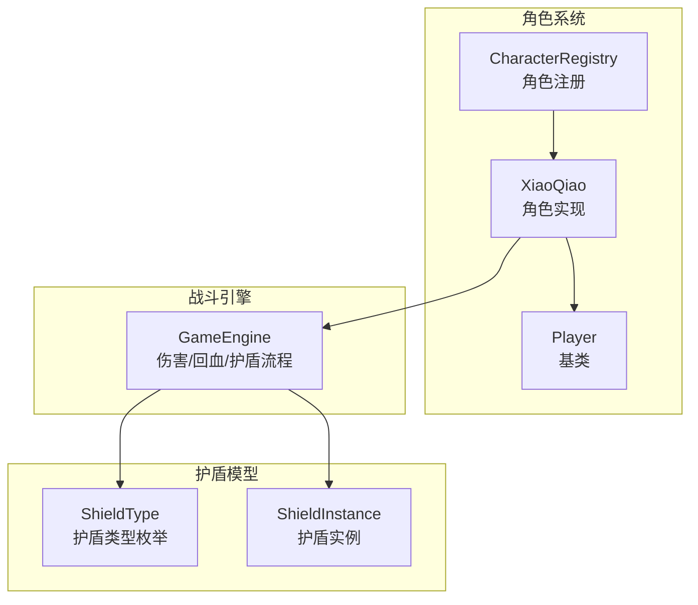
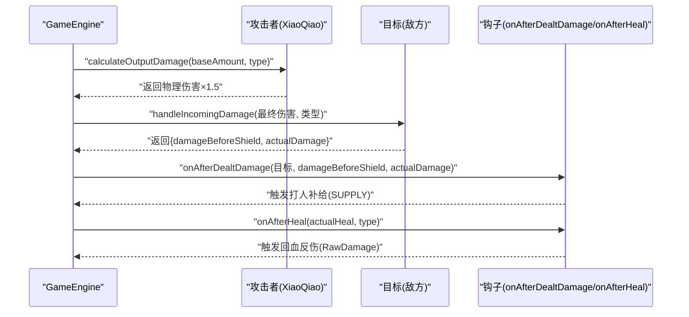
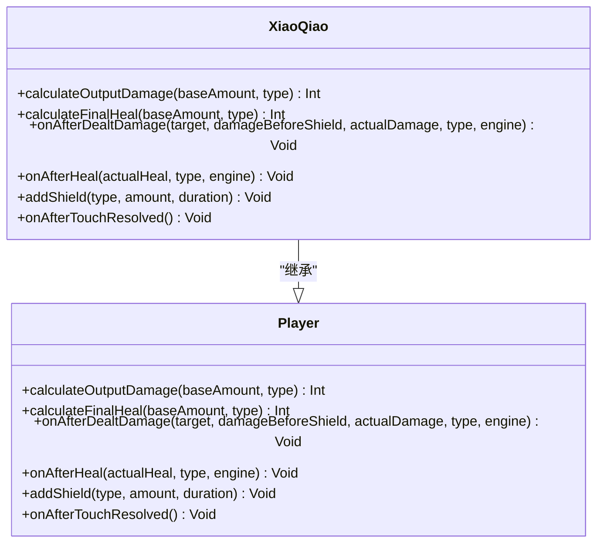
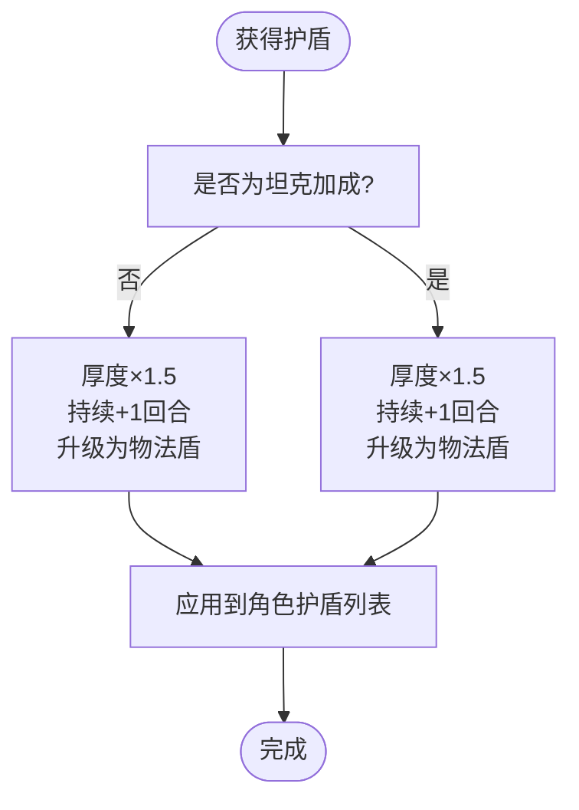
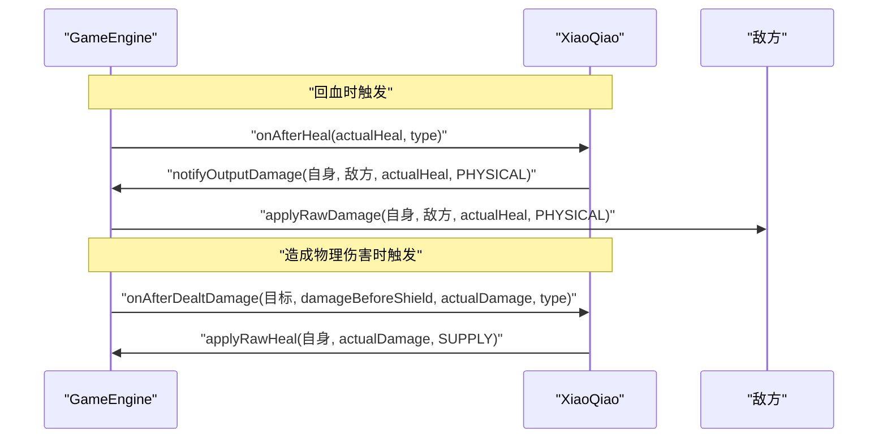
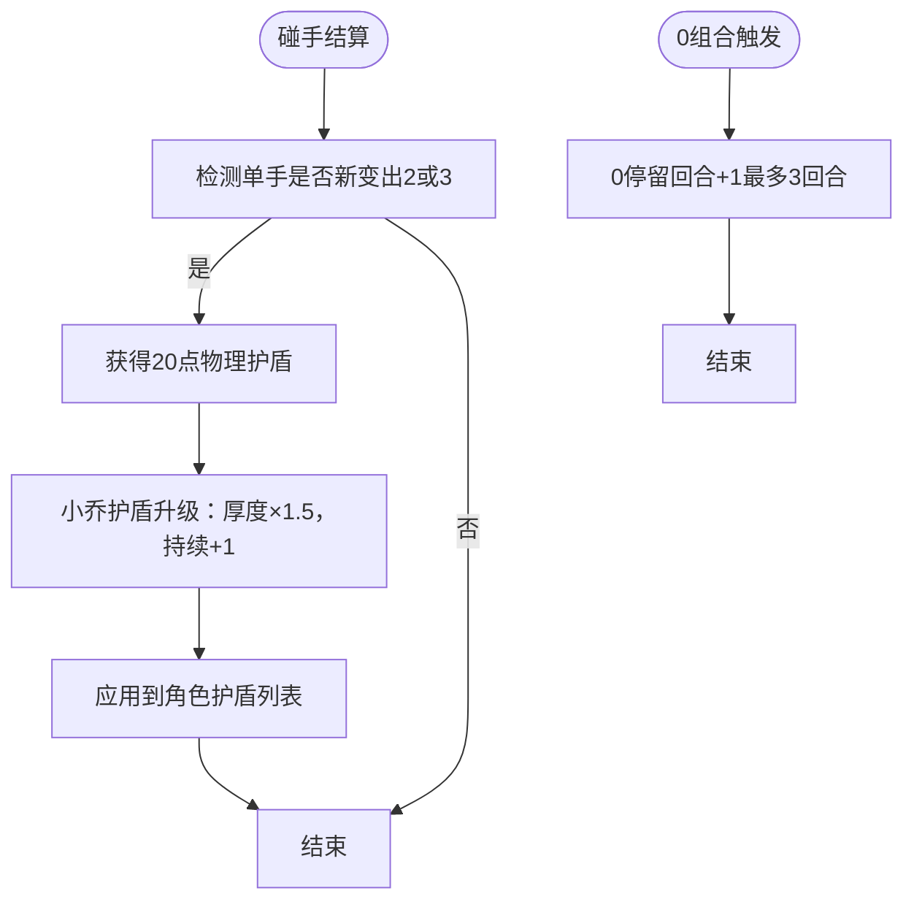
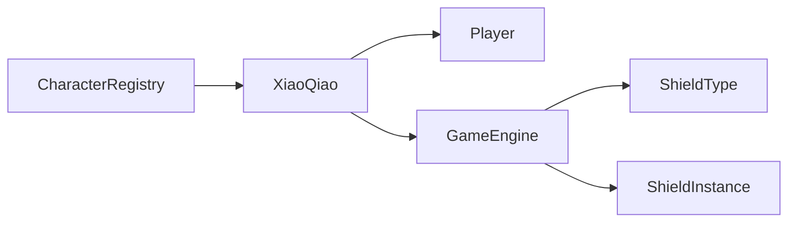

# 小乔角色详解

<cite>
**本文档引用的文件**
- [XiaoQiao.hx](file://character/XiaoQiao.hx)
- [CharacterRegistry.hx](file://character/CharacterRegistry.hx)
- [Player.hx](file://model/Player.hx)
- [GameEngine.hx](file://GameEngine.hx)
- [ShieldType.hx](file://model/ShieldType.hx)
- [ShieldInstance.hx](file://model/ShieldInstance.hx)
- [main.js](file://main.js)
- [小乔.md](file://ai/skills/小乔.md)
- [train_8_HERO_2026-06-12T06-27.txt](file://log/train_8_HERO_2026-06-12T06-27.txt)
- [train_4_REBEL_2026-06-12T06-20.txt](file://log/train_4_REBEL_2026-06-12T06-20.txt)
</cite>

## 目录
1. [简介](#简介)
2. [项目结构](#项目结构)
3. [核心组件](#核心组件)
4. [架构总览](#架构总览)
5. [详细组件分析](#详细组件分析)
6. [依赖关系分析](#依赖关系分析)
7. [性能考量](#性能考量)
8. [故障排除指南](#故障排除指南)
9. [结论](#结论)
10. [附录](#附录)

## 简介
本文件为小乔角色的全面技术文档，围绕其作为治疗型角色的设计理念展开，重点阐述其治疗技能实现、辅助能力机制、半肉定位的属性配置，并深入分析其特殊技能效果、冷却机制、与其他角色的配合关系。文档还解释了小乔的HP配置（360HP）与技能平衡性考虑，提供不同对战场景中的使用策略、最佳搭档推荐、技能释放时机等实战指导。

## 项目结构
小乔角色位于角色系统中，继承自通用Player基类，通过GameEngine进行伤害与回血流程控制，并在CharacterRegistry中完成注册。护盾系统采用ShieldType与ShieldInstance模型，支持物理、法术、物法盾与真实伤害等类型。

**图表来源**
- [XiaoQiao.hx:17-96](file://character/XiaoQiao.hx#L17-L96)
- [Player.hx:3-200](file://model/Player.hx#L3-L200)
- [CharacterRegistry.hx:17-82](file://character/CharacterRegistry.hx#L17-L82)
- [GameEngine.hx:16-200](file://GameEngine.hx#L16-L200)
- [ShieldType.hx:1-8](file://model/ShieldType.hx#L1-L8)
- [ShieldInstance.hx:1-13](file://model/ShieldInstance.hx#L1-L13)

**章节来源**
- [XiaoQiao.hx:17-96](file://character/XiaoQiao.hx#L17-L96)
- [CharacterRegistry.hx:17-82](file://character/CharacterRegistry.hx#L17-L82)
- [Player.hx:3-200](file://model/Player.hx#L3-L200)
- [GameEngine.hx:16-200](file://GameEngine.hx#L16-L200)
- [ShieldType.hx:1-8](file://model/ShieldType.hx#L1-L8)
- [ShieldInstance.hx:1-13](file://model/ShieldInstance.hx#L1-L13)

## 核心组件
- XiaoQiao角色类：实现小乔的被动技能与钩子逻辑，包括物理伤害与回血加成、回血反伤、打人补给、护盾升级与护盾触发等。
- Player基类：提供角色通用接口，包括伤害计算钩子、回血计算钩子、护盾管理、伤害抗性逻辑等。
- GameEngine战斗引擎：负责标准伤害与回血流程，触发角色钩子，维护护盾与伤害快照。
- CharacterRegistry注册中心：集中管理角色工厂与元数据，确保角色创建与显示一致。
- 护盾模型：ShieldType与ShieldInstance定义护盾类型与实例，支撑小乔的物法护盾升级机制。

**章节来源**
- [XiaoQiao.hx:17-96](file://character/XiaoQiao.hx#L17-L96)
- [Player.hx:31-177](file://model/Player.hx#L31-L177)
- [GameEngine.hx:124-200](file://GameEngine.hx#L124-L200)
- [CharacterRegistry.hx:17-82](file://character/CharacterRegistry.hx#L17-L82)
- [ShieldType.hx:1-8](file://model/ShieldType.hx#L1-L8)
- [ShieldInstance.hx:1-13](file://model/ShieldInstance.hx#L1-L13)

## 架构总览
小乔的技能实现遵循“钩子驱动”的设计模式：在GameEngine的标准流程中，角色通过重写Player的钩子方法参与伤害与回血的计算与后处理。小乔的关键点在于：
- 物理伤害×1.5与回血×1.5的双重加成。
- 回血时对敌方造成等量物理伤害（RawDamage，不触发物理伤害加成，防止循环）。
- 造成物理伤害后，按“实际扣血量”补给自身（SUPPLY类型）。
- 获得的护盾升级为物法盾，厚度×1.5，持续+1回合。
- 单手新变出2或3时，获得20点物理护盾（经升级后为30点物法盾，持续4回合）。
- 0可停留3回合（普通角色为2回合）。

**图表来源**
- [GameEngine.hx:137-200](file://GameEngine.hx#L137-L200)
- [XiaoQiao.hx:45-62](file://character/XiaoQiao.hx#L45-L62)
- [Player.hx:57-62](file://model/Player.hx#L57-L62)

**章节来源**
- [GameEngine.hx:137-200](file://GameEngine.hx#L137-L200)
- [XiaoQiao.hx:24-62](file://character/XiaoQiao.hx#L24-L62)
- [Player.hx:36-62](file://model/Player.hx#L36-L62)

## 详细组件分析

### XiaoQiao角色类
XiaoQiao继承Player，重写多个钩子以实现治疗型辅助的核心机制：
- calculateOutputDamage：物理伤害×1.5。
- calculateFinalHeal：回血×1.5（含坦克加成时叠加）。
- onAfterDealtDamage：造成物理伤害后，按“实际扣血量”补给自身（SUPPLY类型，不解毒）。
- onAfterHeal：回血时对敌方造成等量物理伤害（RawDamage，不触发物理伤害加成）。
- addShield：将获得的护盾升级为物法盾，厚度×1.5，持续+1回合。
- onAfterTouchResolved：单手新变出2或3时，获得20点物理护盾（经升级后为30点物法盾，持续4回合）。

**图表来源**
- [Player.hx:36-177](file://model/Player.hx#L36-L177)
- [XiaoQiao.hx:24-96](file://character/XiaoQiao.hx#L24-L96)

**章节来源**
- [XiaoQiao.hx:19-96](file://character/XiaoQiao.hx#L19-L96)
- [Player.hx:36-177](file://model/Player.hx#L36-L177)

### 护盾系统与物法护盾升级
小乔的护盾升级机制通过addShield实现：将获得的护盾厚度×1.5，持续时间+1回合，并统一升级为物法盾（BOTH_PHYSICAL_MAGIC）。该机制与坦克加成叠加，进一步提升生存能力。

**图表来源**
- [XiaoQiao.hx:65-70](file://character/XiaoQiao.hx#L65-L70)
- [GameEngine.hx:328-345](file://GameEngine.hx#L328-L345)
- [ShieldType.hx:3-8](file://model/ShieldType.hx#L3-L8)

**章节来源**
- [XiaoQiao.hx:65-70](file://character/XiaoQiao.hx#L65-L70)
- [GameEngine.hx:328-345](file://GameEngine.hx#L328-L345)
- [ShieldType.hx:3-8](file://model/ShieldType.hx#L3-L8)

### 回血反伤与打人补给机制
小乔的回血反伤与打人补给通过GameEngine的钩子系统实现：
- 回血反伤：onAfterHeal触发，对敌方造成等量物理伤害（RawDamage，不触发物理伤害加成）。
- 打人补给：onAfterDealtDamage触发，按“实际扣血量”补给自身（SUPPLY类型）。

**图表来源**
- [XiaoQiao.hx:54-62](file://character/XiaoQiao.hx#L54-L62)
- [XiaoQiao.hx:45-51](file://character/XiaoQiao.hx#L45-L51)
- [GameEngine.hx:301-327](file://GameEngine.hx#L301-L327)

**章节来源**
- [XiaoQiao.hx:45-62](file://character/XiaoQiao.hx#L45-L62)
- [GameEngine.hx:301-327](file://GameEngine.hx#L301-L327)

### 护盾触发被动与0停留机制
- 护盾触发：单手新变出2或3时，获得20点物理护盾（经小乔addShield升级后为30点物法盾，持续4回合）。
- 0停留：小乔的initTurns设为3，普通角色为2，使0可停留更久，布局更从容。

**图表来源**
- [XiaoQiao.hx:77-94](file://character/XiaoQiao.hx#L77-L94)
- [Player.hx:10-16](file://model/Player.hx#L10-L16)

**章节来源**
- [XiaoQiao.hx:77-94](file://character/XiaoQiao.hx#L77-L94)
- [Player.hx:10-16](file://model/Player.hx#L10-L16)

### HP配置与半肉定位
- 小乔的HP为360，属于半肉定位，兼顾生存与辅助能力。
- 通过护盾升级与回血加成，小乔在面对高爆发时具备更强的续航能力。
- 与坦克加成叠加时，回血×1.5×1.5=×2.25，护盾更厚，进一步强化半肉定位。

**章节来源**
- [CharacterRegistry.hx:26-27](file://character/CharacterRegistry.hx#L26-L27)
- [XiaoQiao.hx:20-21](file://character/XiaoQiao.hx#L20-L21)
- [Player.hx:43-47](file://model/Player.hx#L43-L47)

### 技能平衡性考虑
- 物理伤害×1.5与回血×1.5的双重加成，使小乔在攻防两端都有显著收益。
- 回血反伤与打人补给形成“攻防一体”的循环，但通过RawDamage与applyRawHeal避免了倍率循环。
- 护盾升级与0停留机制提升了小乔的生存与布局灵活性。
- 与坦克加成叠加时，小乔的生存与辅助能力进一步增强，平衡性得到保障。

**章节来源**
- [XiaoQiao.hx:24-70](file://character/XiaoQiao.hx#L24-L70)
- [Player.hx:43-47](file://model/Player.hx#L43-L47)

### 实战策略与搭档推荐
- 优先选择能够提供稳定回血与护盾的角色，如藏师（坦克加成）与大乔（辅助与控制）。
- 在面对法师时，小乔的物法护盾与回血反伤机制尤为有效。
- 保持手上有2或3，以便触发护盾被动，提升抗压能力。
- 2v2坦克加成下，回血×1.5×1.5=×2.25，护盾更厚，适合持久战。

**章节来源**
- [小乔.md:19-44](file://ai/skills/小乔.md#L19-L44)
- [train_8_HERO_2026-06-12T06-27.txt:10-12](file://log/train_8_HERO_2026-06-12T06-27.txt#L10-L12)

## 依赖关系分析
小乔的实现依赖于Player基类提供的钩子接口与GameEngine的标准流程，同时通过ShieldType与ShieldInstance实现护盾系统。角色注册通过CharacterRegistry集中管理。

**图表来源**
- [XiaoQiao.hx:17-96](file://character/XiaoQiao.hx#L17-L96)
- [Player.hx:3-200](file://model/Player.hx#L3-L200)
- [GameEngine.hx:16-200](file://GameEngine.hx#L16-L200)
- [ShieldType.hx:1-8](file://model/ShieldType.hx#L1-L8)
- [ShieldInstance.hx:1-13](file://model/ShieldInstance.hx#L1-L13)
- [CharacterRegistry.hx:17-82](file://character/CharacterRegistry.hx#L17-L82)

**章节来源**
- [XiaoQiao.hx:17-96](file://character/XiaoQiao.hx#L17-L96)
- [Player.hx:3-200](file://model/Player.hx#L3-L200)
- [GameEngine.hx:16-200](file://GameEngine.hx#L16-L200)
- [ShieldType.hx:1-8](file://model/ShieldType.hx#L1-L8)
- [ShieldInstance.hx:1-13](file://model/ShieldInstance.hx#L1-L13)
- [CharacterRegistry.hx:17-82](file://character/CharacterRegistry.hx#L17-L82)

## 性能考量
- 小乔的技能主要通过钩子触发，避免了复杂的计算开销，性能开销较低。
- 护盾升级与回血加成在GameEngine层面统一处理，减少重复计算。
- 0停留机制与护盾触发被动在碰手结算时检查，逻辑简单高效。

[本节为一般性讨论，不涉及具体文件分析]

## 故障排除指南
- 回血反伤未生效：确认onAfterHeal触发且actualHeal>0，且敌方存在。
- 打人补给未生效：确认onAfterDealtDamage触发且actualDamage>0。
- 护盾升级异常：确认addShield被调用且厚度×1.5、持续+1回合。
- 0停留机制异常：确认initTurns设为3，且在碰手结算后正确增加。

**章节来源**
- [XiaoQiao.hx:45-62](file://character/XiaoQiao.hx#L45-L62)
- [XiaoQiao.hx:65-70](file://character/XiaoQiao.hx#L65-L70)
- [Player.hx:10-16](file://model/Player.hx#L10-L16)

## 结论
小乔作为治疗型角色，通过物理伤害与回血加成、回血反伤、打人补给与护盾升级等机制，实现了攻防一体的辅助定位。其360HP的半肉配置与物法护盾升级，在面对高爆发与持续战时均具备较强生存能力。通过合理的搭档选择与技能释放时机，小乔能够在不同对战场景中发挥重要作用。

[本节为总结性内容，不涉及具体文件分析]

## 附录
- 小乔的AI权重与优先级参考：回血×1.5后打人等量伤害、回血×1.5对敌造成等量伤害、[0,6]或[6,6]最高价值、[0,4]次优、[0,1/5/8/9]附赠补给、凑2/3获得物法盾、[x,6]单手回血等量伤害。
- 克制关系：克制法师（物法盾抵挡法伤，回血时反伤），被孙悟空[0,2]冻结克制。

**章节来源**
- [小乔.md:4-44](file://ai/skills/小乔.md#L4-L44)