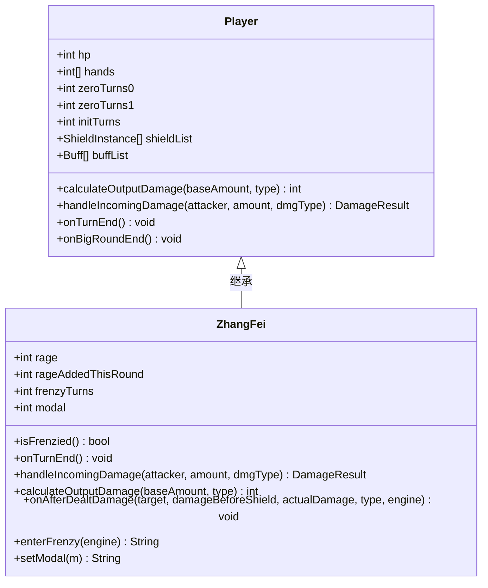
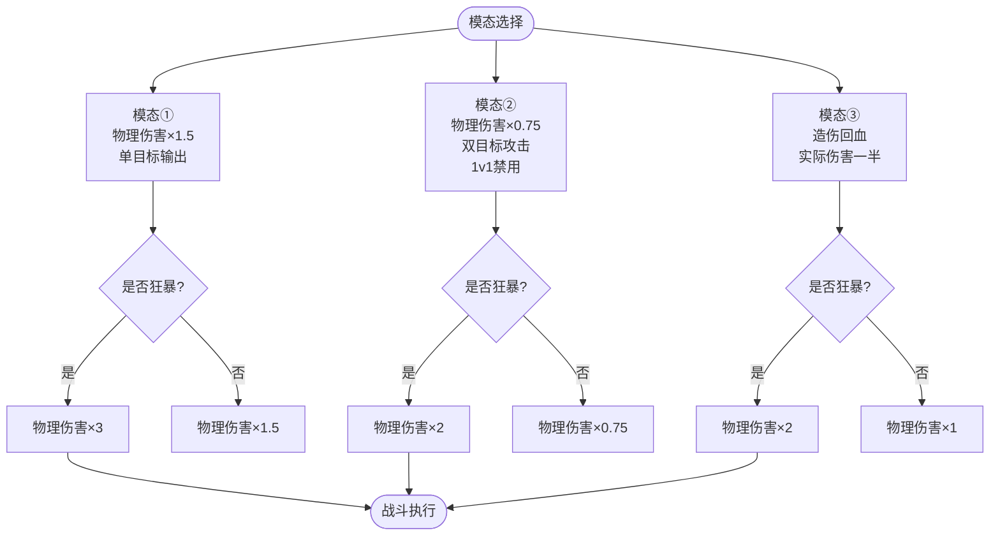
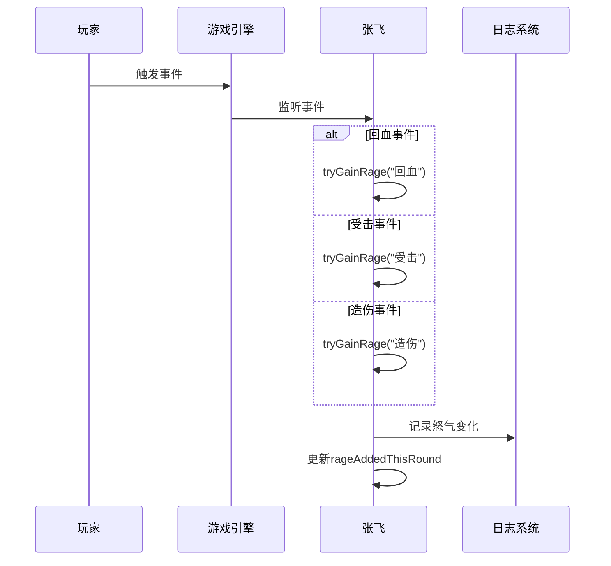
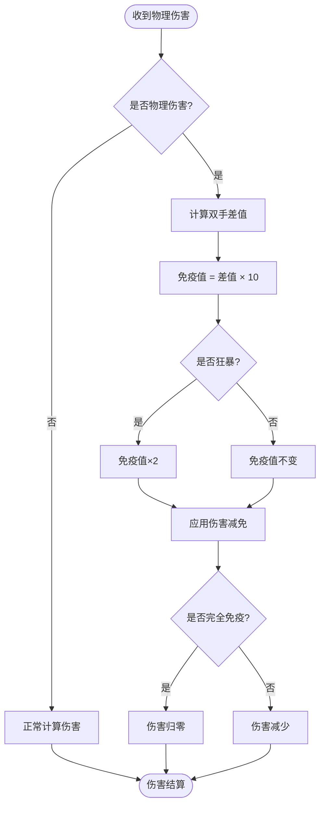
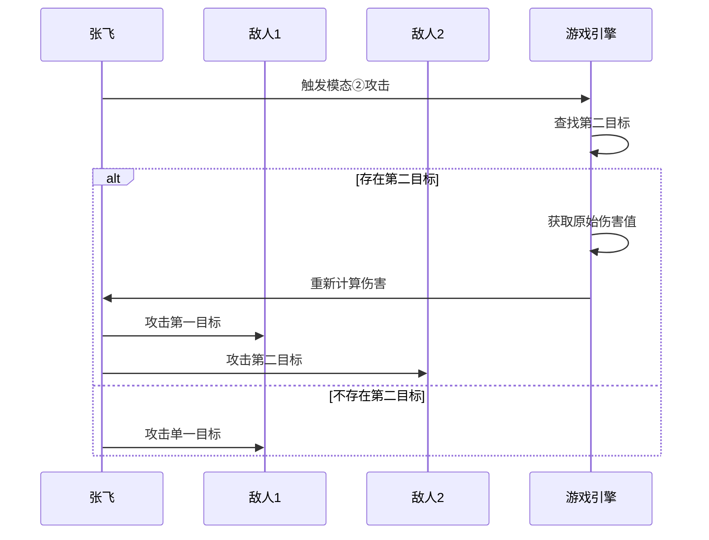
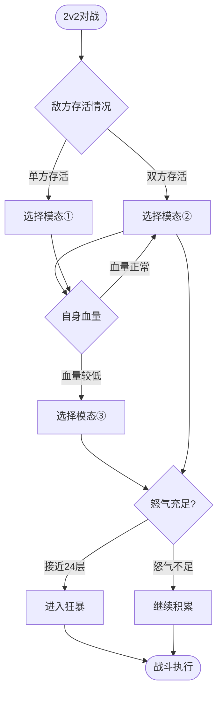

# 张飞角色详解

<cite>
**本文档引用的文件**
- [ZhangFei.hx](file://character/ZhangFei.hx)
- [Player.hx](file://character/Player.hx)
- [CharacterRegistry.hx](file://character/CharacterRegistry.hx)
- [ShieldInstance.hx](file://model/ShieldInstance.hx)
- [ShieldType.hx](file://model/ShieldType.hx)
- [Buff.hx](file://model/Buff.hx)
- [DamageType.hx](file://model/DamageType.hx)
- [HealType.hx](file://model/HealType.hx)
- [张飞.md](file://ai/skills/张飞.md)
- [train_2_HERO_2026-06-12T07-05.txt](file://log/train_2_HERO_2026-06-12T07-05.txt)
- [train_7_REBEL_2026-06-12T06-25.txt](file://log/train_7_REBEL_2026-06-12T06-25.txt)
</cite>

## 目录
1. [简介](#简介)
2. [角色定位与设计理念](#角色定位与设计理念)
3. [核心机制详解](#核心机制详解)
4. [模态系统分析](#模态系统分析)
5. [怒气与狂暴机制](#怒气与狂暴机制)
6. [防御与免伤系统](#防御与免伤系统)
7. [团队保护能力](#团队保护能力)
8. [与其他坦克角色对比](#与其他坦克角色对比)
9. [2v2阵容中的作用](#2v2阵容中的作用)
10. [技能连携配合](#技能连携配合)
11. [战术运用指南](#战术运用指南)
12. [最佳出装建议](#最佳出装建议)
13. [实战应对策略](#实战应对策略)
14. [性能与优化分析](#性能与优化分析)
15. [故障排除指南](#故障排除指南)
16. [结论](#结论)

## 简介

张飞是《斗地主》游戏中的一名强力坦克型角色，以其高血量（560HP）和独特的防御机制而著称。作为队伍中的前排担当，张飞不仅拥有出色的生存能力，还具备强大的团队保护和输出能力。本文档将深入分析张飞的设计理念、核心机制以及实战应用策略。

## 角色定位与设计理念

### 坦克定位
- **血量配置**：560HP的高血量设计，使其能够承担大量伤害
- **防御导向**：以生存为核心，通过多种机制提升防护能力
- **团队保护**：具备保护队友和控制战场节奏的能力

### 设计理念
张飞的设计体现了"高血量+高防御"的坦克理念，通过以下机制实现：
- 物理伤害免疫机制
- 多层次的伤害减免
- 回血与治疗双重保障
- 模态切换的战术灵活性

**章节来源**
- [CharacterRegistry.hx:44](file://character/CharacterRegistry.hx#L44)
- [ZhangFei.hx:8-21](file://character/ZhangFei.hx#L8-L21)

## 核心机制详解

### 基础属性与继承关系

**图表来源**
- [Player.hx:3-24](file://character/Player.hx#L3-L24)
- [ZhangFei.hx:22-36](file://character/ZhangFei.hx#L22-L36)

### 核心机制概览

张飞的核心机制围绕四个主要方面构建：

1. **行动结束补给**：回合结束时自动回复10点生命值
2. **物理伤害免疫**：基于双手差值计算的伤害减免
3. **模态系统**：三种不同的战斗模式
4. **怒气与狂暴**：通过积累怒气激活强大状态

**章节来源**
- [ZhangFei.hx:44-62](file://character/ZhangFei.hx#L44-L62)
- [ZhangFei.hx:67-90](file://character/ZhangFei.hx#L67-L90)
- [ZhangFei.hx:95-114](file://character/ZhangFei.hx#L95-L114)
- [ZhangFei.hx:168-208](file://character/ZhangFei.hx#L168-L208)

## 模态系统分析

### 模态类型与效果

张飞的模态系统是其战术灵活性的核心，包含三种不同的战斗模式：

**图表来源**
- [ZhangFei.hx:101-114](file://character/ZhangFei.hx#L101-L114)
- [ZhangFei.hx:213-218](file://character/ZhangFei.hx#L213-L218)

### 模态切换机制

模态切换通过专门的方法实现，具有以下特点：

- **参数验证**：确保模态值在1-3范围内
- **状态记录**：记录当前使用的模态
- **界面反馈**：提供视觉反馈显示当前模态

**章节来源**
- [ZhangFei.hx:213-218](file://character/ZhangFei.hx#L213-L218)
- [ZhangFei.hx:234-265](file://character/ZhangFei.hx#L234-L265)

## 怒气与狂暴机制

### 怒气系统设计

张飞的怒气系统是其核心玩法机制，通过以下方式积累：

**图表来源**
- [ZhangFei.hx:168-173](file://character/ZhangFei.hx#L168-L173)
- [ZhangFei.hx:178-182](file://character/ZhangFei.hx#L178-L182)
- [ZhangFei.hx:187-192](file://character/ZhangFei.hx#L187-L192)

### 狂暴状态机制

狂暴是张飞最强大的状态，具有以下效果：

- **伤害倍增**：物理伤害×3（模态①）或×2（其他模态）
- **免伤提升**：物理伤害减免×2
- **零组合强化**：零组合使用回合数增加至3回合
- **现有零组合延长**：已存在的零组合寿命+1

**章节来源**
- [ZhangFei.hx:197-208](file://character/ZhangFei.hx#L197-L208)
- [ZhangFei.hx:20-21](file://character/ZhangFei.hx#L20-L21)

## 防御与免伤系统

### 物理伤害免疫机制

张飞的免伤系统基于双手差值计算，具有以下特点：

**图表来源**
- [ZhangFei.hx:67-90](file://character/ZhangFei.hx#L67-L90)
- [ZhangFei.hx:70-73](file://character/ZhangFei.hx#L70-L73)

### 免伤计算逻辑

免伤计算遵循以下规则：
- **基础计算**：免疫值 = 双手差值 × 10
- **狂暴加成**：狂暴状态下免疫值×2
- **完全免疫**：当免疫值≥实际伤害时，伤害归零
- **部分免疫**：当免疫值<实际伤害时，伤害减少相应数值

**章节来源**
- [ZhangFei.hx:67-90](file://character/ZhangFei.hx#L67-L90)

## 团队保护能力

### 模态②的团队保护

模态②的"0.75倍伤害打两个敌人"机制提供了强大的团队保护能力：

**图表来源**
- [ZhangFei.hx:125-146](file://character/ZhangFei.hx#L125-L146)

### 回血机制的团队价值

模态③的"造伤回血一半"机制不仅提升个人生存能力，还能：
- 为队友创造更好的输出环境
- 在混战中维持队伍整体血量
- 提供持续的治疗支持

**章节来源**
- [ZhangFei.hx:148-159](file://character/ZhangFei.hx#L148-L159)

## 与其他坦克角色对比

### 与藏师的对比

| 特性 | 张飞 | 藏师 |
|------|------|------|
| 基础血量 | 560HP | 660HP |
| 防御机制 | 物理伤害免疫 | 护盾系统 |
| 模态系统 | 3种模态 | 无模态 |
| 团队保护 | 双目标攻击 | 单目标保护 |
| 狂暴机制 | 怒气驱动 | 组合技能 |

### 与杨大力的对比

| 特性 | 张飞 | 杨大力 |
|------|------|--------|
| 基础血量 | 560HP | 1000HP |
| 防御机制 | 免伤+回血 | 高血量硬抗 |
| 战术价值 | 多样化模态 | 纯坦克 |
| 团队贡献 | 多目标输出 | 单目标抗伤 |

**章节来源**
- [CharacterRegistry.hx:29-51](file://character/CharacterRegistry.hx#L29-L51)

## 2v2阵容中的作用

### 模态选择策略

在2v2阵容中，张飞的模态选择具有明确的指导原则：

**图表来源**
- [张飞.md:40-44](file://ai/skills/张飞.md#L40-L44)

### 战术应用场景

1. **双人对双人**：使用模态②最大化伤害输出
2. **低血量续航**：使用模态③维持战斗能力
3. **接近狂暴**：不惜受击换取怒气积累

**章节来源**
- [张飞.md:23-26](file://ai/skills/张飞.md#L23-L26)
- [张飞.md:40-44](file://ai/skills/张飞.md#L40-L44)

## 技能连携配合

### 与零组合的配合

张飞的免伤机制与零组合形成完美配合：
- **双手差值最大化**：保持较大的双手差值以获得更高免伤
- **零组合触发**：通过零组合获得额外收益
- **伤害倍增**：在狂暴状态下享受伤害倍增效果

### 与其他角色的协同

1. **与输出角色配合**：提供保护，让输出角色专注于输出
2. **与辅助角色配合**：共同维持团队生存能力
3. **与控制角色配合**：在控制敌人时提供保护

## 战术运用指南

### 基础战术原则

1. **保持双手差值**：通过合理的手牌组合维持高免伤
2. **合理分配模态**：根据战场情况选择最适合的模态
3. **管理怒气资源**：平衡攻击与生存需求
4. **时机把握**：在合适的时机进入狂暴状态

### 高级战术技巧

1. **预判伤害**：提前计算可能受到的伤害量
2. **资源管理**：合理分配回血和输出资源
3. **团队协调**：与队友配合制定战术计划
4. **心理博弈**：通过模态切换迷惑对手

## 最佳出装建议

### 装备选择原则

1. **生存优先**：优先选择提升生存能力的装备
2. **伤害适中**：适度提升输出能力，但不牺牲生存
3. **功能性装备**：选择具有特殊效果的装备
4. **性价比考虑**：在预算范围内选择最优装备

### 推荐装备组合

| 装备类型 | 推荐理由 | 典型效果 |
|----------|----------|----------|
| 生存装备 | 提升血量上限和防御能力 | 增加生存时间 |
| 回复装备 | 提供持续的治疗效果 | 维持战斗持久性 |
| 控制装备 | 增强控制和限制能力 | 扰乱对手节奏 |
| 辅助装备 | 提供团队增益效果 | 增强整体战斗力 |

## 实战应对策略

### 面对不同对手的策略

#### 面对高输出对手
- 保持高免伤状态
- 利用模态③进行续航
- 寻找机会进入狂暴状态

#### 面对控制型对手
- 优先提升免伤能力
- 利用护盾和回血机制
- 与队友配合反制控制

#### 面对数量优势对手
- 使用模态②进行群体输出
- 保护关键队友
- 利用地形和位置优势

### 关键决策时刻

1. **怒气积累阶段**：优先保证生存，适当接受伤害换取怒气
2. **接近狂暴阶段**：可以采取更激进的策略
3. **狂暴期间**：最大化输出，清理残余敌人
4. **后期阶段**：注重团队配合和资源分配

## 性能与优化分析

### 代码架构优势

张飞的实现体现了良好的面向对象设计：

1. **继承关系清晰**：通过Player基类实现统一的接口
2. **职责分离明确**：每个方法都有明确的功能边界
3. **扩展性强**：易于添加新的功能和特性
4. **维护性好**：代码结构清晰，便于理解和修改

### 性能考虑因素

1. **计算复杂度**：免伤计算为O(1)复杂度，性能优异
2. **内存使用**：使用基本数据类型，内存占用较小
3. **事件处理**：通过钩子机制实现高效的事件响应
4. **状态管理**：合理的状态变量设计，避免冗余计算

## 故障排除指南

### 常见问题及解决方案

#### 模态切换无效
**问题描述**：模态切换按钮点击无反应
**解决方法**：
1. 检查模态值范围（1-3）
2. 确认角色处于可操作状态
3. 验证前端JavaScript绑定是否正确

#### 怒气积累异常
**问题描述**：怒气值显示不正确
**解决方法**：
1. 检查事件监听是否正常工作
2. 验证大回合重置逻辑
3. 确认tryGainRage方法调用

#### 免伤计算错误
**问题描述**：免伤值与预期不符
**解决方法**：
1. 检查双手差值计算
2. 验证狂暴状态判断
3. 确认伤害减免应用顺序

### 调试技巧

1. **日志追踪**：利用trace语句记录关键状态变化
2. **单元测试**：编写针对核心算法的测试用例
3. **性能监控**：监控关键方法的执行时间和内存使用
4. **边界条件**：测试极端情况下的行为表现

## 结论

张飞作为一款精心设计的坦克型角色，通过其独特的模态系统、怒气机制和免伤系统，为玩家提供了丰富的战术选择和深度的游戏体验。其560HP的高血量配置、基于双手差值的物理伤害免疫机制，以及三种不同模态的灵活切换，使张飞能够在各种战斗环境中发挥重要作用。

### 核心优势总结

1. **生存能力强**：高血量+免伤机制提供出色生存能力
2. **战术灵活**：三种模态适应不同战斗场景
3. **团队价值高**：模态②的双目标攻击增强团队输出
4. **操作深度大**：怒气管理和狂暴时机把控体现操作水平

### 发展方向建议

1. **平衡性调整**：根据实战表现调整各项数值
2. **UI改进**：优化模态切换和状态显示
3. **AI优化**：提升AI对张飞机制的理解和应用
4. **扩展内容**：考虑添加更多模态或特殊效果

张飞的设计充分体现了游戏平衡性与趣味性的结合，为玩家提供了既有挑战性又充满成就感的游戏体验。通过深入理解其机制和策略，玩家可以更好地发挥张飞的潜力，在游戏中取得优异的成绩。