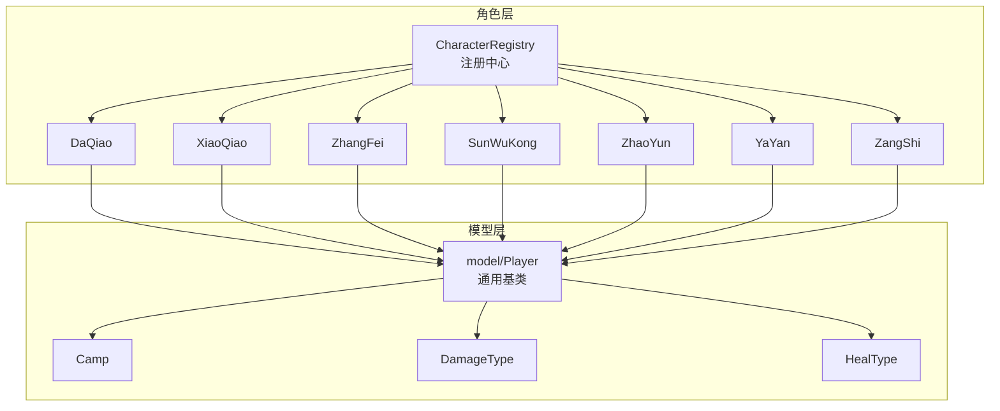
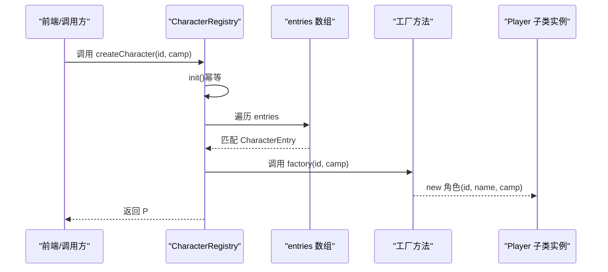
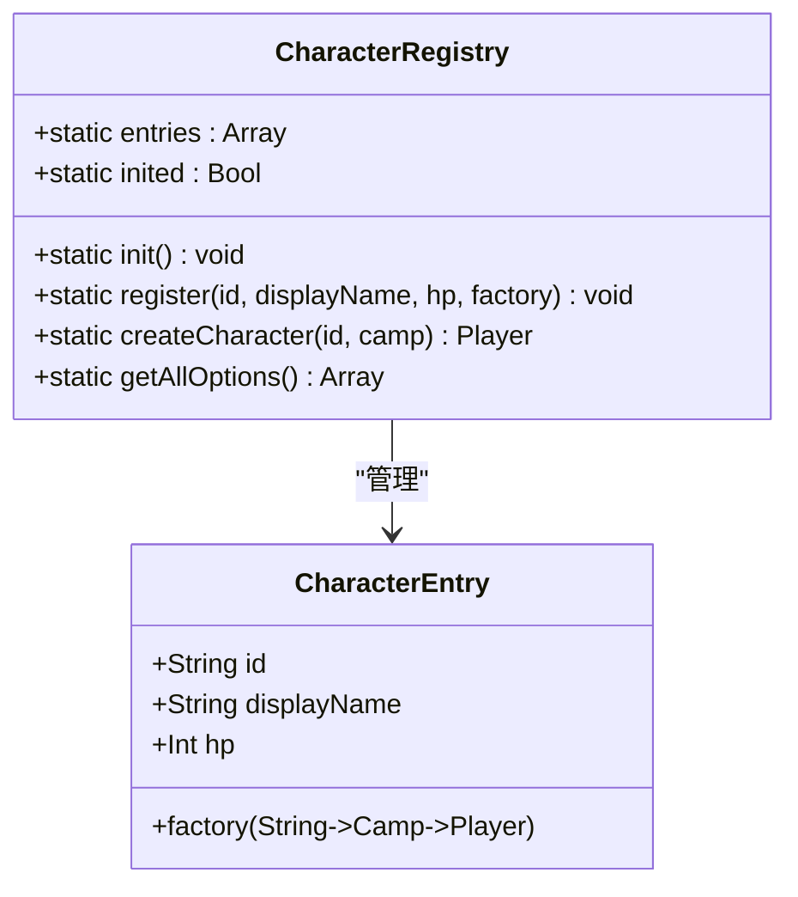
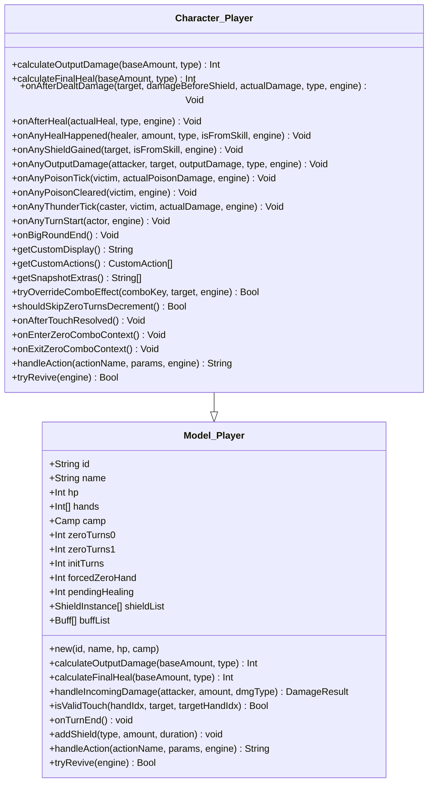
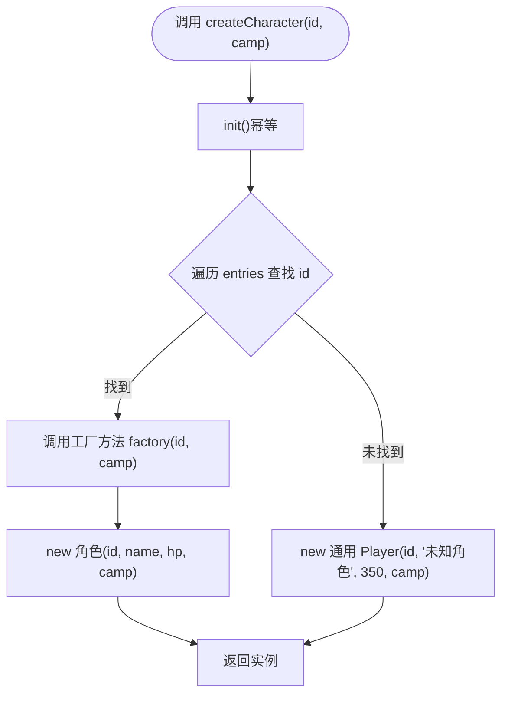
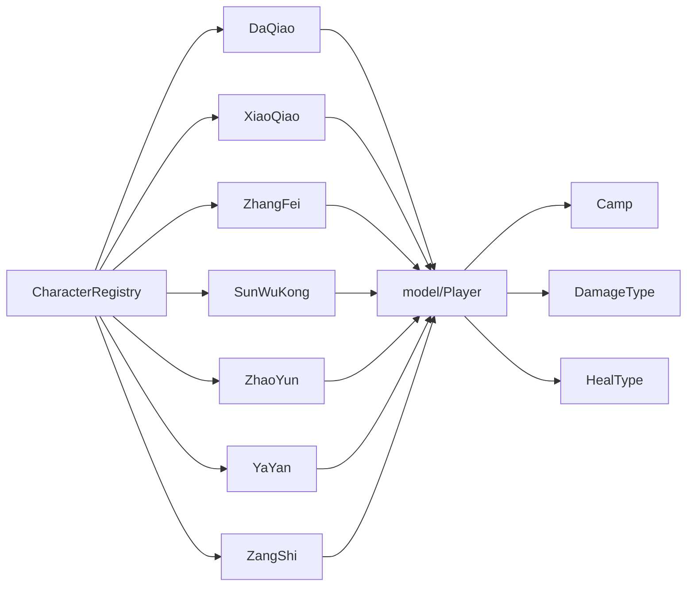

# 角色工厂与注册机制

<cite>
**本文档引用的文件**
- [CharacterRegistry.hx](file://character/CharacterRegistry.hx)
- [Player.hx（角色基类）](file://character/Player.hx)
- [Player.hx（模型基类）](file://model/Player.hx)
- [Camp.hx](file://model/Camp.hx)
- [DamageType.hx](file://model/DamageType.hx)
- [HealType.hx](file://model/HealType.hx)
- [DaQiao.hx](file://character/DaQiao.hx)
- [XiaoQiao.hx](file://character/XiaoQiao.hx)
- [ZhangFei.hx](file://character/ZhangFei.hx)
- [SunWuKong.hx](file://character/SunWuKong.hx)
- [ZhaoYun.hx](file://character/ZhaoYun.hx)
- [YaYan.hx](file://character/YaYan.hx)
- [ZangShi.hx](file://character/ZangShi.hx)
</cite>

## 目录
1. [简介](#简介)
2. [项目结构](#项目结构)
3. [核心组件](#核心组件)
4. [架构总览](#架构总览)
5. [详细组件分析](#详细组件分析)
6. [依赖关系分析](#依赖关系分析)
7. [性能考量](#性能考量)
8. [故障排查指南](#故障排查指南)
9. [结论](#结论)
10. [附录](#附录)

## 简介
本文件聚焦于“角色工厂与注册机制”，系统性解析 CharacterRegistry 类的工厂模式设计、CharacterEntry 元数据结构、角色注册流程、工厂方法实现，以及 Player 基类的设计理念与阵营系统集成。文档还提供扩展新角色的方法、最佳实践与错误处理建议，帮助开发者快速、安全地新增角色并维护系统稳定性。

## 项目结构
围绕角色工厂与注册机制的关键目录与文件如下：
- character/CharacterRegistry.hx：角色注册中心，负责角色元数据与工厂方法的集中注册与创建
- character/Player.hx：角色子类基类（继承自 model/Player.hx），提供角色特有能力与钩子接口
- model/Player.hx：游戏模型基类，定义角色通用属性、伤害抗性、护盾与增益管理等
- model/Camp.hx、model/DamageType.hx、model/HealType.hx：阵营、伤害类型、治疗类型的枚举定义
- 角色实现：character/ 下包含多个具体角色类，每个角色通过 CharacterRegistry.init() 注册其工厂方法

图表来源
- [CharacterRegistry.hx:17-82](file://character/CharacterRegistry.hx#L17-L82)
- [Player.hx（角色基类）:1-375](file://character/Player.hx#L1-L375)
- [Player.hx（模型基类）:1-398](file://model/Player.hx#L1-L398)
- [Camp.hx:1-8](file://model/Camp.hx#L1-L8)
- [DamageType.hx:1-7](file://model/DamageType.hx#L1-L7)
- [HealType.hx:1-6](file://model/HealType.hx#L1-L6)

章节来源
- [CharacterRegistry.hx:17-82](file://character/CharacterRegistry.hx#L17-L82)
- [Player.hx（角色基类）:1-375](file://character/Player.hx#L1-L375)
- [Player.hx（模型基类）:1-398](file://model/Player.hx#L1-L398)
- [Camp.hx:1-8](file://model/Camp.hx#L1-L8)
- [DamageType.hx:1-7](file://model/DamageType.hx#L1-L7)
- [HealType.hx:1-6](file://model/HealType.hx#L1-L6)

## 核心组件
- CharacterEntry 元数据结构：包含唯一 id、显示名、标准 HP、工厂方法（String->Camp->Player）
- CharacterRegistry：静态注册中心，提供 init() 初始化注册、register() 注册条目、createCharacter() 动态创建、getAllOptions() 前端选项导出
- Player 基类（模型层）：通用角色属性、阵营、手牌状态、护盾与增益管理、伤害抗性与回血逻辑、事件钩子接口
- Player 基类（角色层）：角色子类的扩展基类，提供 calculateOutputDamage/calculateFinalHeal、onAfterDealtDamage/onAfterHeal 等钩子，以及自描述与自定义动作接口

章节来源
- [CharacterRegistry.hx:10-15](file://character/CharacterRegistry.hx#L10-L15)
- [CharacterRegistry.hx:22-80](file://character/CharacterRegistry.hx#L22-L80)
- [Player.hx（角色基类）:19-375](file://character/Player.hx#L19-L375)
- [Player.hx（模型基类）:21-398](file://model/Player.hx#L21-L398)

## 架构总览
工厂模式与注册中心的整体工作流如下：

图表来源
- [CharacterRegistry.hx:62-72](file://character/CharacterRegistry.hx#L62-L72)
- [CharacterRegistry.hx:22-60](file://character/CharacterRegistry.hx#L22-L60)

章节来源
- [CharacterRegistry.hx:22-80](file://character/CharacterRegistry.hx#L22-L80)

## 详细组件分析

### CharacterRegistry：工厂与注册中心
- CharacterEntry 元数据结构
  - id：角色唯一标识，用于前端 select.value
  - displayName：下拉选项显示名（含表情与 HP 信息）
  - hp：标准 HP
  - factory：工厂方法签名 String->Camp->Player
- init() 初始化注册
  - 一次性注册所有角色，采用 register() 统一写入 entries
  - 通过闭包捕获具体角色类的构造函数，形成稳定的工厂方法
- register() 参数与作用
  - 接收 id、displayName、hp、factory
  - 将 CharacterEntry 推入 entries
- createCharacter() 动态创建
  - 调用 init() 确保注册完成
  - 遍历 entries 查找匹配 id 的条目
  - 调用工厂方法创建实例；未命中时回退为通用 Player(id, "未知角色", 350, camp)
- getAllOptions() 前端选项导出
  - 返回 [{id, displayName}] 列表，供前端渲染

图表来源
- [CharacterRegistry.hx:17-82](file://character/CharacterRegistry.hx#L17-L82)
- [CharacterRegistry.hx:10-15](file://character/CharacterRegistry.hx#L10-L15)

章节来源
- [CharacterRegistry.hx:10-15](file://character/CharacterRegistry.hx#L10-L15)
- [CharacterRegistry.hx:22-80](file://character/CharacterRegistry.hx#L22-L80)

### Player 基类设计理念与阵营系统集成
- 构造函数参数
  - id、name、hp、camp：通用角色属性
- 角色属性管理
  - 手牌状态 hands、零回合计数 zeroTurns0/zeroTurns1、初始零回合 initTurns、强制零手 forcedZeroHand、待定治疗 pendingHealing
  - 护盾 shieldList、增益 buffList
- 阵营系统集成
  - camp 字段与 Camp 枚举配合，用于阵营判定（如藏师草莓蛋糕对敌方事件的监听）
- 伤害与回血核心逻辑
  - calculateOutputDamage/calculateFinalHeal：子类可重写以实现加成
  - handleIncomingDamage：完整抗伤流程（攻击者 Buff、自身 Buff、护盾、落地扣血）
  - isValidTouch：触碰合法性通用预检（考虑另一只手为 0 且寿命将尽的情况）
- 事件钩子体系
  - onAnyHealHappened、onAnyShieldGained、onAnyOutputDamage、onAnyPoisonTick、onAnyPoisonCleared、onAnyThunderTick、onAnyTurnStart、onBigRoundEnd
  - 自描述接口：getCustomDisplay/getCustomActions/getSnapshotExtras/tryOverrideComboEffect/handleAction/tryRevive
- 增益与护盾管理
  - addBuff/getBuff/onTurnEnd/cleanEmptyBuffs/addShield/decreaseShieldDuration

图表来源
- [Player.hx（角色基类）:19-375](file://character/Player.hx#L19-L375)
- [Player.hx（模型基类）:21-398](file://model/Player.hx#L21-L398)

章节来源
- [Player.hx（角色基类）:19-375](file://character/Player.hx#L19-L375)
- [Player.hx（模型基类）:21-398](file://model/Player.hx#L21-L398)

### 角色注册流程与工厂方法实现
- 注册流程
  - init() 中逐行 register(...)，将角色的工厂方法绑定到 id
  - 工厂方法以闭包形式捕获具体角色类的构造函数，参数为 id、displayName、hp、camp
- 工厂方法实现
  - createCharacter() 通过工厂方法动态创建 Player 子类实例
  - 未命中时回退为通用 Player(id, "未知角色", 350, camp)
- 前端选项
  - getAllOptions() 导出 [{id, displayName}]，便于前端渲染

图表来源
- [CharacterRegistry.hx:62-72](file://character/CharacterRegistry.hx#L62-L72)
- [CharacterRegistry.hx:22-60](file://character/CharacterRegistry.hx#L22-L60)

章节来源
- [CharacterRegistry.hx:22-80](file://character/CharacterRegistry.hx#L22-L80)

### 典型角色示例：小乔、张飞、孙悟空、大乔、赵云、鸦眼、藏师
- 小乔（半肉）
  - 物伤×1.5、回血×1.5、回血时对敌方造成等量物伤、造成物伤时给自己补给等量血、0可停留3回合、护盾升级为物法盾
- 张飞（坦克）
  - 行动结束补给10血（狂暴翻倍）、受物理伤害时按双手差值免疫伤害（狂暴翻倍）、三模态切换、怒气系统与狂暴
- 孙悟空（半肉）
  - x/y 双向联动、回血时追加 y、造成物伤时追加 x、[0,2] 大招覆盖（70法伤+回血+冻结，补偿零回合寿命）
- 大乔（半肉）
  - 全场回血抢夺（50%，神大乔额外+10）、造成物伤时回复50%伤害值、进化为神大乔（物伤×1.5、物免1/4、复活甲废弃）
- 赵云（半肉）
  - x/y 双向联动、单手被动（1/4→回10+y，5/8/9→造成20+x），0组合期间禁止单手被动
- 鸦眼（输出）
  - 乌鸦诅咒（对目标阵营施加乌鸦buff，2回合不叠加）、灼燃箭（toggle开启，攻击后法伤+自耗60物伤+补给）、魔王剑（消耗6乌鸦，法伤回血×2）
- 藏师（坦克）
  - 物伤减半、反弹实际扣血50%（上限200）、回血×2.5、护盾厚度×2、草莓蛋糕（每大回合上限8次，3个蛋糕一组释放）

章节来源
- [XiaoQiao.hx:17-96](file://character/XiaoQiao.hx#L17-L96)
- [ZhangFei.hx:22-273](file://character/ZhangFei.hx#L22-L273)
- [SunWuKong.hx:17-207](file://character/SunWuKong.hx#L17-L207)
- [DaQiao.hx:20-281](file://character/DaQiao.hx#L20-L281)
- [ZhaoYun.hx:29-151](file://character/ZhaoYun.hx#L29-L151)
- [YaYan.hx:25-174](file://character/YaYan.hx#L25-L174)
- [ZangShi.hx:19-202](file://character/ZangShi.hx#L19-L202)

## 依赖关系分析
- 角色层依赖模型层
  - 所有角色类（character/*）均继承自 character/Player.hx，后者再继承 model/Player.hx
- 注册中心依赖角色类
  - CharacterRegistry.init() 通过闭包引用具体角色类的构造函数
- 枚举依赖
  - model/Player.hx 使用 Camp、DamageType、HealType 枚举进行阵营与伤害/治疗分类

图表来源
- [CharacterRegistry.hx:22-60](file://character/CharacterRegistry.hx#L22-L60)
- [Player.hx（角色基类）:19-375](file://character/Player.hx#L19-L375)
- [Player.hx（模型基类）:21-398](file://model/Player.hx#L21-L398)
- [Camp.hx:1-8](file://model/Camp.hx#L1-L8)
- [DamageType.hx:1-7](file://model/DamageType.hx#L1-L7)
- [HealType.hx:1-6](file://model/HealType.hx#L1-L6)

章节来源
- [CharacterRegistry.hx:22-60](file://character/CharacterRegistry.hx#L22-L60)
- [Player.hx（角色基类）:19-375](file://character/Player.hx#L19-L375)
- [Player.hx（模型基类）:21-398](file://model/Player.hx#L21-L398)

## 性能考量
- 注册中心幂等性
  - init() 通过 inited 标志避免重复注册，降低重复初始化成本
- 工厂方法查找
  - entries 为线性数组，查找复杂度 O(n)；n=11，性能可接受
- 建议
  - 若角色数量增长，可考虑使用 Map<String, CharacterEntry> 提升查找效率
  - 将工厂方法缓存至 Map，避免重复闭包捕获

[本节为通用性能讨论，不直接分析具体文件]

## 故障排查指南
- 未命中角色 ID
  - 现象：createCharacter() 返回通用 Player("未知角色", 350)
  - 排查：确认 CharacterRegistry.init() 中是否注册对应 id
- 工厂方法异常
  - 现象：创建角色时报错
  - 排查：检查 register() 传入的工厂方法签名与角色构造函数参数是否一致
- 前端选项缺失
  - 现象：下拉菜单缺少角色
  - 排查：确认 getAllOptions() 被调用且 init() 已执行
- 阵营相关逻辑异常
  - 现象：阵营判断错误导致技能失效
  - 排查：核对 camp 字段与 Camp 枚举使用一致性

章节来源
- [CharacterRegistry.hx:62-72](file://character/CharacterRegistry.hx#L62-L72)
- [CharacterRegistry.hx:77-80](file://character/CharacterRegistry.hx#L77-L80)

## 结论
CharacterRegistry 通过 CharacterEntry 元数据与工厂方法实现了清晰的角色注册与动态创建机制；Player 基类提供了完善的事件钩子与伤害/回血核心逻辑，支撑各角色差异化能力。结合阵营、伤害类型与治疗类型枚举，系统在可扩展性与一致性方面表现良好。遵循本文最佳实践，可安全高效地扩展新角色并维护系统稳定。

[本节为总结性内容，不直接分析具体文件]

## 附录

### 最佳实践与扩展新角色指南
- 新增角色步骤
  - 在 CharacterRegistry.init() 中添加一行 register(...)，绑定 id 与工厂方法
  - 在 character/ 下创建角色类，继承 character/Player.hx，并在构造函数中调用 super(...)
  - 如需阵营相关逻辑，使用 Camp 枚举；如需伤害/治疗分类，使用 DamageType/HealType
- 参数与命名
  - id 必须全局唯一，displayName 用于前端展示
  - hp 为标准 HP，用于回退与前端显示
- 错误处理
  - createCharacter() 未命中时回退为通用 Player，避免崩溃
  - 角色自定义动作返回错误字符串，前端可据此提示

章节来源
- [CharacterRegistry.hx:22-60](file://character/CharacterRegistry.hx#L22-L60)
- [CharacterRegistry.hx:62-72](file://character/CharacterRegistry.hx#L62-L72)
- [Player.hx（角色基类）:19-375](file://character/Player.hx#L19-L375)
- [Camp.hx:1-8](file://model/Camp.hx#L1-L8)
- [DamageType.hx:1-7](file://model/DamageType.hx#L1-L7)
- [HealType.hx:1-6](file://model/HealType.hx#L1-L6)