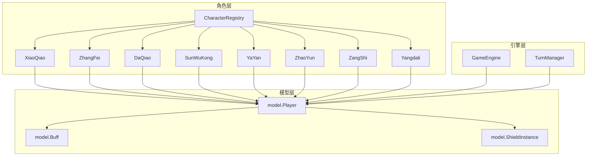
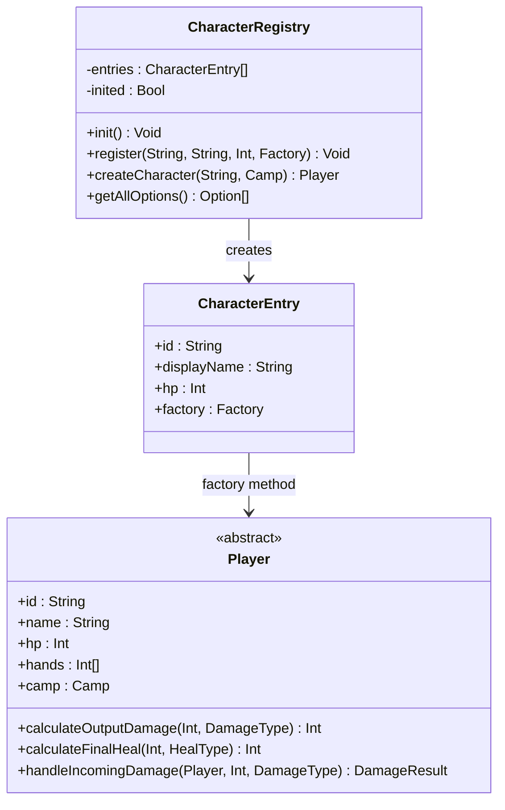
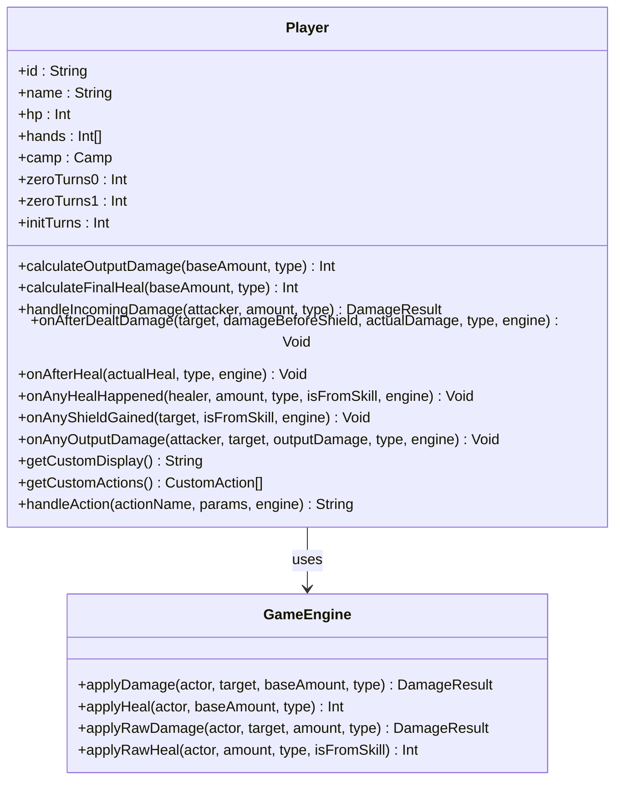
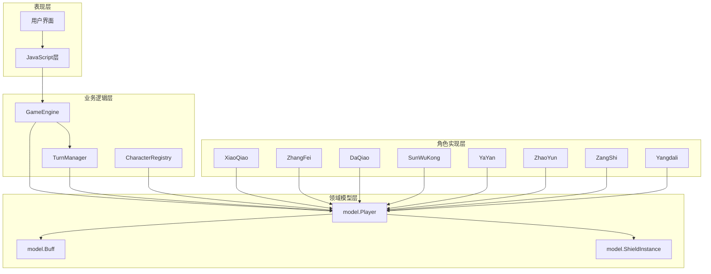
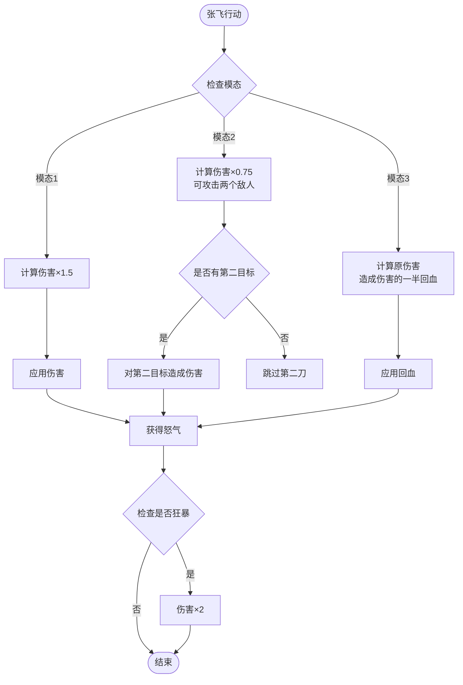
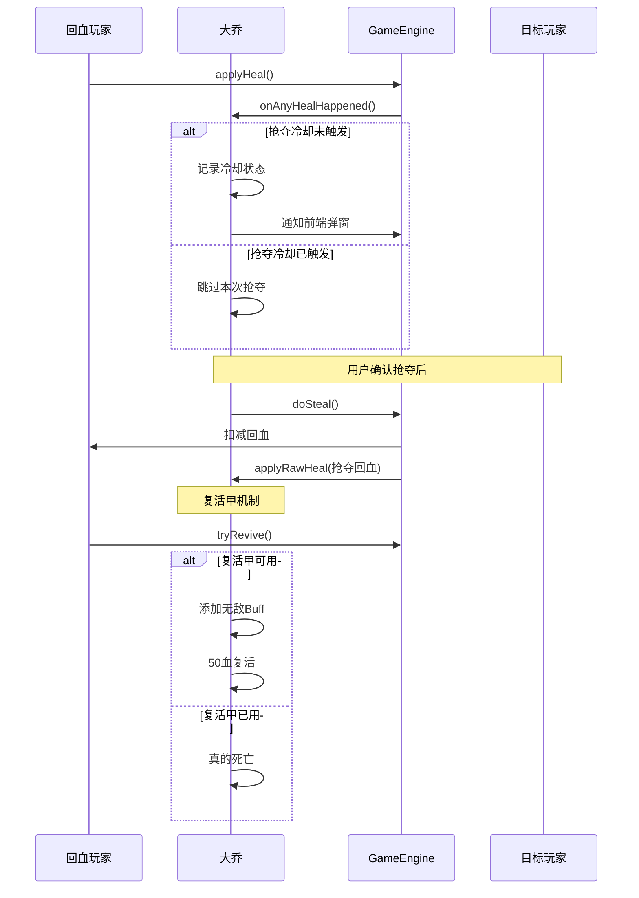
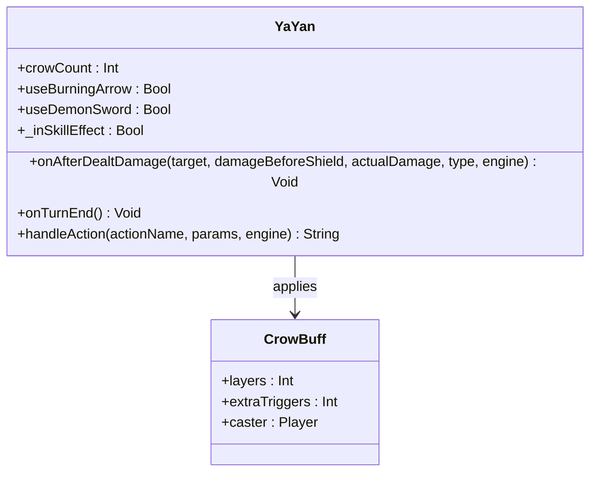
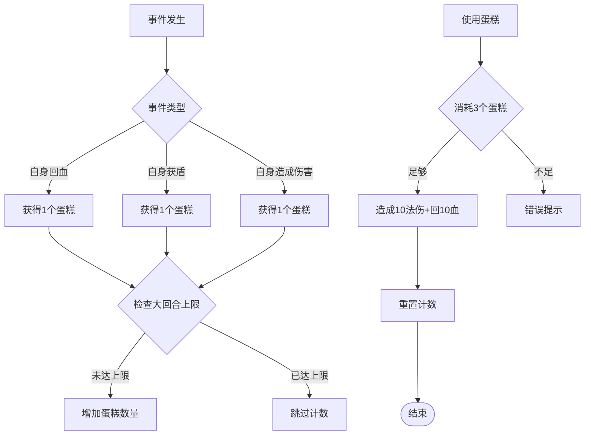
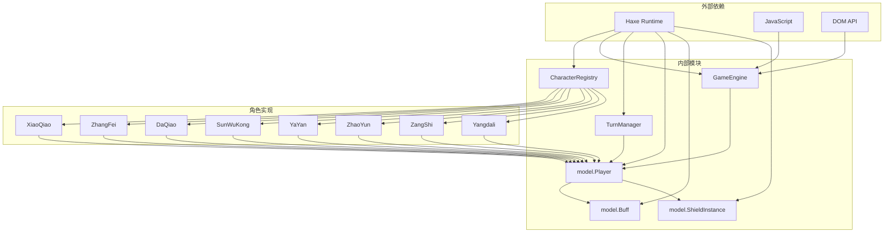

# 角色系统

<cite>
**本文档引用的文件**
- [CharacterRegistry.hx](file://character/CharacterRegistry.hx)
- [Player.hx](file://character/Player.hx)
- [XiaoQiao.hx](file://character/XiaoQiao.hx)
- [ZhangFei.hx](file://character/ZhangFei.hx)
- [DaQiao.hx](file://character/DaQiao.hx)
- [SunWuKong.hx](file://character/SunWuKong.hx)
- [YaYan.hx](file://character/YaYan.hx)
- [ZhaoYun.hx](file://character/ZhaoYun.hx)
- [ZangShi.hx](file://character/ZangShi.hx)
- [Yangdali.hx](file://character/Yangdali.hx)
- [model/Player.hx](file://model/Player.hx)
- [model/Buff.hx](file://model/Buff.hx)
- [model/ShieldInstance.hx](file://model/ShieldInstance.hx)
- [GameEngine.hx](file://GameEngine.hx)
- [TurnManager.hx](file://TurnManager.hx)
</cite>

## 目录
1. [简介](#简介)
2. [项目结构](#项目结构)
3. [核心组件](#核心组件)
4. [架构概览](#架构概览)
5. [详细组件分析](#详细组件分析)
6. [依赖关系分析](#依赖关系分析)
7. [性能考虑](#性能考虑)
8. [故障排除指南](#故障排除指南)
9. [结论](#结论)

## 简介

这是一个基于Haxe开发的角色扮演游戏系统，采用工厂模式设计，实现了11种不同类型的英雄角色。系统通过CharacterRegistry工厂类统一管理角色注册和创建，每个角色都继承自Player基类，拥有独特的技能机制和战斗策略。

该系统的核心特色包括：
- **工厂模式**：CharacterRegistry提供统一的角色注册和创建接口
- **钩子系统**：Player基类提供丰富的事件钩子，支持角色技能扩展
- **组合技能**：支持[x,y]组合技能触发，包括双子星、零组合等
- **状态管理**：完善的Buff、护盾、状态持续时间管理系统
- **平衡性设计**：通过伤害倍率、回血加成、特殊效果实现角色平衡

## 项目结构



**图表来源**
- [CharacterRegistry.hx:17-82](file://character/CharacterRegistry.hx#L17-L82)
- [Player.hx:3-375](file://character/Player.hx#L3-L375)
- [GameEngine.hx:16-725](file://GameEngine.hx#L16-L725)

**章节来源**
- [CharacterRegistry.hx:1-82](file://character/CharacterRegistry.hx#L1-L82)
- [Player.hx:1-375](file://character/Player.hx#L1-L375)

## 核心组件

### CharacterRegistry工厂模式

CharacterRegistry实现了标准的工厂模式，提供统一的角色注册和创建接口：



**图表来源**
- [CharacterRegistry.hx:10-82](file://character/CharacterRegistry.hx#L10-L82)
- [Player.hx:3-375](file://character/Player.hx#L3-L375)

### Player基类设计理念

Player基类采用了高度模块化的钩子系统设计，为所有角色提供统一的扩展接口：



**图表来源**
- [Player.hx:3-375](file://character/Player.hx#L3-L375)
- [GameEngine.hx:137-320](file://GameEngine.hx#L137-L320)

**章节来源**
- [CharacterRegistry.hx:17-82](file://character/CharacterRegistry.hx#L17-L82)
- [Player.hx:3-375](file://character/Player.hx#L3-L375)

## 架构概览

系统采用分层架构设计，各层职责清晰分离：



**图表来源**
- [GameEngine.hx:16-725](file://GameEngine.hx#L16-L725)
- [TurnManager.hx:6-232](file://TurnManager.hx#L6-L232)
- [CharacterRegistry.hx:17-82](file://character/CharacterRegistry.hx#L17-L82)

## 详细组件分析

### 小乔（XiaoQiao）- 治疗与辅助专家

小乔是一个半肉定位的治疗辅助角色，具有独特的治疗链反应机制：

```mermaid
sequenceDiagram
participant Actor as 小乔
participant Target as 目标敌人
participant Engine as GameEngine
participant Other as 其他玩家
Actor->>Engine : applyDamage(造成物理伤害)
Engine->>Engine : calculateOutputDamage(1.5倍加成)
Engine->>Target : handleIncomingDamage()
Target-->>Engine : DamageResult
Engine->>Actor : onAfterDealtDamage()
Note over Actor : 触发"打人补给"技能
Actor->>Engine : applyRawHeal(等量治疗)
Actor->>Engine : onAfterHeal()
Note over Actor : 触发"回血反伤"技能
Actor->>Other : applyRawDamage(等量物理伤害)
```

**图表来源**
- [XiaoQiao.hx:42-62](file://character/XiaoQiao.hx#L42-L62)
- [GameEngine.hx:137-233](file://GameEngine.hx#L137-L233)

小乔的核心特性：
- **治疗倍率**：所有回血量×1.5
- **伤害倍率**：造成物理伤害×1.5
- **治疗链**：回血时对敌方造成等量物理伤害
- **反击链**：造成物伤时给自己补给等量生命
- **护盾强化**：获得的物理护盾升级为物法护盾，厚度×1.5，持续+1回合

**章节来源**
- [XiaoQiao.hx:9-96](file://character/XiaoQiao.hx#L9-L96)

### 张飞（ZhangFei）- 坦克与战士

张飞是一个坦克定位的战士角色，拥有复杂的三模态战斗系统：



**图表来源**
- [ZhangFei.hx:95-159](file://character/ZhangFei.hx#L95-L159)
- [ZhangFei.hx:165-208](file://character/ZhangFei.hx#L165-L208)

张飞的战斗系统特点：
- **三模态系统**：模态1物伤×1.5，模态20.75倍打两个敌人，模态3造成伤害一半回血
- **怒气系统**：每大回合上限4层怒气，≥24层可主动进入狂暴3回合
- **狂暴效果**：行动结束补给20血（翻倍），免伤×2，物伤再×1.5
- **被动免疫**：受到物理伤害时，免疫"双手差值×10"的物理伤害

**章节来源**
- [ZhangFei.hx:8-273](file://character/ZhangFei.hx#L8-L273)

### 大乔（DaQiao）- 团队支援与复活专家

大乔是一个半肉定位的团队支援角色，拥有独特的抢夺和复活机制：



**图表来源**
- [DaQiao.hx:36-68](file://character/DaQiao.hx#L36-L68)
- [DaQiao.hx:179-198](file://character/DaQiao.hx#L179-L198)
- [DaQiao.hx:112-135](file://character/DaQiao.hx#L112-L135)

大乔的核心能力：
- **抢夺系统**：主动抢夺全场任意"回复"行为的50%（仅RECOVERY，补给不可抢）
- **进化系统**：当前HP突破300后，可选择扣300血进化为神大乔
- **复活机制**：死后获得InvincibleBuff 2回合，之后以50血复活（仅限一次）
- **冷却管理**：每回合对同一玩家的抢夺有冷却保护

**章节来源**
- [DaQiao.hx:9-281](file://character/DaQiao.hx#L9-L281)

### 孙悟空（SunWuKong）- 机动性与爆发伤害

孙悟空是一个半肉定位的高机动性角色，拥有独特的被动成长系统：

```mermaid
flowchart TD
Start([触发事件]) --> EventType{事件类型}
EventType --> |自身输出| UpdateX[更新x值<br/>x = max(40, 输出值)]
EventType --> |全场输出| UpdateX2[更新x值<br/>x = max(40, 输出值)]
EventType --> |自身回血| UpdateY[更新y值<br/>y = max(30, 回血量)]
EventType --> |全场回血| UpdateY2[更新y值<br/>y = max(30, 回血量)]
UpdateX --> Passive[被动合成]
UpdateX2 --> Passive
UpdateY --> Passive
UpdateY2 --> Passive
Passive --> CalcDamage[计算伤害<br/>base + x]
CalcDamage --> ApplyDamage[应用伤害]
ApplyDamage --> CheckZero{是否[0,2]组合}
CheckZero --> |是| ZeroCombo[触发大招]
CheckZero --> |否| End([结束])
ZeroCombo --> ApplyMagic[70法伤]
ApplyMagic --> ApplyHeal[70回血]
ApplyHeal --> Freeze[冻结目标1回合]
Freeze --> SkipZero[标记跳过zeroTurns递减]
SkipZero --> End
```

**图表来源**
- [SunWuKong.hx:77-101](file://character/SunWuKong.hx#L77-L101)
- [SunWuKong.hx:136-166](file://character/SunWuKong.hx#L136-L166)

孙悟空的特色机制：
- **被动成长**：自身输出时更新x值，全场回血时更新y值
- **[0,2]大招**：70法伤 + 回70血 + 冻结对方1回合，最多3次
- **延寿机制**：[0,2]触发后下回合跳过zeroTurns递减，不消耗0使用次数
- **后果预判**：预测触碰后的双手状态，允许在特定条件下放行

**章节来源**
- [SunWuKong.hx:9-207](file://character/SunWuKong.hx#L9-L207)

### 雅 Yan（YaYan）- 控制与削弱专家

雅 Yan是一个输出定位的角色，拥有复杂的多重技能组合：



**图表来源**
- [YaYan.hx:25-34](file://character/YaYan.hx#L25-L34)
- [YaYan.hx:104-167](file://character/YaYan.hx#L104-L167)

雅 Yan的技能系统：
- **乌鸦诅咒**：主动消耗40血，对目标阵营所有人施加乌鸦buff（2回合）
- **灼燃箭**：攻击时toggle开启，额外法伤 = |双手和差| × 10，自扣60物理
- **魔王剑**：消耗6乌鸦，额外+2触发次数，法伤和回血×2，行动结束扣150物理
- **乌鸦系统**：通过CrowBuff机制提供额外触发次数

**章节来源**
- [YaYan.hx:9-174](file://character/YaYan.hx#L9-L174)

### 赵云（ZhaoYun）- 敏捷与连击专家

赵云是一个半肉定位的敏捷型角色，拥有攻防联动的成长系统：

```mermaid
sequenceDiagram
participant Actor as 赵云
participant Engine as GameEngine
participant Target as 目标
Actor->>Engine : calculateOutputDamage(baseAmount, PHYSICAL)
Engine->>Engine : 合并x值
Engine-->>Actor : 合成后的伤害值
Actor->>Engine : onAnyOutputDamage()
Note over Actor : 更新y值 = 总输出 / 2
Actor->>Engine : calculateFinalHeal(baseAmount, type)
Engine->>Engine : 合并y值
Engine-->>Actor : 合成后的回血值
Actor->>Engine : onAnyHealHappened()
Note over Actor : 更新x值 = 总回血量
Note over Actor : 单手被动触发
Actor->>Engine : applyHeal(10+y)
Actor->>Engine : applyDamage(20+x)
```

**图表来源**
- [ZhaoYun.hx:48-87](file://character/ZhaoYun.hx#L48-L87)
- [ZhaoYun.hx:105-136](file://character/ZhaoYun.hx#L105-L136)

赵云的特色机制：
- **攻防联动**：造成物理伤害时合并x值，回血时合并y值
- **被动成长**：输出事件更新y（输出/2），回血事件更新x（总回血量）
- **单手被动**：手变为1/4回复10+y血，5/8/9造成20+x物理伤害
- **0组合保护**：0组合期间禁止单手被动触发

**章节来源**
- [ZhaoYun.hx:8-151](file://character/ZhaoYun.hx#L8-L151)

### 藏师（ZangShi）- 坦克与支援专家

藏师是一个坦克定位的角色，拥有独特的草莓蛋糕系统：



**图表来源**
- [ZangShi.hx:99-140](file://character/ZangShi.hx#L99-L140)
- [ZangShi.hx:146-165](file://character/ZangShi.hx#L146-L165)

藏师的核心能力：
- **物理减半**：受到的所有物理伤害减半
- **反弹机制**：反弹自身实际扣血量50%的物理伤害（上限200）
- **回复加成**：自身回复量×2.5，护盾厚度×2
- **草莓蛋糕**：每大回合上限8次，每3个蛋糕可释放一次群体伤害

**章节来源**
- [ZangShi.hx:9-202](file://character/ZangShi.hx#L9-L202)

### 杨大力（Yangdali）

杨大力是一个力量型输出角色，具有极高的生存能力：

**章节来源**
- [Yangdali.hx:9-24](file://character/Yangdali.hx#L9-L24)

## 依赖关系分析



**图表来源**
- [CharacterRegistry.hx:3-4](file://character/CharacterRegistry.hx#L3-L4)
- [GameEngine.hx:3-9](file://GameEngine.hx#L3-L9)

**章节来源**
- [GameEngine.hx:16-725](file://GameEngine.hx#L16-L725)
- [TurnManager.hx:6-232](file://TurnManager.hx#L6-L232)

## 性能考虑

### 时间复杂度分析

1. **角色创建**：O(n) - 遍历注册表查找角色
2. **伤害计算**：O(b) - b为攻击者Buff数量
3. **护盾处理**：O(s) - s为有效护盾数量
4. **事件广播**：O(p) - p为存活玩家数量

### 内存管理

1. **Buff系统**：使用层数而非对象复制，减少内存分配
2. **护盾系统**：合并相同类型的护盾，避免重复存储
3. **事件监听**：按需触发，避免不必要的回调

### 优化建议

1. **角色注册缓存**：CharacterRegistry可添加角色ID到索引的映射
2. **事件过滤**：GameEngine可添加事件类型过滤器
3. **对象池**：为频繁创建的Buff和Shield实例使用对象池

## 故障排除指南

### 常见问题诊断

1. **角色创建失败**
   - 检查CharacterRegistry是否已初始化
   - 验证角色ID是否存在
   - 确认工厂方法正确实现

2. **伤害计算异常**
   - 检查calculateOutputDamage重写是否正确
   - 验证Buff叠加顺序
   - 确认伤害类型匹配

3. **技能触发问题**
   - 检查onAfterDealtDamage等钩子是否正确实现
   - 验证事件广播是否正常
   - 确认技能冷却状态

**章节来源**
- [CharacterRegistry.hx:62-72](file://character/CharacterRegistry.hx#L62-L72)
- [GameEngine.hx:56-85](file://GameEngine.hx#L56-L85)

## 结论

该角色系统通过精心设计的工厂模式和钩子系统，实现了高度模块化和可扩展的角色架构。每个角色都有独特的战斗风格和技能机制，同时保持了良好的平衡性。

系统的主要优势：
- **模块化设计**：角色间低耦合，易于维护和扩展
- **统一接口**：所有角色遵循相同的钩子协议
- **灵活扩展**：新增角色只需实现必要接口
- **平衡性考虑**：通过伤害倍率、回血加成等机制实现角色平衡

未来改进建议：
- 添加角色平衡性统计系统
- 实现技能冷却可视化
- 增加角色间互动机制
- 优化性能监控和调试工具