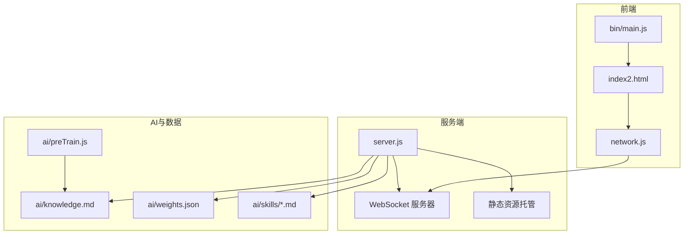
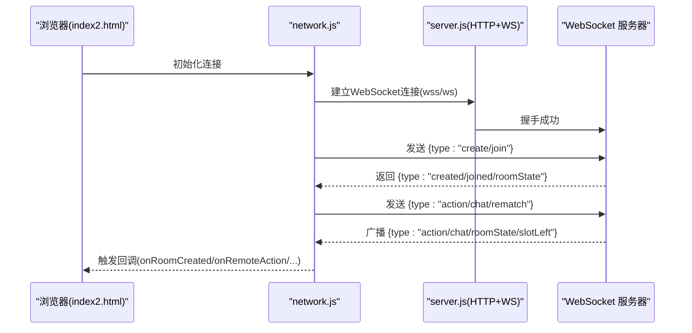
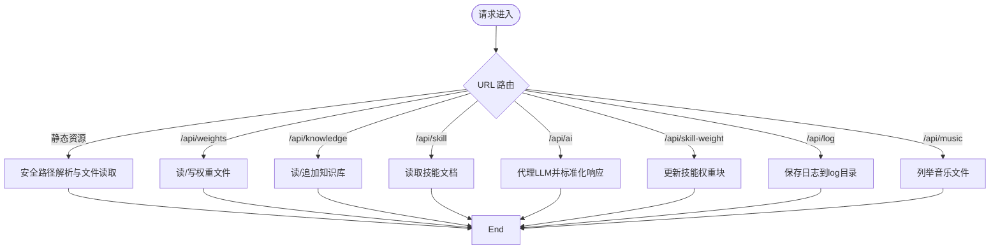
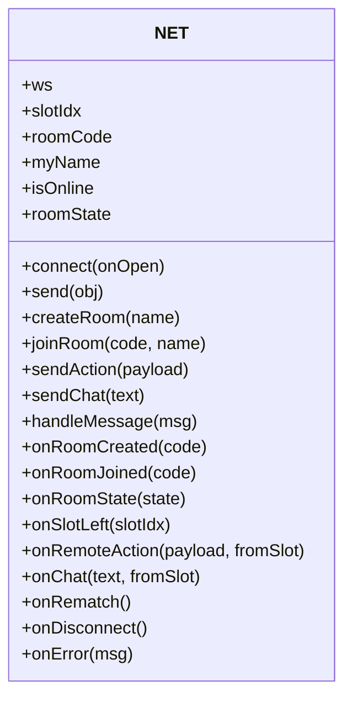
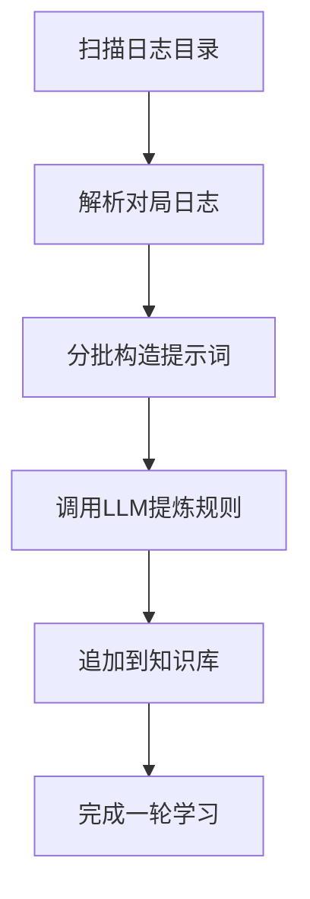
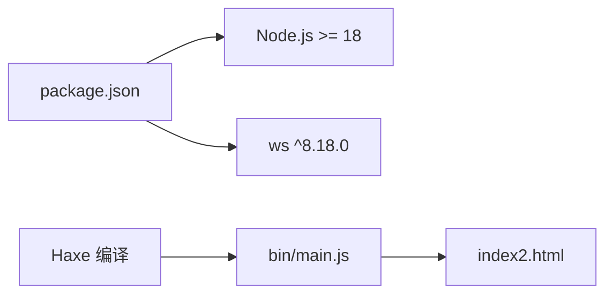

# 部署与运维

<cite>
**本文档引用的文件**
- [package.json](file://package.json)
- [server.js](file://server.js)
- [js/server.js](file://js/server.js)
- [network.js](file://network.js)
- [index2.html](file://index2.html)
- [ai/preTrain.js](file://ai/preTrain.js)
- [ai/weights.json](file://ai/weights.json)
- [ai/knowledge.md](file://ai/knowledge.md)
- [ai/skills/法师.md](file://ai/skills/法师.md)
- [ai/skills/小乔.md](file://ai/skills/小乔.md)
- [ai/skills/张飞.md](file://ai/skills/张飞.md)
- [PROJECT_ONBOARDING.md](file://PROJECT_ONBOARDING.md)
- [bin/main.js](file://bin/main.js)
</cite>

## 目录
1. [简介](#简介)
2. [项目结构](#项目结构)
3. [核心组件](#核心组件)
4. [架构总览](#架构总览)
5. [详细组件分析](#详细组件分析)
6. [依赖分析](#依赖分析)
7. [性能考量](#性能考量)
8. [故障排除指南](#故障排除指南)
9. [结论](#结论)
10. [附录](#附录)

## 简介
本文件面向生产环境部署与运维，围绕“指尖博弈”联机服务端进行系统化说明，涵盖服务器配置要求、Node.js 版本兼容性、WebSocket 服务配置、监控与维护策略、安全防护、日志管理与分析、故障排除、自动化部署与备份恢复等主题。文档以仓库现有代码为基础，结合前后端交互与AI训练能力，给出可落地的运维实践。

## 项目结构
项目采用前后端同构的单页应用架构，服务端同时承载静态资源与WebSocket联机通信，并提供AI相关API与训练工具。关键目录与文件职责概览：
- 服务端入口与HTTP/WebSocket：server.js
- 前端联机客户端网络层：js/network.js
- 2v2前端页面与联机UI：index2.html
- AI离线学习与知识库：ai/preTrain.js、ai/knowledge.md
- 角色技能权重与策略：ai/skills/*.md、ai/weights.json
- 构建产物与Haxe入口：bin/main.js、build.hxml
- 项目快速接入文档：PROJECT_ONBOARDING.md

图表来源
- [server.js:1-344](file://server.js#L1-L344)
- [js/server.js:1-344](file://js/server.js#L1-L344)
- [network.js:1-113](file://network.js#L1-L113)
- [index2.html:1-988](file://index2.html#L1-L988)
- [ai/preTrain.js:1-180](file://ai/preTrain.js#L1-L180)
- [ai/knowledge.md:1-44](file://ai/knowledge.md#L1-L44)
- [ai/weights.json:1-1](file://ai/weights.json#L1-L1)

章节来源
- [PROJECT_ONBOARDING.md:1-211](file://PROJECT_ONBOARDING.md#L1-L211)
- [server.js:1-344](file://server.js#L1-L344)
- [js/server.js:1-344](file://js/server.js#L1-L344)
- [network.js:1-113](file://network.js#L1-L113)
- [index2.html:1-988](file://index2.html#L1-L988)
- [ai/preTrain.js:1-180](file://ai/preTrain.js#L1-L180)
- [ai/knowledge.md:1-44](file://ai/knowledge.md#L1-L44)
- [ai/weights.json:1-1](file://ai/weights.json#L1-L1)

## 核心组件
- 服务端HTTP与静态资源：提供静态文件分发、API路由与WebSocket握手。
- WebSocket联机服务：房间管理、消息广播、断线接管与房间清理。
- 前端联机客户端：WebSocket连接、消息编解码、房间状态与事件回调。
- AI训练与知识库：离线学习、知识库增量更新、角色权重持久化。
- 构建与入口：Haxe编译产物与前端入口脚本。

章节来源
- [server.js:14-215](file://server.js#L14-L215)
- [server.js:217-344](file://server.js#L217-L344)
- [js/server.js:14-215](file://js/server.js#L14-L215)
- [js/server.js:217-344](file://js/server.js#L217-L344)
- [network.js:5-113](file://network.js#L5-L113)
- [ai/preTrain.js:1-180](file://ai/preTrain.js#L1-L180)
- [ai/knowledge.md:1-44](file://ai/knowledge.md#L1-L44)
- [ai/weights.json:1-1](file://ai/weights.json#L1-L1)
- [bin/main.js:1-21](file://bin/main.js#L1-L21)

## 架构总览
服务端以HTTP服务器承载静态资源与API，同时复用同一TCP端口提供WebSocket握手与长连接。前端通过network.js建立WebSocket，服务端维护房间字典，实现消息广播与房间状态同步。AI模块通过离线脚本与服务端API协同，实现知识库与权重的持续优化。

图表来源
- [server.js:263-339](file://server.js#L263-L339)
- [network.js:13-112](file://network.js#L13-L112)
- [index2.html:538-784](file://index2.html#L538-L784)

## 详细组件分析

### 服务端HTTP与WebSocket（server.js）
- HTTP服务器
  - 静态资源映射与安全校验：路径解析与安全检查，防止越权访问。
  - API路由
    - /api/weights：读取/写入AI权重文件。
    - /api/knowledge：读取/追加知识库内容。
    - /api/skill：按名称读取角色技能文档。
    - /api/ai：代理多家LLM，统一响应格式。
    - /api/skill-weight：更新技能文档中的权重块并可选追加复盘。
    - /api/log：保存训练日志至log目录。
    - /api/music：列出音乐文件。
- WebSocket服务器
  - 房间管理：房间字典、座位占用、房主固定。
  - 消息处理：创建房间、加入房间、动作广播、聊天广播、重赛请求。
  - 断线处理：标记座位空闲、通知其他玩家、房间清空逻辑。

图表来源
- [server.js:15-215](file://server.js#L15-L215)

章节来源
- [server.js:14-215](file://server.js#L14-L215)
- [server.js:217-344](file://server.js#L217-L344)

### 前端联机客户端（network.js）
- 连接管理：根据协议选择wss或ws，连接成功/断开回调。
- 消息编解码：发送与接收均以JSON传输。
- 房间交互：创建房间、加入房间、发送动作、聊天、重赛。
- 事件回调：onRoomCreated、onRoomJoined、onRoomState、onRemoteAction、onChat、onRematch、onDisconnect、onError。

图表来源
- [network.js:5-113](file://network.js#L5-L113)

章节来源
- [network.js:5-113](file://network.js#L5-L113)
- [index2.html:538-784](file://index2.html#L538-L784)

### AI训练与知识库（ai/preTrain.js、ai/knowledge.md、ai/weights.json、ai/skills/*.md）
- 离线学习：扫描日志、分批调用LLM、提炼规则、追加到知识库。
- 知识库：结构化规则与复盘记录，支持按角色细化。
- 权重：角色权重JSON，服务端提供读写接口。
- 技能文档：角色技能与权重块，服务端提供读取与更新接口。

图表来源
- [ai/preTrain.js:101-121](file://ai/preTrain.js#L101-L121)
- [ai/preTrain.js:124-179](file://ai/preTrain.js#L124-L179)
- [ai/knowledge.md:1-44](file://ai/knowledge.md#L1-L44)
- [ai/weights.json:1-1](file://ai/weights.json#L1-L1)
- [ai/skills/法师.md:3-6](file://ai/skills/法师.md#L3-L6)
- [ai/skills/小乔.md:3-6](file://ai/skills/小乔.md#L3-L6)
- [ai/skills/张飞.md:3-6](file://ai/skills/张飞.md#L3-L6)

章节来源
- [ai/preTrain.js:1-180](file://ai/preTrain.js#L1-L180)
- [ai/knowledge.md:1-44](file://ai/knowledge.md#L1-L44)
- [ai/weights.json:1-1](file://ai/weights.json#L1-L1)
- [ai/skills/法师.md:1-32](file://ai/skills/法师.md#L1-L32)
- [ai/skills/小乔.md:1-44](file://ai/skills/小乔.md#L1-L44)
- [ai/skills/张飞.md:1-44](file://ai/skills/张飞.md#L1-L44)

## 依赖分析
- Node.js运行时：服务端基于原生http与ws，Node版本要求见package.json。
- 第三方依赖：ws（WebSocket库）。
- 构建链路：Haxe编译生成JS，前端入口脚本加载。

图表来源
- [package.json:1-16](file://package.json#L1-L16)
- [bin/main.js:1-21](file://bin/main.js#L1-L21)

章节来源
- [package.json:1-16](file://package.json#L1-L16)
- [bin/main.js:1-21](file://bin/main.js#L1-L21)

## 性能考量
- 连接与房间规模
  - 房间最大4人，房间字典为内存结构，适合中小规模并发。
  - 广播采用遍历slots，注意在高并发下可能产生CPU压力。
- I/O与文件访问
  - /api/weights、/api/knowledge、/api/skill-weight、/api/log涉及文件读写，应关注磁盘IO与锁竞争。
- LLM代理
  - /api/ai转发第三方API，需考虑超时、重试与速率限制，避免阻塞主线程。
- 前端渲染
  - 2v2日志采用批量写入DOM，减少重排；仍需避免极端日志量导致的UI卡顿。

章节来源
- [server.js:220-261](file://server.js#L220-L261)
- [server.js:62-127](file://server.js#L62-L127)
- [index2.html:374-428](file://index2.html#L374-L428)

## 故障排除指南
- 无法启动或端口占用
  - 检查PORT环境变量与系统端口占用；默认端口为3000。
- WebSocket连接失败
  - 确认index2.html中协议与主机地址；生产环境建议使用wss。
- 路径越权与403
  - 服务端对静态路径与API路径均有安全校验，检查请求URL与文件路径。
- LLM代理错误
  - 检查MINIMAX_API_KEY/QIANFAN_API_KEY/DEEPSEEK_API_KEY环境变量；查看代理响应与错误码。
- 知识库与权重异常
  - 确认知识库与权重文件存在且可读写；必要时通过/api/knowledge与/api/weights进行恢复。
- 断线与房间清理
  - 客户端断线后服务端会广播slotLeft并清理房间；若出现异常，检查客户端onclose回调与服务端close事件处理。

章节来源
- [server.js:184-190](file://server.js#L184-L190)
- [server.js:321-338](file://server.js#L321-L338)
- [network.js:18-25](file://network.js#L18-L25)
- [server.js:69-95](file://server.js#L69-L95)

## 结论
本项目以轻量Node.js服务承载前端与联机逻辑，辅以AI离线学习与知识库系统。生产部署建议结合进程管理、健康检查、日志采集与告警、安全加固与备份策略，确保稳定性与可维护性。后续可引入连接池、负载均衡与容器化编排以支撑更大规模并发。

## 附录

### 生产环境部署清单
- 服务器配置
  - 操作系统：Linux（推荐Ubuntu/CentOS）
  - CPU/内存：根据并发与日志量评估，建议至少2核4GB起步
  - 存储：预留log目录空间与AI知识库增长空间
- Node.js版本
  - 使用Node.js >= 18（见package.json engines）
- 端口与协议
  - HTTP端口：默认3000，可通过PORT环境变量配置
  - WebSocket：在同一端口复用，生产建议启用wss
- 环境变量
  - MINIMAX_API_KEY、QIANFAN_API_KEY、DEEPSEEK_API_KEY（如需使用对应LLM）
- 进程管理
  - 使用PM2或Docker守护进程，开启自动重启与日志切割
- 安全加固
  - 反向代理启用TLS与WAF；限制请求体大小与频率；对敏感API增加鉴权
- 监控与告警
  - 指标：CPU/内存/连接数/请求延迟/错误率；日志：访问/错误/性能
- 备份与恢复
  - 定期备份：log目录、ai/knowledge.md、ai/weights.json
  - 恢复流程：停止服务 -> 恢复文件 -> 启动服务 -> 验证功能

### 自动化部署与运维脚本（示例思路）
- 构建与发布
  - Haxe编译：haxe build.hxml
  - Node安装：npm ci
  - 启动：pm2 start server.js --name "finger-game" --env production
- 健康检查
  - /api/weights GET与POST验证服务可用性
- 备份脚本
  - tar czf backup-$(date +%Y%m%d-%H%M%S).tar.gz log ai/knowledge.md ai/weights.json
- 回滚策略
  - 停止服务 -> 恢复上一个备份 -> 启动服务 -> 验证

### 日志管理与分析
- 访问日志：由HTTP服务器输出（console.log），建议接入日志聚合系统
- 错误日志：捕获异常与代理错误，统一格式化输出
- 性能日志：结合业务埋点与外部APM（如Prometheus+Grafana）采集指标

### 安全防护措施
- DDoS防护：反向代理层限速与IP白名单
- SQL注入：服务端无数据库，无需SQL注入防护
- XSS攻击：静态资源与API响应均为安全输出，避免内联脚本
- API限流：对/api/ai与文件写入接口增加速率限制与配额控制