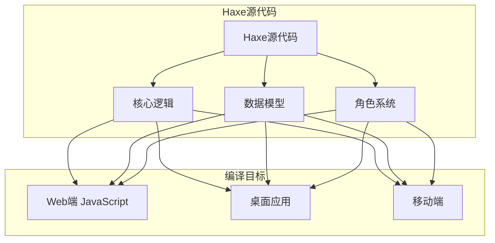
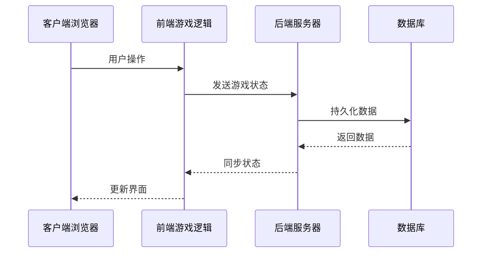
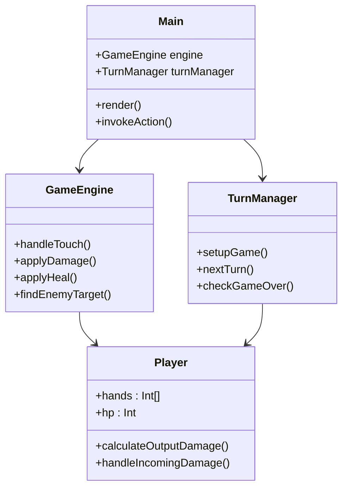
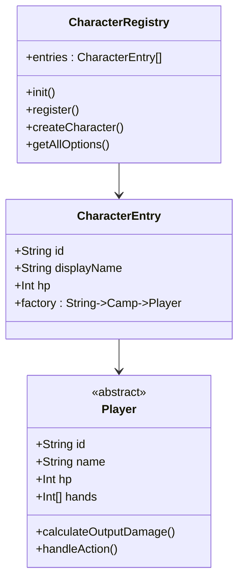
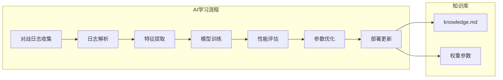
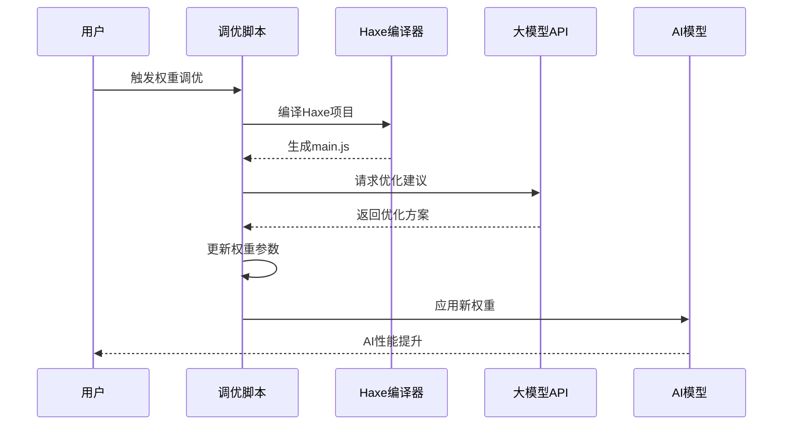
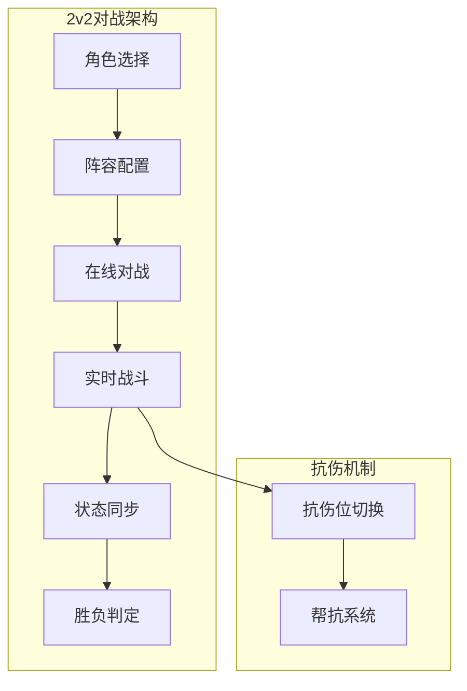
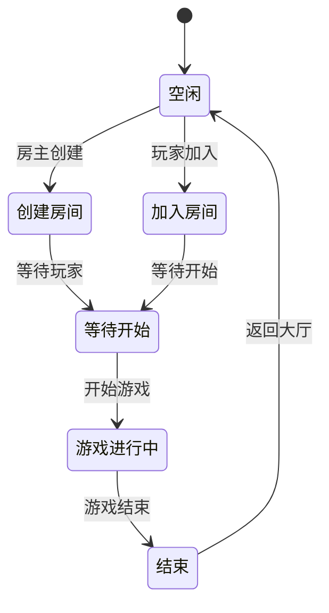
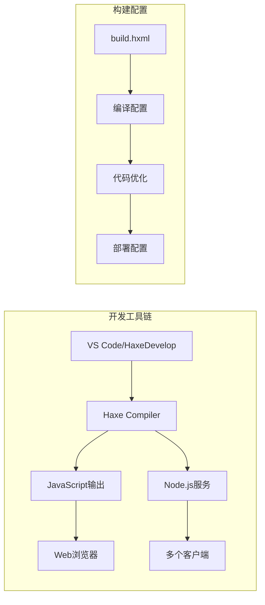

# 项目概述

<cite>
**本文档引用的文件**
- [Main.hx](file://Main.hx)
- [GameEngine.hx](file://GameEngine.hx)
- [TurnManager.hx](file://TurnManager.hx)
- [build.hxml](file://build.hxml)
- [package.json](file://package.json)
- [index.html](file://index.html)
- [index2.html](file://index2.html)
- [character/CharacterRegistry.hx](file://character/CharacterRegistry.hx)
- [character/DaQiao.hx](file://character/DaQiao.hx)
- [character/XiaoQiao.hx](file://character/XiaoQiao.hx)
- [character/ZhangFei.hx](file://character/ZhangFei.hx)
- [model/Player.hx](file://model/Player.hx)
- [ai/preTrain.js](file://ai/preTrain.js)
- [ai/skills/大乔.md](file://ai/skills/大乔.md)
- [tune_weights.py](file://tune_weights.py)
- [js/guide.html](file://js/guide.html)
</cite>

## 目录
1. [项目简介](#项目简介)
2. [核心理念与创新](#核心理念与创新)
3. [技术架构设计](#技术架构设计)
4. [指尖碰撞对战机制](#指尖碰撞对战机制)
5. [角色系统与技能体系](#角色系统与技能体系)
6. [AI学习与智能对战](#ai学习与智能对战)
7. [实时联机对战功能](#实时联机对战功能)
8. [教育价值与技术创新](#教育价值与技术创新)
9. [技术栈与开发环境](#技术栈与开发环境)
10. [快速体验指南](#快速体验指南)
11. [项目特色对比](#项目特色对比)
12. [总结](#总结)

## 项目简介

指尖博弈是一个基于Haxe语言开发的多英雄对战游戏，采用独特的"指尖碰撞"玩法，将传统的卡牌游戏与数学运算相结合，创造出全新的策略对战体验。游戏的核心创新在于将"两数相加取模10"的数学原理融入到战斗机制中，形成了独特的数字相加取模10战斗系统。

该项目不仅是一个娱乐游戏，更是一个集成了AI学习、实时联机、角色培养等多重功能的综合性游戏平台。通过Haxe跨平台编译技术，游戏能够同时运行在Web端和桌面环境中，为玩家提供流畅的游戏体验。

## 核心理念与创新

### 数学驱动的战斗系统

游戏的核心创新在于将数学运算直接转化为战斗机制。每个对战回合，玩家需要选择自己的一只手数字与对手的一只手数字进行相加，然后对结果取模10，这个结果会更新到玩家的手中。这种设计不仅增加了游戏的策略深度，还让玩家在游戏中潜移默化地练习数学运算能力。

### 角色差异化设计

游戏内置11种不同类型的英雄角色，每种角色都有独特的技能机制和战斗风格：

- **坦克型角色**：如张飞、藏师，负责承受伤害和保护队友
- **输出型角色**：如小乔、孙悟空，专注于造成伤害
- **辅助型角色**：如大乔、阴阳师，提供团队增益和控制
- **刺客型角色**：如忍者、鸦眼，擅长突袭和爆发

### 实时策略平衡

通过"0手倒计时"机制，游戏实现了动态的策略平衡。当玩家的手变为0时，会进入倒计时状态，倒计时结束后必须使用这只手进行行动。这种机制既增加了游戏的紧张感，也防止了某些策略过于强势。

## 技术架构设计

### Haxe跨平台架构

项目采用Haxe作为核心开发语言，通过单一代码库编译到多个目标平台：



**图表来源**
- [build.hxml:1-6](file://build.hxml#L1-L6)

### 前后端分离架构

游戏采用了现代化的前后端分离架构，前端负责用户界面和交互，后端提供实时对战服务：



**图表来源**
- [package.json:1-16](file://package.json#L1-L16)
- [index2.html:538-540](file://index2.html#L538-L540)

### 模块化设计

项目采用高度模块化的架构设计，各个组件职责明确，便于维护和扩展：



**图表来源**
- [Main.hx:9-13](file://Main.hx#L9-L13)
- [GameEngine.hx:16-43](file://GameEngine.hx#L16-L43)
- [TurnManager.hx:6-13](file://TurnManager.hx#L6-L13)
- [model/Player.hx:3-26](file://model/Player.hx#L3-L26)

**章节来源**
- [build.hxml:1-6](file://build.hxml#L1-L6)
- [package.json:1-16](file://package.json#L1-L16)

## 指尖碰撞对战机制

### 核心数学算法

游戏的核心机制基于"两数相加取模10"的数学运算：

```mermaid
flowchart TD
Start([开始回合]) --> SelectHands[选择手牌]
SelectHands --> GetNumbers[获取双方数字]
GetNumbers --> AddCalc[计算 A + B]
AddCalc --> ModCalc[取模运算 (A + B) % 10]
ModCalc --> UpdateHand[更新手牌]
UpdateHand --> CheckZero{是否为0?}
CheckZero --> |是| SetCountdown[设置倒计时]
CheckZero --> |否| CheckCombo[检查组合效果]
SetCountdown --> CheckCombo
CheckCombo --> ApplyEffects[应用组合效果]
ApplyEffects --> End([回合结束])
```

**图表来源**
- [GameEngine.hx:418-468](file://GameEngine.hx#L418-L468)

### 组合触发系统

游戏实现了丰富的组合触发机制，根据不同的数字组合产生不同的战斗效果：

| 组合类型 | 数字组合 | 触发效果 |
|---------|---------|---------|
| 双子星 | [1,1] | 无敌2回合 |
| 双子星 | [2,2]/[3,3] | 获得30点物理护盾，持续3回合 |
| 双子星 | [4,4] | 下2次攻击伤害翻倍 |
| 双子星 | [5,5] | 获得2层反弹盾 |
| 双子星 | [6,6] | 直接回复90血 |
| 双子星 | [7,7] | 30物伤+3层中毒 |
| 双子星 | [8,8] | 获得2次额外行动机会 |
| 双子星 | [9,9] | 巨额物理伤害，场上3的倍数越多伤害越高 |
| 双子星 | [0,0] | 对敌方造成150点真实伤害 |

**章节来源**
- [GameEngine.hx:495-551](file://GameEngine.hx#L495-L551)

## 角色系统与技能体系

### 角色注册中心

游戏采用工厂模式设计，通过CharacterRegistry集中管理所有角色：



**图表来源**
- [character/CharacterRegistry.hx:17-81](file://character/CharacterRegistry.hx#L17-L81)
- [model/Player.hx:3-26](file://model/Player.hx#L3-L26)

### 角色技能详解

#### 大乔（半肉/天后）

大乔是游戏中的核心辅助角色，拥有独特的"抢夺"机制：

- **主动抢夺**：可抢夺全场50%的回复型回血（自己的不算）
- **回血反伤**：造成物伤时对敌方造成等量物理伤害
- **进化系统**：HP超过300后可进化为神大乔，获得更强能力

#### 小乔（半肉/输出）

小乔是典型的攻防一体角色：

- **双重加成**：物理伤害×1.5，回血量×1.5
- **回血反伤**：回血时对敌方造成等量物理伤害
- **护盾强化**：所有护盾升级为物法盾，厚度×1.5，持续+1回合

#### 张飞（坦克/战士）

张飞是强力的坦克角色，拥有多种战斗形态：

- **三模态切换**：攻击型、范围攻击型、治疗型三种形态
- **狂暴系统**：积累24怒气进入狂暴，获得额外能力
- **免伤机制**：双手差值×10的物理伤害免疫

**章节来源**
- [character/DaQiao.hx:20-171](file://character/DaQiao.hx#L20-L171)
- [character/XiaoQiao.hx:17-95](file://character/XiaoQiao.hx#L17-L95)
- [character/ZhangFei.hx:22-272](file://character/ZhangFei.hx#L22-L272)

## AI学习与智能对战

### AI训练系统

项目集成了完整的AI学习系统，通过机器学习技术不断提升AI对战水平：



**图表来源**
- [ai/preTrain.js:101-121](file://ai/preTrain.js#L101-L121)

### 权重调优系统

通过Python脚本实现AI权重的自动化调优：



**图表来源**
- [tune_weights.py:220-278](file://tune_weights.py#L220-L278)

### 角色AI策略

针对不同角色制定了专门的AI策略：

| 角色 | 核心定位 | 优先级策略 |
|------|----------|-----------|
| 大乔 | 回复抢夺 | 1. 有0时：[0,1/5/8/9]打人 → 自己回血 + 能抢队友回血双收<br>2. 凑[x,6]或[6,6]：触发大量回血同时打人<br>3. HP>280时优先冲进化 |
| 小乔 | 攻防一体 | 1. 物理伤害×1.5，回血量×1.5<br>2. 回血反伤，打人回血<br>3. 护盾强化为物法盾 |
| 张飞 | 坦克战士 | 1. 三模态切换：攻击型/范围攻击型/治疗型<br>2. 狂暴系统：24怒气进入狂暴<br>3. 双手差值×10免伤 |

**章节来源**
- [ai/skills/大乔.md:1-34](file://ai/skills/大乔.md#L1-L34)
- [tune_weights.py:119-216](file://tune_weights.py#L119-L216)

## 实时联机对战功能

### 2v2对战模式

游戏支持多人实时对战，特别是创新的2v2模式：



**图表来源**
- [index2.html:1-988](file://index2.html#L1-L988)

### 联机对战特性

- **实时同步**：所有玩家的操作实时同步到服务器
- **抗伤位系统**：队友可切换抗伤位，保护脆弱位置
- **帮抗机制**：队友濒死时可选择帮抗，承受1.5倍伤害
- **阵容配置**：支持双半肉流和坦脆流两种战术体系

### 在线大厅系统



**图表来源**
- [index2.html:541-548](file://index2.html#L541-L548)

**章节来源**
- [index2.html:1-988](file://index2.html#L1-L988)

## 教育价值与技术创新

### 数学教育价值

游戏将数学运算融入到娱乐体验中，具有显著的教育价值：

- **基础运算练习**：通过反复的加法运算提高计算能力
- **策略思维培养**：培养玩家的策略规划和决策能力
- **概率统计概念**：通过组合触发机制理解概率和期望值
- **逻辑推理能力**：通过分析对手可能的行动提高逻辑思维

### 技术创新点

#### 1. 跨平台编译优势

Haxe语言提供了强大的跨平台编译能力，使得同一个代码库可以编译到多个目标平台：

- **Web端**：通过JavaScript运行，支持现代浏览器
- **桌面应用**：支持Windows、macOS、Linux平台
- **移动应用**：支持iOS和Android平台
- **服务器端**：支持Node.js环境

#### 2. 实时联机架构

采用WebSocket实现实时双向通信，确保游戏状态的实时同步：

- **低延迟通信**：优化的网络协议减少延迟
- **断线重连**：完善的断线检测和重连机制
- **状态一致性**：确保所有客户端看到一致的游戏状态

#### 3. AI学习集成

将机器学习技术深度集成到游戏系统中：

- **离线学习**：通过历史对战日志训练AI模型
- **在线学习**：实时分析玩家行为优化AI策略
- **多模型支持**：支持多种AI模型并行训练和比较

## 技术栈与开发环境

### 核心技术栈

| 技术类别 | 具体技术 | 版本/说明 |
|---------|---------|----------|
| 编程语言 | Haxe | 4.x版本 |
| 前端框架 | 原生JavaScript | ES6+语法 |
| 后端服务 | Node.js | 18.0+ |
| 网络通信 | WebSocket | ws库 |
| 数据库 | 文件系统 | JSON格式存储 |
| 构建工具 | Haxe Compiler | haxe命令 |
| 包管理 | npm | Node Package Manager |

### 开发环境要求

#### 硬件要求
- **最低配置**：Intel i3或AMD Ryzen 3以上处理器
- **内存**：4GB RAM（推荐8GB以上）
- **存储**：至少2GB可用空间
- **网络**：稳定的互联网连接

#### 软件要求
- **操作系统**：Windows 10+/macOS 10.15+/Linux Ubuntu 18.04+
- **浏览器**：Chrome 90+/Firefox 88+/Safari 14+
- **Node.js**：18.0或更高版本
- **Haxe**：4.0或更高版本

### 开发工具配置



**图表来源**
- [build.hxml:1-6](file://build.hxml#L1-L6)

**章节来源**
- [build.hxml:1-6](file://build.hxml#L1-L6)
- [package.json:12-15](file://package.json#L12-L15)

## 快速体验指南

### 本地运行步骤

1. **环境准备**
   ```bash
   # 克隆项目
   git clone https://github.com/yourusername/finger-game.git
   cd finger-game
   
   # 安装依赖
   npm install
   
   # 编译Haxe代码
   haxe build.hxml
   ```

2. **启动服务**
   ```bash
   # 启动Web服务器
   npm start
   
   # 或者直接打开index.html
   ```

3. **访问游戏**
   - **1v1模式**：打开`index.html`
   - **2v2模式**：打开`index2.html`
   - **新手指南**：打开`js/guide.html`

### 游戏基本操作

#### 1v1对战操作
1. **角色选择**：从下拉菜单中选择想要的角色
2. **开始游戏**：点击"激活角色·开始游戏"按钮
3. **手指碰撞**：点击己方一只手，再点击敌方一只手
4. **查看结果**：观察数字变化和触发的效果

#### 2v2对战操作
1. **阵容配置**：选择4个角色组成2v2队伍
2. **抗伤位设置**：确定谁来承担抗伤责任
3. **实时对战**：按照回合制进行对战
4. **帮抗操作**：队友濒死时可选择帮抗

### AI对战体验

1. **AI训练**：点击"AI自战训练"按钮开始训练
2. **权重调优**：通过`tune_weights.py`脚本优化AI参数
3. **离线学习**：使用`preTrain.js`分析历史对战日志
4. **实时对战**：与训练好的AI进行对战

## 项目特色对比

### 与其他卡牌游戏的区别

| 特性 | 指尖博弈 | 传统卡牌游戏 |
|------|---------|-------------|
| 核心机制 | 数学运算 + 策略对战 | 卡牌资源 + 策略对战 |
| 操作方式 | 触摸点击 | 拖拽放置 |
| 策略深度 | 数学计算 + 组合触发 | 卡牌组合 + 资源管理 |
| 教育价值 | 数学练习 + 策略思维 | 策略思维 + 卡牌理解 |
| 技术创新 | Haxe跨平台 + AI学习 | 传统游戏引擎 |

### 技术优势对比

#### Haxe跨平台优势
- **单一代码库**：一套代码支持多个平台
- **高性能编译**：编译为高效的JavaScript
- **类型安全**：静态类型检查减少运行时错误
- **生态丰富**：支持大量第三方库和工具

#### AI集成优势
- **自适应学习**：AI能够从对战中学习改进
- **多模型支持**：支持不同AI模型并行训练
- **实时优化**：在线分析玩家行为实时调整策略
- **知识库管理**：系统化的AI知识存储和更新

## 总结

指尖博弈项目通过创新的"指尖碰撞"玩法，成功地将数学运算与策略对战相结合，创造出了独特而富有教育意义的游戏体验。项目采用Haxe跨平台技术栈，实现了Web端和多平台的无缝运行，同时集成了先进的AI学习系统和实时联机对战功能。

### 主要成就

1. **技术创新**：将数学运算直接转化为游戏机制，具有独特的创新性
2. **教育价值**：在娱乐中融入数学教育，培养玩家的计算能力和策略思维
3. **技术先进**：采用Haxe跨平台技术和AI学习系统，展现了现代游戏开发的前沿技术
4. **用户体验**：简洁直观的操作界面，丰富的角色选择和策略深度

### 未来发展方向

1. **AI进一步优化**：通过机器学习技术不断提升AI对战水平
2. **社交功能增强**：增加更多的社交互动和竞技功能
3. **内容扩展**：持续推出新的角色和游戏模式
4. **平台拓展**：支持更多的设备和平台

指尖博弈不仅是一款有趣的游戏，更是一个展示技术实力和创新思维的优秀案例，为未来的游戏开发提供了新的思路和方向。